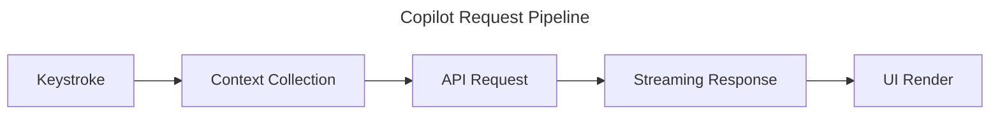

# GitHub Copilot Custom Instructions — copilot-howto

<!-- This file is auto-loaded by GitHub Copilot for all Copilot Chat interactions in this repository. It serves as both a live example and the actual instructions for working on this repo. -->

## Project Overview

This is the **GitHub Copilot How-To Guide** — a tutorial repository teaching GitHub Copilot features through working examples, architecture diagrams, and real-world workflows. Every file in this repo is either documentation a learner will read or a runnable example they will copy.

The audience ranges from developers who have never used Copilot to engineers configuring Copilot at the enterprise level. Write for the person who is motivated but new to the specific feature being covered.

## Stack

- **Documentation**: Markdown (`.md`) with GitHub Flavored Markdown extensions
- **Diagrams**: Mermaid (embedded in Markdown code fences)
- **Workflow examples**: GitHub Actions YAML (`.yml`)
- **Extension scaffolds**: Node.js (Express, CommonJS `require`)
- **Configuration examples**: JSONC, YAML

## Content Standards

- Prefer clarity over brevity. A longer explanation that a reader can follow is better than a terse one they have to reverse-engineer.
- Every guide must include at least one working, copy-paste-ready example. Do not describe a feature without showing it.
- Use real-world scenarios, not toy examples. "A Node.js Express API that validates user input" is better than "a function that adds two numbers."
- When you reference a GitHub Copilot feature, link to the official GitHub Copilot documentation at `https://docs.github.com/en/copilot`. Use inline links, not footnotes.
- All external links must use HTTPS.

## Writing Style

- Write in second person: "you install the extension", not "the user installs the extension."
- Use active voice. "Copilot sends the request" rather than "the request is sent by Copilot."
- Keep paragraphs to 3–5 sentences. Break longer explanations into bullet points or numbered steps.
- Start with the outcome, then explain the mechanism. Tell readers what they will be able to do before explaining how it works.
- No marketing language. Do not write "powerful," "seamless," "cutting-edge," "game-changing," or similar filler.
- Do not open any response with "As an AI language model" or any variant. Do not use filler phrases like "Certainly!", "Of course!", "Great question!", or "Happy to help!"

## File Structure Conventions

- All `README.md` files use H2 (`##`) for top-level section headers within the file, never H1 for sections (H1 is reserved for the document title only).
- All example files (`.js`, `.yml`, `.jsonc`, `.sh`) must start with a comment block explaining what the file demonstrates, what it requires, and how to run it.
- Markdown files that contain multiple major sections should include a Table of Contents immediately after the opening H1.
- Module directories are numbered (`03-slash-commands/`, `05-custom-instructions/`, etc.) to enforce a logical reading order.

## GitHub Actions YAML

When generating or editing GitHub Actions workflow files:

- Always include an explicit `permissions:` block. Never rely on default permissions. Scope permissions to least privilege.
- Always pin action versions to a full SHA commit hash for third-party actions, or to a specific tag for `actions/*` actions. Do not use `@main` or floating tags like `@v3` unless the user explicitly asks.
- Always include a `name:` field at the top of every workflow.
- Add `on:` triggers that make sense for the workflow purpose (e.g., `pull_request` for review workflows, `push` for test workflows).
- Include a `concurrency:` block to cancel in-progress runs when a new run starts on the same branch.

Example permissions block:

```yaml
permissions:
  contents: read
  pull-requests: write
```

## Mermaid Diagrams

When generating Mermaid diagrams:

- Always include a `title` directive at the top of the diagram.
- Prefer `flowchart LR` (left-to-right) for architecture and pipeline diagrams.
- Prefer `sequenceDiagram` for request/response flows and multi-party interactions.
- Keep node labels short (under 40 characters). Use a legend or surrounding prose for detail.
- Do not use experimental or rarely-supported Mermaid syntax. Stick to `flowchart`, `sequenceDiagram`, `classDiagram`, and `gantt`.

Example:

````markdown

````

## Forbidden Patterns

Do not include any of the following in generated content:

- Marketing language: "powerful", "seamless", "revolutionary", "game-changing", "next-level"
- Filler openers: "Certainly!", "Of course!", "Great question!", "Absolutely!", "Happy to help!"
- AI self-references: "As an AI language model...", "I don't have the ability to...", "I'm just an AI..."
- Vague instructions: "Configure as needed", "Set up appropriately", "Adjust to your environment" — always provide a concrete example instead
- Outdated advice: Do not recommend `@latest` for npm installs in CI; always pin versions

## Module Scope Reference

When a user asks about a specific topic, these are the relevant module directories:

| Topic | Directory |
|---|---|
| Slash commands (/explain, /fix, /tests, etc.) | `03-slash-commands/` |
| Custom instructions (.github/copilot-instructions.md) | `05-custom-instructions/` |
| Copilot Extensions (skillset and agent) | `14-extensions/` |
| Chat variables (@workspace, #file, etc.) | `04-chat-variables/` |
| GitHub Actions integration | `12-github-actions/` |
| Copilot Workspace | `13-copilot-workspace/` |
| gh copilot CLI | `06-cli/` |
| Inline suggestions and ghost text | `01-inline-suggestions/` |
| IDE setup (VS Code, JetBrains, Neovim, Xcode) | `02-ide-integration/` |
| Enterprise features (policies, audit logs, SSO) | `15-enterprise/` |
