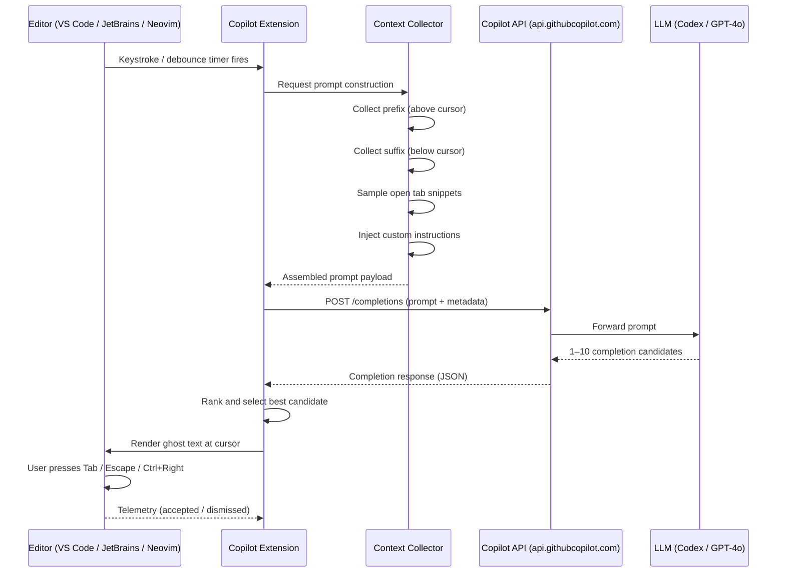

# GitHub Copilot Inline Suggestions (Ghost Text)

Inline suggestions are GitHub Copilot's core feature: as you type, the AI generates context-aware code completions that appear directly in your editor as greyed-out "ghost text." You decide whether to accept, dismiss, or partially accept each suggestion.

---

## Table of Contents

1. [What Are Inline Suggestions?](#what-are-inline-suggestions)
2. [How the Model Decides What to Suggest](#how-the-model-decides-what-to-suggest)
3. [The Ghost Text UI](#the-ghost-text-ui)
4. [Types of Suggestions](#types-of-suggestions)
5. [Triggering Suggestions](#triggering-suggestions)
6. [Accepting and Dismissing Suggestions](#accepting-and-dismissing-suggestions)
7. [Partial Acceptance](#partial-acceptance)
8. [Next Edit Suggestions (NES)](#next-edit-suggestions-nes)
9. [Context Sources](#context-sources)
10. [How a Completion Request Flows](#how-a-completion-request-flows)
11. [Settings That Affect Suggestions](#settings-that-affect-suggestions)

---

## What Are Inline Suggestions?

Inline suggestions are AI-generated code completions that appear as ghost text — typically rendered in a muted, greyed-out colour — directly at your cursor position as you type. They are non-intrusive: if you keep typing your own code the suggestion disappears; if you want to accept it you press `Tab`.

Ghost text differs from a traditional autocomplete dropdown in several important ways:

| Traditional Autocomplete | Copilot Ghost Text |
|---|---|
| Matches tokens you've already typed | Predicts what you're about to write |
| Shows a list of candidates | Shows a single inline prediction |
| Works from a static symbol index | Uses an LLM trained on code |
| Typically one word or symbol | Can span multiple lines or entire functions |

Ghost text is rendered at the character level, meaning Copilot can complete a partially typed word, finish a line, or generate a full function body in one suggestion.

---

## How the Model Decides What to Suggest

When you pause typing (or manually trigger a suggestion), Copilot constructs a **prompt** that captures the context of your current editing session and sends it to the Copilot API. The model then generates one or more completions.

Factors that shape the suggestion:

### 1. The Text Before the Cursor (Prefix)
The most heavily weighted signal. This includes everything in the current file above the cursor: imports, class definitions, previously written functions, and the partial line you're currently writing.

### 2. The Text After the Cursor (Suffix)
Copilot uses "fill-in-the-middle" (FIM) prompting, which means the text that already exists *below* your cursor is also sent as context. This lets Copilot generate code that connects what's above to what's below — extremely useful when inserting a function in the middle of a file.

### 3. File Type and Language
The file extension (`.ts`, `.py`, `.rs`, etc.) tells the model which language to target. Copilot adjusts idioms, naming conventions, and library usage accordingly.

### 4. Import Statements
If you have `import pandas as pd` at the top of a Python file, Copilot will suggest pandas APIs. If you swap it for `import polars as pl`, suggestions shift to polars idioms. Imports are one of the strongest signals for library choice.

### 5. Open Editor Tabs
Copilot includes snippets from other files you have open in the editor (sometimes called "neighboring tabs"). If you have a `UserService` class open in one tab and are writing a test file in another, Copilot can infer `UserService`'s method signatures and suggest correct test code.

### 6. Comments and Docstrings
A comment like `// Parse the JWT and return the decoded payload, or throw if expired` immediately before a function is one of the most reliable ways to guide Copilot toward a specific implementation. Comments are effectively natural-language prompts embedded in code.

### 7. Custom Instructions
If you have configured custom instructions (via `.github/copilot-instructions.md` or your IDE settings), those instructions are prepended to every prompt, shaping style, framework choices, and code conventions.

### 8. Cursor Position
Where the cursor sits in the file matters. Copilot distinguishes between being inside a class body, inside a function, at module level, or inside a comment block, and adjusts the kind of suggestion accordingly.

---

## The Ghost Text UI

Ghost text appears immediately after your cursor in a visually distinct style — usually grey or italic, depending on your editor theme. Here is what you will see in VS Code:

```
function calculateTax(price: number, rate: number): number {
    return price * rate;  ← your typed text ends here
                        ← ghost text appears here (e.g.,  / 100;)
```

### Cycling Through Suggestions

Copilot generates multiple candidate completions. You can cycle through them without accepting any:

- **VS Code**: `Alt+]` for next suggestion, `Alt+[` for previous
- **JetBrains**: `Alt+]` / `Alt+[`
- **Neovim**: `Alt+]` / `Alt+[` (copilot.vim)

Cycling is useful when the first suggestion is close but not quite right — a later suggestion may be a better fit.

### Visual Indicators

- **Ghost text colour**: controlled by `editorGhostText.foreground` in your VS Code colour theme
- **Completions panel**: Press `Ctrl+Enter` (VS Code) to open a panel showing up to 10 candidate completions at once

---

## Types of Suggestions

### Single-Line Completions
The most common type. Copilot completes the remainder of the line you are typing.

```python
# Before accepting:
user_age = int(input("Enter your age: ▌"))

# Ghost text suggestion:
user_age = int(input("Enter your age: ")) if user_age > 0 else 0
```

### Multi-Line Blocks
Copilot can suggest an entire `if/else` block, a `try/catch` block, or a loop body.

```javascript
// You type:
async function fetchUser(userId) {
    ▌
// Ghost text:
    try {
        const response = await fetch(`/api/users/${userId}`);
        if (!response.ok) throw new Error(`HTTP ${response.status}`);
        return await response.json();
    } catch (error) {
        console.error('Failed to fetch user:', error);
        throw error;
    }
}
```

### Whole Function Implementations
After you write a function signature (or a descriptive comment), Copilot can generate the complete implementation.

```typescript
// You write:
/**
 * Debounces a function, delaying its execution until after
 * `delay` ms have elapsed since the last call.
 */
function debounce<T extends (...args: unknown[]) => void>(fn: T, delay: number): T {
    ▌
// Ghost text fills the entire body
```

### Test Cases
In test files, after writing a `describe` or `it` block, Copilot infers the system under test and suggests assertions.

### Configuration and Boilerplate
In files like `Dockerfile`, `docker-compose.yml`, `.github/workflows/*.yml`, or `tsconfig.json`, Copilot suggests idiomatic configuration blocks.

---

## Triggering Suggestions

### Automatic (Default Behaviour)
By default, Copilot shows suggestions automatically after a short debounce period (roughly 300–500 ms) when you stop typing. This behaviour is controlled by `github.copilot.editor.enableAutoCompletions`.

### Manual Trigger
If you have disabled auto-completions, or if a suggestion did not appear when you expected it, you can trigger one manually:

| IDE | Manual Trigger Shortcut |
|---|---|
| VS Code | `Alt+\` |
| JetBrains | `Alt+\` |
| Neovim (copilot.vim) | `:Copilot suggest` |

### Completions Panel
In VS Code, `Ctrl+Enter` opens a dedicated panel showing up to 10 completions simultaneously. This is useful for comparing alternatives before choosing one.

---

## Accepting and Dismissing Suggestions

| Action | VS Code | JetBrains | Neovim (copilot.vim) |
|---|---|---|---|
| Accept full suggestion | `Tab` | `Tab` | `Tab` |
| Dismiss suggestion | `Escape` | `Escape` | `Ctrl+]` |
| Next suggestion | `Alt+]` | `Alt+]` | `Alt+]` |
| Previous suggestion | `Alt+[` | `Alt+[` | `Alt+[` |

See [acceptance-shortcuts.md](./acceptance-shortcuts.md) for the full shortcut reference across all IDEs.

---

## Partial Acceptance

You do not have to accept an entire suggestion. Copilot supports accepting suggestions incrementally:

### Accept by Word (VS Code)
Press `Ctrl+Right` to accept the next **word** of the ghost text instead of the entire suggestion. Each subsequent `Ctrl+Right` accepts the next word. This is useful when the beginning of a suggestion is correct but the end is not.

```
// Ghost text: fetchUserProfile(userId, { includeRoles: true })
// After Ctrl+Right:  fetchUserProfile▌
// After Ctrl+Right:  fetchUserProfile(userId,▌
// After Tab:         fetchUserProfile(userId, { includeRoles: true })
```

### Accept by Line (VS Code — experimental)
Some VS Code builds support `Ctrl+Down` to accept the suggestion line by line, though this shortcut is not yet stable across all versions.

### Why Partial Acceptance Matters
Partial acceptance lets you use Copilot as a drafting assistant even when you disagree with part of the suggestion. You take what is correct and retype or adjust the rest, which is often faster than dismissing and re-triggering.

---

## Next Edit Suggestions (NES)

Next Edit Suggestions is a distinct mode of Copilot that predicts **where in the file you will want to edit next**, based on a change you just made. Instead of completing code at the cursor, NES identifies a nearby code location and pre-populates a suggested edit there.

For a full guide, see [next-edit-suggestions.md](./next-edit-suggestions.md).

**Quick summary:**
- After you rename a function parameter, NES points to all usages of that parameter and suggests updating them.
- After you change a function signature, NES suggests updating the call sites in the same file.
- Navigation: a small arrow indicator appears in the gutter; press `Tab` to jump to the suggested location and accept the edit.

---

## Context Sources

Understanding what Copilot can and cannot "see" helps you position relevant context where it will be used:

| Context Source | How Copilot Uses It | Notes |
|---|---|---|
| Current file (above cursor) | Primary signal; high weight | Always included |
| Current file (below cursor) | Fill-in-the-middle signal | Always included |
| Open editor tabs | Neighboring tab snippets | Copilot selects relevant snippets; not all tabs are fully included |
| `#file` references in chat | Explicit file context | Chat only, not inline |
| `.github/copilot-instructions.md` | System-level custom instructions | Prepended to every prompt |
| IDE custom instructions settings | System-level custom instructions | Merged with file-based instructions |
| Cursor position (line, scope) | Determines suggestion type | Implicit |

### What Copilot Does Not Have Access to by Default
- Files not currently open in the editor
- Git history
- External documentation (unless you paste it or use Copilot Chat `@` agents)
- Closed editor tabs

---

## How a Completion Request Flows

The following diagram illustrates what happens between a keystroke and the ghost text appearing in your editor.



**Key points from the flow:**
1. The extension batches context collection locally before making a network call, so no raw file content is sent without being processed into a prompt first.
2. The API returns multiple candidates; the extension ranks them and shows the top one as ghost text (others are available via `Alt+]`).
3. Acceptance telemetry is sent back, which is how GitHub measures Copilot's acceptance rate.

---

## Settings That Affect Suggestions

For the full settings reference, see [settings-reference.md](./settings-reference.md).

### Quick Reference

| Setting | Type | Effect |
|---|---|---|
| `github.copilot.enable` | Object | Enable or disable Copilot per language (`{ "python": true, "plaintext": false }`) |
| `github.copilot.editor.enableAutoCompletions` | Boolean | Toggle automatic ghost text (default: `true`) |
| `github.copilot.nextEditSuggestions.enabled` | Boolean | Enable Next Edit Suggestions |
| `github.copilot.editor.enableCodeActions` | Boolean | Show Copilot code actions in the lightbulb menu |
| `github.copilot.advanced.indentationMode` | Object | Per-language indentation handling |

### Disabling for Specific Languages

```json
// settings.json
{
  "github.copilot.enable": {
    "*": true,
    "plaintext": false,
    "markdown": false,
    "yaml": true
  }
}
```

### Disabling Auto-Trigger (Manual Only Mode)

```json
{
  "github.copilot.editor.enableAutoCompletions": false
}
```

With auto-completions disabled, suggestions only appear when you press `Alt+\` manually. Some developers prefer this to reduce visual noise while reading code.

---

## Further Reading

- [acceptance-shortcuts.md](./acceptance-shortcuts.md) — Keyboard shortcuts across all IDEs
- [next-edit-suggestions.md](./next-edit-suggestions.md) — NES deep dive
- [effective-prompting-for-completion.md](./effective-prompting-for-completion.md) — How to write code that produces better suggestions
- [settings-reference.md](./settings-reference.md) — Complete VS Code settings reference
- [GitHub Copilot documentation](https://docs.github.com/en/copilot) — Official docs
