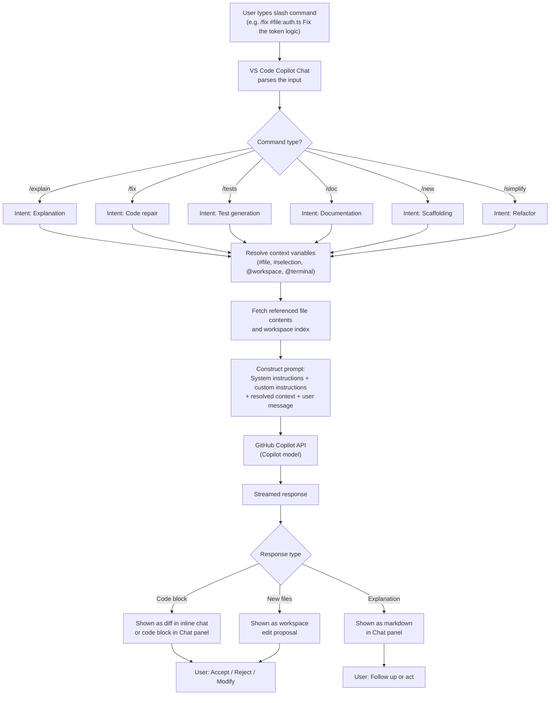

# GitHub Copilot Slash Commands — Complete Guide

Slash commands are short-form directives you type in the GitHub Copilot Chat panel or inline chat to trigger specific, well-defined behaviors. Instead of writing a natural-language prompt from scratch, you prefix your message with a `/command` keyword, and Copilot interprets it as an instruction to explain, fix, generate tests, create documentation, scaffold new code, or simplify existing code.

---

## Where Slash Commands Work

| Environment | Slash Commands Available | Notes |
|---|---|---|
| VS Code — Chat panel (`Ctrl+Alt+I` / `Cmd+Option+I`) | Yes — full set | Primary interface; retains multi-turn context |
| VS Code — Inline chat (`Ctrl+I` / `Cmd+I`) | Yes — full set | Opens in the editor, scoped to selection or cursor position |
| GitHub.com — Copilot Chat (browser) | Yes | Same built-ins; no extension commands unless configured |
| JetBrains IDEs (IntelliJ, PyCharm, etc.) | Yes — via Copilot plugin | Chat panel; inline chat via `Alt+\` |
| GitHub CLI (`gh copilot`) | Partial | `gh copilot explain` and `gh copilot suggest` map to similar intents |
| Visual Studio 2022 | Yes — via Copilot extension | Chat panel; same built-in commands |
| Neovim | Limited | Community plugins; official support varies |

---

## The 7 Built-In Slash Commands

### `/explain` — Understand Code

Asks Copilot to explain what selected code, a file, or a concept does. Works best when you tell Copilot _what_ you want explained: the algorithm, the side effects, the data flow, the performance characteristics, and so on.

**Basic usage:**
```
/explain What does this function do and what are its edge cases?
```

**With selection context:** Select a block of code in the editor, open inline chat, and type:
```
/explain Walk me through this line by line. I'm especially confused about the reduce call.
```

**With a file reference:**
```
/explain #file:src/auth/jwt.service.ts What is the token refresh flow?
```

**With workspace context:**
```
/explain @workspace How does authentication flow from the frontend login form to the database?
```

See [explain-with-context.md](./explain-with-context.md) for detailed examples.

---

### `/fix` — Correct Broken or Problematic Code

Asks Copilot to identify and repair bugs, type errors, failed tests, or security issues. Copilot proposes a diff you can accept, reject, or modify.

**Basic usage (with selection):**
```
/fix The test below is failing with: TypeError: Cannot read properties of undefined (reading 'id')
```

**For TypeScript type errors:**
```
/fix #file:src/models/user.ts Fix all TypeScript strict-mode errors in this file
```

**For a security issue:**
```
/fix This SQL query is vulnerable to injection. Rewrite it using parameterized queries.
```

See [fix-with-selection.md](./fix-with-selection.md) for detailed examples.

---

### `/tests` — Generate Tests

Asks Copilot to write unit tests, integration tests, or edge-case tests for selected code. You can specify the framework, style, and coverage requirements.

**Basic usage:**
```
/tests Generate Jest unit tests for this function, including edge cases.
```

**Specifying framework:**
```
/tests Write pytest tests for this class. Use fixtures and parametrize for multiple inputs.
```

**For edge cases only:**
```
/tests Focus only on boundary conditions: empty input, null values, and integer overflow.
```

See [generate-tests.md](./generate-tests.md) for detailed examples.

---

### `/doc` — Generate Documentation

Asks Copilot to write JSDoc, docstrings, inline comments, or higher-level README-style documentation for selected code.

**Basic usage:**
```
/doc Add JSDoc to this function including @param, @returns, and @throws.
```

**For a class:**
```
/doc Generate full class-level documentation for this TypeScript class.
```

**For a module:**
```
/doc #file:src/payments/index.ts Write a module-level README explaining what this module exports and how to use it.
```

See [generate-docs.md](./generate-docs.md) for detailed examples.

---

### `/new` — Scaffold New Code

Asks Copilot to generate a new file, component, class, or module from a description. Unlike other commands, `/new` creates net-new content rather than modifying existing code.

**Basic usage:**
```
/new Create a React functional component called UserProfileCard that accepts a user prop with name, email, and avatarUrl fields.
```

**For a backend endpoint:**
```
/new Scaffold an Express route handler for POST /api/v1/orders. It should validate the request body, call an OrderService, and return 201 on success.
```

**For a Python class:**
```
/new Create a Python dataclass representing a Product with id, name, price, and inventory_count. Include validation in __post_init__.
```

See [new-component.md](./new-component.md) for detailed examples.

---

### `/simplify` — Reduce Complexity

Asks Copilot to refactor code to be more readable, idiomatic, or concise — without changing its behavior. Use this when code is functionally correct but hard to read or maintain.

**Basic usage:**
```
/simplify This nested if-else chain is hard to follow. Rewrite it more clearly.
```

**For verbose iteration:**
```
/simplify Replace this manual loop with idiomatic array methods.
```

**For repeated logic:**
```
/simplify Extract the repeated validation logic into a helper function.
```

See [simplify-refactor.md](./simplify-refactor.md) for detailed examples.

---

### `/clear` — Reset the Chat Context

Clears the current conversation history in the Chat panel. Use this when you want to start a fresh context — for example, when switching from debugging one file to working on an unrelated feature.

```
/clear
```

There are no arguments for `/clear`. It simply wipes the current session's message history so subsequent prompts are not influenced by earlier turns.

> **Note:** Clearing the chat does not affect your open files, selections, or any code Copilot already generated. It only removes the conversation history that informs future responses.

---

## Combining Slash Commands with Chat Variables

Slash commands become significantly more powerful when combined with context variables. These let you attach specific code, files, or environment state to your request.

### `#selection`

Refers to the currently selected text in the active editor. When you open inline chat with text selected, `#selection` is attached automatically.

```
/explain #selection Why does this regex allow empty strings?
```

### `#file:path/to/file`

Attaches the full content of a specific file to your request. Useful when the code you are asking about spans multiple locations or when you want Copilot to see the full module rather than a snippet.

```
/fix #file:src/services/payment.service.ts Fix the error handling in the charge method.
```

### `@workspace`

Searches across the entire open workspace for relevant context. Copilot uses its understanding of your project structure to inform the response. Best used for architectural questions or cross-cutting concerns.

```
/explain @workspace How does the caching layer interact with the database layer?
```

### `@terminal`

Attaches the current terminal output to your request. Extremely useful for interpreting error messages, stack traces, or test failures.

```
/fix @terminal The test suite failed with the output above. Fix the broken test.
```

### `#editor`

Refers to the entire content of the currently active editor file (not just a selection).

```
/explain #editor Give me a high-level summary of what this file does.
```

### Combining Multiple Variables

You can combine variables in a single command to give Copilot richer context:

```
/fix #file:src/api/routes.ts #file:src/models/order.ts
The route handler is failing because of a model mismatch. Fix the route to match the model.
```

```
/tests #file:src/utils/currency.ts #file:src/utils/currency.test.ts
The existing tests cover the happy path. Add tests for negative amounts, NaN, and currency overflow.
```

---

## Extension-Defined Slash Commands

In addition to the seven built-in commands, GitHub Copilot Extensions can contribute their own slash commands. Extensions are third-party tools (or internal tools your organization builds) that integrate with Copilot Chat via the GitHub Copilot Extensions API.

### How to Use Extension Commands

Extension-defined commands are accessed by `@mention`ing the extension first, then using a slash command or natural-language prompt:

```
@docker /run Explain why my container keeps restarting.
```

```
@sentry /explain Show me the stack trace for the most recent error in production.
```

```
@datadog /logs Are there any anomalies in the last hour of production traffic?
```

```
@your-internal-tool /deploy What is the current deployment status for the staging environment?
```

### How Extension Commands Differ from Built-Ins

| Built-in Commands | Extension Commands |
|---|---|
| Available everywhere Copilot Chat is available | Only available if the extension is installed and enabled |
| `/explain`, `/fix`, `/tests`, etc. | Defined by the extension (e.g., `/run`, `/deploy`, `/scan`) |
| No `@mention` required | Must `@mention` the extension name first |
| Maintained by GitHub | Maintained by the extension's authors |
| Free with Copilot subscription | May require separate licensing |

### Finding Available Extensions

Visit the [GitHub Marketplace](https://github.com/marketplace?type=apps&copilot_app=true) and filter for Copilot Extensions. Your organization admin can also install private extensions for internal tools.

### Building Your Own Extension

If no existing extension meets your needs, you can build one. This requires:
1. Registering a GitHub App
2. Implementing a webhook endpoint that handles Copilot API messages
3. Publishing the extension (publicly on Marketplace, or privately to your org)

This is significant engineering work — see the [GitHub Copilot Extensions documentation](https://docs.github.com/en/copilot/using-github-copilot/copilot-extensions) for the full guide.

---

## Inline Chat vs. Chat Panel

These are two different surfaces for interacting with Copilot. Understanding which to use for which task makes you significantly more productive.

### Inline Chat (`Ctrl+I` / `Cmd+I`)

Opens directly inside the editor at your cursor or selection.

**Best for:**
- Focused, in-place edits: fixing a single function, adding a docstring, simplifying a block
- Quick questions about the code in front of you
- Accepting or rejecting a specific code change without switching context

**Characteristics:**
- Changes are shown as an inline diff that you can accept (`Tab`) or discard (`Escape`)
- Context is limited to what is visible in the editor (or your selection)
- Does not retain multi-turn history after you close it
- Keyboard-driven workflow; never requires switching to a sidebar

**Typical inline chat workflow:**
1. Select a function you want to fix
2. Press `Ctrl+I` (or `Cmd+I` on macOS)
3. Type `/fix The return type is wrong here`
4. Review the inline diff
5. Accept with `Tab` or discard with `Escape`

### Chat Panel (`Ctrl+Alt+I` / `Cmd+Option+I`)

Opens as a persistent sidebar panel, separate from the editor.

**Best for:**
- Multi-turn conversations where each answer informs the next question
- Architectural questions that require understanding the whole codebase
- Tasks that span multiple files
- Generating entirely new components or modules

**Characteristics:**
- Retains full conversation history for the session (until you `/clear` it)
- Supports `@workspace`, `@terminal`, and multi-file `#file` references
- Generated code is inserted via "Insert at cursor" or "Copy" buttons — not as an automatic diff
- Better for exploratory work where you want to ask follow-up questions

**Typical chat panel workflow:**
1. Open the Chat panel with `Ctrl+Alt+I`
2. Ask: `/explain @workspace How does the authentication middleware work?`
3. Follow up: "What would happen if I removed the token expiry check?"
4. Follow up: `/fix #file:src/middleware/auth.ts Add the missing expiry validation`
5. Copy the generated code and paste it into your file

---

## How a Slash Command Flows

The diagram below shows what happens from the moment you submit a slash command to when you receive a response.



---

## Limitations

### No Custom Slash Commands Without Building a Copilot Extension

GitHub Copilot does not let you define your own `/mycommand` shortcuts in settings or configuration files. The seven built-in commands are fixed, and there is no equivalent of a "custom commands" directory.

**Your options if you need custom commands:**

1. **Build a Copilot Extension** — Requires registering a GitHub App, implementing a webhook, and publishing the extension. Significant engineering work; suitable for team-wide tooling.

2. **Use custom instructions** — Write persistent instructions in `.github/copilot-instructions.md` or VS Code settings to shape how existing commands respond. Does not add new commands, but changes behavior. See the [custom instructions guide](../02-custom-instructions/README.md).

3. **Use VS Code prompt files** — VS Code supports `*.prompt.md` files (experimental in some versions) that let you save and re-run complex prompts.

4. **Use VS Code Snippets** — For frequently typed prompts, create editor snippets that expand a short prefix into a full prompt template.

### Context Window Limits

Attaching many large `#file` references can exceed the model's context budget. When this happens, Copilot may silently truncate or omit content. Prioritize smaller, more targeted file attachments.

### No Persistent Chat History

There is no built-in way to recall previous chat sessions after you close VS Code. Use `/export` (if available in your version) or manually copy important conversations.

### Commands Cannot Be Chained

You cannot run `/fix && /tests` in a single turn. Commands run one per message. See [chaining-commands.md](./chaining-commands.md) for multi-turn workflow patterns that achieve the same goal.

### Inline Chat Does Not Persist

Inline chat context is lost when you close it. If you start a fix in inline chat and realize you need a longer conversation, switch to the Chat panel.

---

## Quick Reference

| Command | What It Does | Best Combined With |
|---|---|---|
| `/explain` | Explains what code does, how it works | `#selection`, `#file`, `@workspace` |
| `/fix` | Repairs bugs, type errors, security issues | `#selection`, `#file`, `@terminal` |
| `/tests` | Generates unit and integration tests | `#selection`, `#file` |
| `/doc` | Generates JSDoc, docstrings, or READMEs | `#selection`, `#file` |
| `/new` | Scaffolds new files, components, classes | Custom instructions, natural description |
| `/simplify` | Reduces complexity, improves readability | `#selection` |
| `/clear` | Resets the chat context | — |

---

## Further Reading

- [explain-with-context.md](./explain-with-context.md) — Deep-dive examples for `/explain`
- [fix-with-selection.md](./fix-with-selection.md) — Deep-dive examples for `/fix`
- [generate-tests.md](./generate-tests.md) — Deep-dive examples for `/tests`
- [generate-docs.md](./generate-docs.md) — Deep-dive examples for `/doc`
- [new-component.md](./new-component.md) — Deep-dive examples for `/new`
- [simplify-refactor.md](./simplify-refactor.md) — Deep-dive examples for `/simplify`
- [chaining-commands.md](./chaining-commands.md) — Multi-command workflows
- [GitHub Copilot Chat documentation](https://docs.github.com/en/copilot/using-github-copilot/copilot-chat/asking-github-copilot-questions-in-your-ide)
