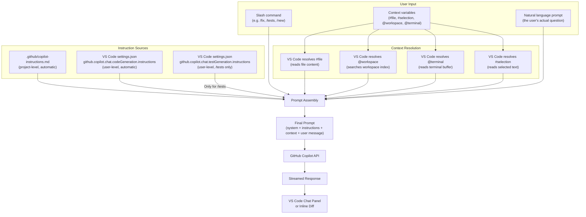

# GitHub Copilot Custom Instructions — Complete Guide

Custom instructions are persistent context that you write once and that automatically shapes every Copilot Chat response in your repository or VS Code profile. Instead of repeating "use TypeScript strict mode" or "write tests with Jest" in every prompt, you put it in your instructions once and Copilot applies it silently.

---

## What Custom Instructions Are

When you ask Copilot a question, it builds a prompt behind the scenes. That prompt includes your message, any context variables you attached (`#file`, `#selection`, etc.), and — if you have them configured — your custom instructions. Those instructions are injected into every interaction automatically.

Custom instructions are best suited for:

- **Code style rules:** "Use 2-space indentation. Never use tabs."
- **Naming conventions:** "Database tables use snake_case. TypeScript types use PascalCase."
- **Framework preferences:** "Always use React functional components. Never class components."
- **Testing requirements:** "Write tests with Jest. Use `describe`/`it` blocks. Aim for 80% coverage."
- **Forbidden patterns:** "Never use `any` in TypeScript. Never commit console.log statements."
- **Language of response:** "Always respond in English even if I write in another language."

---

## Two Levels of Custom Instructions

### Level 1: Project-Level Instructions

**File:** `.github/copilot-instructions.md` in your repository root

This file is loaded automatically for all Copilot Chat interactions that occur within the repository. Every contributor who has Copilot will have these instructions applied — it is a team-level configuration.

**Creating the file:**
```bash
mkdir -p .github
touch .github/copilot-instructions.md
```

Write it in plain Markdown. There is no special front matter required. Copilot reads the file content directly.

**Scope:** Applies to all interactions in this repository. Does not affect other repositories.

**Token budget:** The file contents count toward the context window. Keep it under approximately 8,000 characters to avoid crowding out your actual code context. Be concise: bullet points over paragraphs.

**Format guidance:**
- Use headings to organize sections
- Use bullet points rather than prose
- Prefer prescriptive ("Use X") over descriptive ("We use X because...")
- Avoid repeating things that are already enforced by your linter or tsconfig

See [project-copilot-instructions.md](./project-copilot-instructions.md) for a production-ready template.

---

### Level 2: User-Level Instructions (VS Code Settings)

These apply globally across all repositories in your VS Code profile. They are personal preferences that follow you across projects.

**Two separate settings:**

1. **`github.copilot.chat.codeGeneration.instructions`** — Applied to all code generation requests (including `/fix`, `/new`, `/simplify`, `/doc`).

2. **`github.copilot.chat.testGeneration.instructions`** — Applied specifically to test generation requests (`/tests`).

Each setting is an array of instruction objects. Each object has either a `text` property (inline instruction text) or a `file` property (path to a file containing instructions).

**Locating the settings in VS Code:**
1. Open the Command Palette (`Ctrl+Shift+P` / `Cmd+Shift+P`)
2. Type `Preferences: Open User Settings (JSON)`
3. Add the settings inside the root object

Or navigate via the Settings UI:
1. Open Settings (`Ctrl+,` / `Cmd+,`)
2. Search for `copilot instructions`
3. Click "Edit in settings.json" for each setting

See [personal-instructions-vscode.jsonc](./personal-instructions-vscode.jsonc) for a complete example.

---

## How Project Instructions Are Loaded

When you open Copilot Chat in VS Code within a repository:

1. VS Code detects the open workspace root
2. It looks for `.github/copilot-instructions.md` in the workspace root
3. If found, the file content is read and injected into the system prompt for every Copilot Chat interaction
4. This is automatic — no manual step or command is needed
5. If the file changes on disk, the changes take effect on the next chat interaction (no restart needed)

**The instructions are loaded on every interaction**, not cached for the session. This means you can edit them mid-session and the next message will use the updated instructions.

**What "all chat interactions" means:**
- Chat panel prompts
- Inline chat prompts (`Ctrl+I`)
- `/explain`, `/fix`, `/tests`, `/doc`, `/new`, `/simplify`
- Follow-up messages in a multi-turn conversation

**What the instructions do NOT affect:**
- Ghost text (the autocomplete that appears as you type) — that is driven by a different model and does not use chat instructions
- GitHub.com Copilot Chat — project instructions from `.github/copilot-instructions.md` apply there too, but VS Code user-level settings do not

---

## What Works Well in Instructions

The following types of instructions reliably improve Copilot's output:

### Code Style
```markdown
- Use 2-space indentation everywhere. Never use tabs.
- Maximum line length is 100 characters.
- Always include trailing commas in multi-line objects and arrays.
- Use single quotes for strings in JavaScript/TypeScript. Use double quotes in JSON.
```

### Naming Conventions
```markdown
- Files: kebab-case (e.g., user-profile.service.ts)
- TypeScript classes and interfaces: PascalCase
- Functions and variables: camelCase
- Constants: UPPER_SNAKE_CASE
- Database tables and columns: snake_case
- React components: PascalCase, named exports only
```

### Testing Framework
```markdown
- Write tests with Jest and React Testing Library
- Use describe/it block structure (not test())
- Test file names: *.test.ts co-located with source files
- Minimum 80% branch coverage
- Mock external dependencies, not internal ones
```

### Language Preferences
```markdown
- Use TypeScript with strict mode for all new code
- Use async/await over .then() chains
- Prefer functional patterns (map, filter, reduce) over imperative loops
- Use const by default; use let only when reassignment is necessary
- Never use var
```

### Forbidden Patterns
```markdown
- Never use TypeScript's `any` type. Use `unknown` if the type is truly unknown.
- Never use console.log in production code. Use the project's logger utility.
- Never hardcode credentials, API keys, or connection strings.
- Never use setTimeout for synchronization (use proper async patterns).
```

---

## What Does Not Work Well in Instructions

### Instructions That Conflict with Copilot's Safety Guidelines

Copilot has built-in constraints around generating certain types of content (e.g., code that looks like malware, instructions for illegal activities). Custom instructions cannot override these.

### Instructions That Are Too Long or Vague

**Too long:** A 15,000-character instruction file causes two problems: it consumes most of the context window, leaving little room for your actual code; and Copilot tends to give less weight to instructions buried in a long document. Keep instructions under 8,000 characters.

**Too vague:** "Write clean code" does not shape behavior. "Use descriptive variable names with a minimum of 3 characters; never use single-letter variable names except for loop indices `i`, `j`, `k`" is actionable.

### Instructions That Contradict Each Other

If your project instructions say "always use functional components" and your user-level instructions say "prefer class components," Copilot will resolve the conflict unpredictably. Review your instructions at both levels for contradictions.

### Instructions About Things That Don't Exist Yet

"Always import from the `@myorg/design-system` package" works if that package is installed. If it is not, Copilot will still try to follow the instruction, generating code that does not compile. Instructions should reflect the actual state of the project.

---

## No `/init` Equivalent — Creation Recipe

Unlike some AI coding tools, GitHub Copilot does not have an equivalent of `/init` that automatically generates a starter instruction file. You must create `.github/copilot-instructions.md` manually.

**Recipe for a new project:**

1. Create the file:
   ```bash
   mkdir -p .github
   touch .github/copilot-instructions.md
   ```

2. Add the core sections (copy from [project-copilot-instructions.md](./project-copilot-instructions.md) and customize):
   - Project overview (1–2 lines)
   - Tech stack
   - Code style rules
   - Naming conventions
   - Testing framework and requirements
   - Forbidden patterns

3. Verify it is loaded — open Copilot Chat and ask:
   ```
   What testing framework does this project use?
   ```
   If Copilot answers "Jest" (or whatever you specified), the instructions are being loaded.

4. Commit and push so teammates benefit:
   ```bash
   git add .github/copilot-instructions.md
   git commit -m "chore: add GitHub Copilot custom instructions"
   ```

---

## Difference vs. CLAUDE.md (Claude Code)

If you have used Anthropic's Claude Code, you are familiar with `CLAUDE.md`. The two systems are conceptually similar but differ in important ways:

| Feature | GitHub Copilot `.github/copilot-instructions.md` | Claude Code `CLAUDE.md` |
|---|---|---|
| **Scope** | One flat file for the whole repository | Hierarchical: root `CLAUDE.md` + per-directory `CLAUDE.md` files |
| **File imports** | Not supported | `@path/to/file` imports supported |
| **Directory scoping** | Not supported | A `CLAUDE.md` in `src/api/` applies only to that subtree |
| **Format** | Plain Markdown | Markdown with `@file` import syntax |
| **Loading** | Automatic for all chat interactions | Automatic; directory-level files merged with root |
| **User-level overrides** | VS Code settings (`settings.json`) | `~/.claude/CLAUDE.md` |

**The key limitation for Copilot:** There is no way to have different instructions for `src/api/` vs. `src/frontend/` at the file system level. The single `.github/copilot-instructions.md` applies to the entire repository.

See [scoped-instructions-api.md](./scoped-instructions-api.md) for workarounds.

---

## How Instructions + Context Flow into Copilot

The diagram below shows how the different instruction sources and context variables combine into the final prompt that Copilot processes.



---

## Quick Reference

| What you want | Where to configure it |
|---|---|
| Rules that apply to the whole team | `.github/copilot-instructions.md` |
| Personal preferences across all projects | VS Code `settings.json` — `codeGeneration.instructions` |
| Personal test style preferences | VS Code `settings.json` — `testGeneration.instructions` |
| Subsystem-specific rules | Workarounds — see [scoped-instructions-api.md](./scoped-instructions-api.md) |

---

## Further Reading

- [project-copilot-instructions.md](./project-copilot-instructions.md) — Production-ready template for `.github/copilot-instructions.md`
- [personal-instructions-vscode.jsonc](./personal-instructions-vscode.jsonc) — VS Code settings.json snippet
- [scoped-instructions-api.md](./scoped-instructions-api.md) — Workarounds for directory-level scoping
- [GitHub Copilot custom instructions documentation](https://docs.github.com/en/copilot/customizing-copilot/adding-custom-instructions-for-github-copilot)
