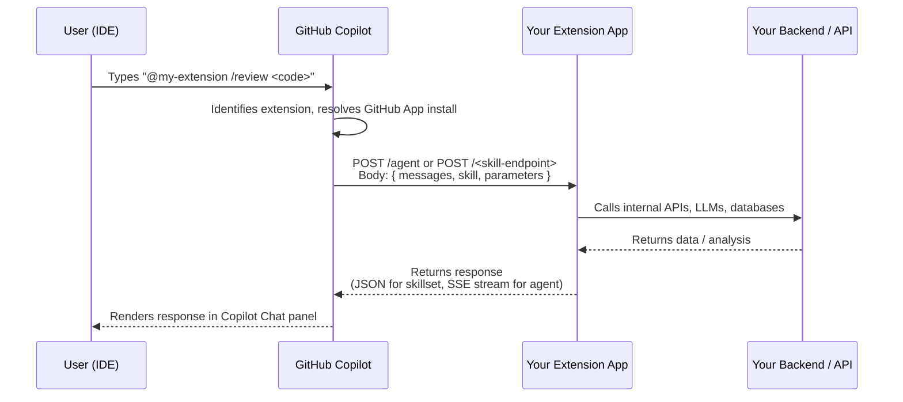

# GitHub Copilot Extensions

GitHub Copilot Extensions let you bring custom agents, tools, and data sources directly into Copilot Chat. Instead of switching between your IDE and a separate tool, you interact with your internal services, cloud providers, databases, and third-party APIs through natural language — right in the chat panel.

Extensions are distributed as GitHub Apps and invoked with `@mentions`. When a user types `@my-extension`, GitHub routes the message to the app's endpoint, the app processes it, and the response appears in Copilot Chat as if Copilot itself answered.

---

## Two Types of Extensions

### Skillset Extensions

Skillset extensions are **declarative**. You define a set of named skills in a YAML manifest, each backed by an HTTP endpoint. GitHub Copilot handles all conversation management — routing the user's message to the right skill, formatting the response, and maintaining chat history. You write the endpoint logic; Copilot writes the chat glue.

**Best for:** discrete tool calls — look up a ticket, check deployment status, run a linter, fetch documentation.

**Key properties:**
- No streaming required — return a plain JSON response
- GitHub manages turn-taking and context
- Simpler to build and host
- Lower operational complexity

### Agent Extensions

Agent extensions give you **full conversational control**. Your server receives the entire messages array (system prompt + conversation history) and streams a response back using Server-Sent Events. You decide how to interpret the conversation, what tools to call internally, and what to say next.

**Best for:** multi-turn reasoning, complex workflows that require planning, integrations that need to call multiple downstream APIs before answering.

**Key properties:**
- You manage the system prompt and conversation context
- Responses must be streamed as SSE
- More powerful, more responsibility
- Can incorporate any LLM or reasoning engine on the backend

---

## How Users Invoke Extensions

Users invoke extensions with an `@mention` in the Copilot Chat input box:

```
@my-extension /skill-name argument
```

For example:

```
@code-reviewer /review — here is the function I want reviewed:

function parseDate(input) {
  return new Date(input);
}
```

Or for an agent extension without a named skill:

```
@deploybot what's the current status of the production environment?
```

**Important distinction from Claude Code:** Claude Code Skills are auto-invoked when the AI decides they are relevant. Copilot Extensions are **never auto-invoked** — the user must always type the `@mention` explicitly. There is no automatic skill dispatch in the Copilot Extensions model.

---

## Invocation Flow

The following sequence diagram shows what happens from the moment a user sends a message mentioning your extension to the moment they see a response.



For skillset extensions, the flow is synchronous — the app returns a JSON body. For agent extensions, the response is a long-lived SSE stream that GitHub progressively renders as chunks arrive.

---

## Mapping from Claude Code Concepts

If you are familiar with Claude Code's extensibility model, this table maps the concepts you already know to their Copilot Extensions equivalents.

| Claude Code Concept | Copilot Extensions Equivalent | Key Difference |
|---|---|---|
| **Skills** (auto-invoked by the AI when relevant) | **Skillset extensions** (user must `@mention`) | No auto-invoke in Copilot; user must explicitly address the extension |
| **Subagents** (delegated tasks, full context control) | **Agent extensions** (full conversational control, streamed) | Agent extensions stream SSE; Claude Code subagents are synchronous tool calls |
| **MCP Servers** (live data tools via the MCP protocol) | **Skillset extensions with HTTP endpoints** | Copilot Extensions do NOT implement the MCP protocol; HTTP endpoints only |
| **Slash commands** (`/command`) | **Skill invocations** (`@ext /skill`) | Skill invocations are scoped to a specific extension |

### On MCP and Copilot Extensions

This is a common source of confusion: **GitHub Copilot Extensions do not use the Model Context Protocol (MCP)**. MCP is Anthropic's open standard for connecting AI assistants to external data sources. Copilot Extensions use a different, GitHub-specific protocol: your app registers an HTTPS endpoint, GitHub sends a signed POST request, and your app returns JSON (skillset) or streams SSE (agent).

If you want to expose MCP servers to GitHub Copilot, watch the GitHub roadmap — as of early 2026, GitHub has announced plans to integrate MCP support separately from the Extensions API.

---

## Finding and Installing Extensions

### From the GitHub Marketplace

1. Open [github.com/marketplace?type=apps&copilot_app=true](https://github.com/marketplace?type=apps&copilot_app=true)
2. Browse or search for extensions
3. Click an extension to open its Marketplace listing
4. Click **Install** and choose which organizations or repositories to grant access
5. Complete any OAuth authorization the extension requires

### In VS Code

1. Open Copilot Chat (`Ctrl+Shift+I` / `Cmd+Shift+I`)
2. Click the `@` button or type `@` in the chat input
3. Select **Browse extensions** — this opens the Marketplace filtered to Copilot-compatible apps
4. Install directly from there

### In GitHub.com (github.com/copilot)

1. In Copilot Chat on github.com, type `@` in the input box
2. A dropdown shows your installed extensions
3. To add more, click the extension icon in the panel header

---

## Prerequisites for Building an Extension

Before you can publish or test an extension, you need:

### 1. A GitHub App

GitHub Apps are the foundation of Copilot Extensions. Your extension is a GitHub App that has the Copilot Chat integration enabled.

**To create one:**
1. Go to **GitHub Settings → Developer Settings → GitHub Apps → New GitHub App**
2. Fill in: App name, Homepage URL, Webhook URL (your server's `/events` endpoint)
3. Under **Permissions**, add **Copilot Chat: Read** (for skillsets) or **Copilot Chat: Read & Write** (for agents)
4. Generate a **Private Key** — you'll use this to verify incoming requests

### 2. OAuth App Setup (for user-level auth)

If your extension needs to act on behalf of the user (e.g., access their private repos, post comments as them), you also need OAuth configured:

1. In your GitHub App settings, enable **User authorization callbacks**
2. Set the **Callback URL** to your server's `/auth/callback` endpoint
3. Store the `client_id` and generate a `client_secret`

### 3. Request Verification

GitHub signs every request to your extension with a header. You must verify this signature to ensure the request is genuine:

```javascript
const crypto = require('crypto');

function verifyGitHubSignature(req, secret) {
  const signature = req.headers['x-github-public-key-signature'];
  const keyId = req.headers['x-github-public-key-identifier'];
  // GitHub uses ECDSA P-256 signatures — see the official docs for full verification
  // https://docs.github.com/en/copilot/building-copilot-extensions/building-a-copilot-agent-for-your-copilot-extension
}
```

---

## Development vs. Production

### Local Development with ngrok

While developing your extension, you need a public HTTPS URL that GitHub can reach. Use ngrok (or any tunnel) to expose your local server:

```bash
# Install ngrok
npm install -g ngrok   # or: brew install ngrok

# Start your local extension server
node index.js &

# Open a tunnel to port 3000
ngrok http 3000
```

ngrok will print a public URL like `https://abc123.ngrok.io`. Use that as your GitHub App's webhook URL during development.

**Workflow:**
1. Edit your extension code locally
2. Restart the local server
3. Test by typing `@your-extension` in Copilot Chat (the tunnel forwards the request to your laptop)
4. Iterate until it works, then deploy to production

### Production Deployment

For production, deploy your extension to any platform that serves HTTPS:

- **Railway**: `railway up` — auto-deploys from GitHub, provides a stable HTTPS domain
- **Render**: Connect your repo, click deploy — free tier available
- **Fly.io**: `fly launch` then `fly deploy` — good for low-latency apps
- **Any VPS**: Deploy behind nginx/Caddy with a TLS certificate from Let's Encrypt

Update your GitHub App's webhook URL to the production domain once deployed.

---

## Security Considerations

- **Always verify request signatures.** GitHub signs every request. Reject anything that doesn't verify.
- **Never log the full request body** in production if it contains user code or conversation history.
- **Scope permissions minimally.** Only request the GitHub permissions your extension actually needs.
- **Use environment variables** for all secrets — never hardcode client IDs, private keys, or API keys.
- **Rate limit your endpoints.** Copilot can send many requests quickly during an active chat session.

---

## Next Steps

- [Build a skillset extension](./skillset-extension-scaffold/README.md)
- [Build an agent extension](./agent-extension-scaffold/README.md)
- [Complete code review extension example](./code-review-extension.md)
- [Browse Marketplace extensions](./marketplace-extensions.md)
- [Official GitHub Copilot Extensions docs](https://docs.github.com/en/copilot/building-copilot-extensions)
