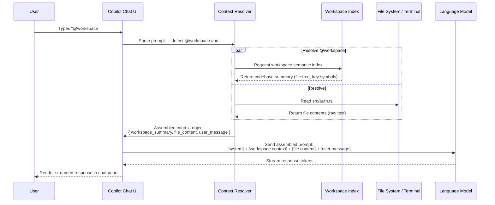

# GitHub Copilot Chat Variables

Chat variables are tokens you embed in your Copilot Chat prompts to attach specific context. Without them, Copilot only knows what you type in the message box. With them, Copilot can see your code, your terminal, your open files, your entire codebase, and even your GitHub repository data.

Think of chat variables as a way to answer the question: "Context for what?"

---

## Two Categories

Chat variables fall into two categories:

**Chat Participants** — addressable agents prefixed with `@`. They route your message to a specialized AI that has access to a specific domain:

| Participant | Domain |
|---|---|
| `@workspace` | Your entire codebase |
| `@terminal` | Your active terminal session |
| `@vscode` | VS Code settings, features, and shortcuts |
| `@github` | GitHub data: issues, PRs, repositories, code search |

**Context Variables** — attachments prefixed with `#`. They paste specific content into your prompt's context window:

| Variable | Attaches |
|---|---|
| `#file` | A specific file's content |
| `#selection` | The text currently selected in the editor |
| `#codebase` | Semantic search results over your codebase |
| `#terminalSelection` | Selected text from the active terminal |
| `#terminalLastCommand` | The last command run + its output |

---

## Chat Participants

### @workspace

`@workspace` instructs Copilot to index your open workspace (folder or project) before answering. It builds a semantic understanding of your codebase — file structure, imports, function names, class hierarchies — and uses that to answer high-level questions.

**Best for:**
- Architecture questions ("how does the auth system work?")
- Finding where something is implemented
- Impact analysis before a change
- Onboarding: understanding unfamiliar codebases

**Example prompts:**
```
@workspace where does the application validate JWT tokens?
@workspace what are all the places we interact with the Stripe API?
@workspace explain the relationship between the User model and the Session model
```

**Limitations:**
- @workspace analyzes statically — it does not run code
- Very large codebases (millions of lines) may not be fully indexed
- It is best for high-level questions; for file-specific analysis, use `#file`

---

### @terminal

`@terminal` gives Copilot access to the content of your active VS Code integrated terminal. It can read what you see in the terminal: command output, error messages, build logs, and the shell prompt.

**Best for:**
- Debugging failed shell commands or build errors
- Explaining stack traces or error output
- Getting suggestions for what to run next

**Example prompts:**
```
@terminal why did the last command fail?
@terminal what should I run to fix this dependency conflict?
@terminal explain the error in the terminal output
```

**Important:** @terminal is read-only. It reads the terminal content; it does not execute commands. If Copilot suggests a fix, you must run it yourself.

---

### @vscode

`@vscode` answers questions about VS Code itself: its features, settings, keyboard shortcuts, and extension API. It is useful when you want to configure the editor or learn about built-in functionality.

**Best for:**
- Finding the right setting to change behavior
- Looking up keyboard shortcuts
- Understanding VS Code extension development

**Example prompts:**
```
@vscode how do I configure auto-save to trigger after 1 second of inactivity?
@vscode what's the keyboard shortcut to move a line up or down?
@vscode how do I add a snippet for a specific language?
```

---

### @github

`@github` connects Copilot to your GitHub account data. It can read issues, pull requests, repository information, and run code search across GitHub. It requires you to be signed into GitHub in VS Code.

**Best for:**
- Checking issue status without leaving the editor
- Summarizing PR descriptions and reviews
- Finding code examples in public repos

**Example prompts:**
```
@github what issues are assigned to me this sprint?
@github summarize the changes in PR #234
@github find examples of how people implement JWT refresh token rotation in Node.js
```

---

## Context Variables

### #file

`#file` attaches the full content of a specific file to your prompt. Use it when you want Copilot to analyze or reason about a particular file's code.

**Syntax:** `#file:path/to/file.ts` or type `#file` and use the autocomplete picker.

**Example prompts:**
```
#file:src/auth/jwt.ts are there any security issues in this JWT implementation?
#file:src/models/user.ts explain the database schema for users
#file:tests/auth.test.ts what edge cases are missing from these tests?
```

You can attach multiple files in one prompt — see [file-context-patterns.md](./file-context-patterns.md) for detailed examples.

---

### #selection

`#selection` attaches whatever text is currently selected in the active editor to your prompt. It is useful when you want to ask about a specific function or block without typing or copying the code.

**How to use:** Select code in the editor, then type your prompt with `#selection`:

```
#selection explain what this regular expression matches
#selection what does this function return when the input is null?
#selection convert this to use async/await instead of callbacks
```

---

### #codebase

`#codebase` performs a semantic search over your workspace and attaches the most relevant results to your prompt. Unlike `@workspace` which indexes everything, `#codebase` retrieves only the code most semantically related to your question.

**Best for:** Targeted questions where you want Copilot to find the relevant code rather than reading the whole prompt.

```
#codebase how does the payment retry logic work?
#codebase show me all the database migration helpers
```

**@workspace vs. #codebase:**
- `@workspace` — asks the workspace-aware agent to answer your whole question
- `#codebase` — fetches relevant code snippets and adds them to your prompt context for any agent to use

---

### #terminalSelection

`#terminalSelection` attaches text you have selected in the terminal panel to your prompt. Useful when you want to ask about a specific part of a long log output, not the whole terminal.

**How to use:** Select text in the terminal, then:

```
#terminalSelection what does this error mean?
#terminalSelection is this warning something I should fix?
```

---

### #terminalLastCommand

`#terminalLastCommand` attaches the most recent command you ran plus its complete output. It is the fastest way to ask "what went wrong?" after a command fails.

```
@terminal #terminalLastCommand why did this fail and how do I fix it?
#terminalLastCommand what does this output mean?
```

---

## Combining Multiple Variables

You can use multiple variables in a single prompt. Copilot will use all the provided context together.

```
@workspace #file:src/auth.ts are there other files in the project that implement authentication differently?
```

```
I ran the migration but it errored. @terminal #file:migrations/20240315_add_index.sql what went wrong?
```

```
#file:src/models/user.ts #file:src/routes/users.ts does the route layer correctly use the User model's validation?
```

See [combining-variables.md](./combining-variables.md) for patterns and anti-patterns when combining variables.

---

## Context Window Budget

Each variable consumes tokens from Copilot's context window. When the total context (conversation history + all attached variables) exceeds the model's limit, Copilot will summarize or truncate earlier parts of the conversation.

**Approximate token costs:**

| Variable | Approximate token cost |
|---|---|
| `@workspace` | ~1,000–3,000 tokens (summary index) |
| `#file` (small file, <100 lines) | ~500–2,000 tokens |
| `#file` (large file, 500+ lines) | ~5,000–15,000 tokens |
| `#selection` (a few lines) | ~100–500 tokens |
| `#codebase` (3–5 results) | ~1,500–4,000 tokens |
| `#terminalLastCommand` | ~200–2,000 tokens (depends on output length) |

**Practical rules:**
- Prefer `#selection` over `#file` when you only care about a small part of a file
- Use `#codebase` when you are not sure which file is relevant — it retrieves only what matters
- Avoid attaching more than 3–4 large files at once; responses become unfocused
- Use `@workspace` for architecture questions, not for "analyze this specific function" (use `#file` for that)

---

## Availability by IDE

| Variable | VS Code | JetBrains IDEs | GitHub.com | Neovim |
|---|---|---|---|---|
| `@workspace` | Yes | Yes | Limited | No |
| `@terminal` | Yes | No | No | No |
| `@vscode` | Yes | No | No | No |
| `@github` | Yes | Yes | Yes | No |
| `#file` | Yes | Yes | Yes (attach) | No |
| `#selection` | Yes | Yes | No | No |
| `#codebase` | Yes | Yes | No | No |
| `#terminalSelection` | Yes | No | No | No |
| `#terminalLastCommand` | Yes | No | No | No |

---

## How Context Variables Are Resolved

The following diagram shows what happens between when you press Enter on a prompt with variables and when Copilot generates its first token.



The key insight: all variable resolution happens **before** the LLM sees your message. The model receives a pre-assembled prompt where each variable's content has already been injected. The LLM never "fetches" anything — Copilot does all the fetching and hands the LLM a fully formed context.

---

## Next Steps

- [Effective @workspace patterns](./workspace-patterns.md)
- [Effective #file patterns](./file-context-patterns.md)
- [Terminal integration patterns](./terminal-integration.md)
- [Combining multiple variables](./combining-variables.md)
