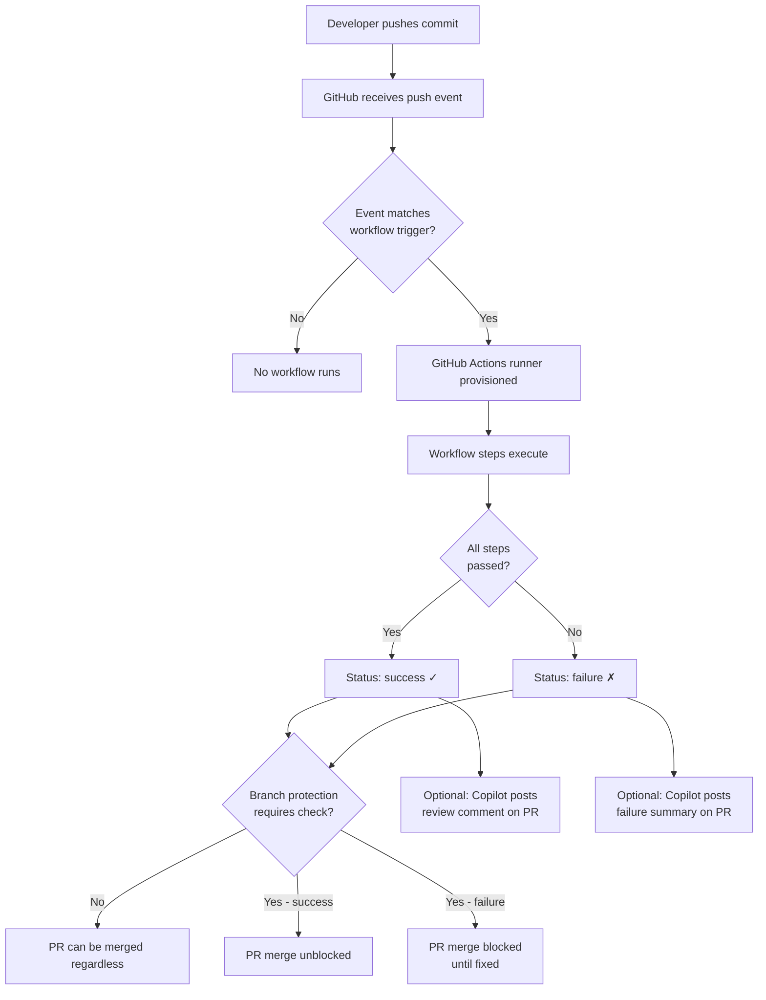

# GitHub Copilot with GitHub Actions

This section covers how to integrate GitHub Copilot into your GitHub Actions workflows for automated code review, security scanning, test summarization, and more.

## Overview: GitHub Actions vs. Claude Code Hooks

Understanding the difference between these two automation layers helps you pick the right tool for each job.

### Claude Code Hooks (Intra-Session)

Claude Code hooks are **synchronous** and run **within a single Claude session**:

- They execute during an active Claude Code session (e.g., before a file is saved, after a tool call)
- They can **block** the session — a hook that exits non-zero stops the current operation
- They are declared in `.claude/settings.json` under `hooks`
- They have access to session context (which files were changed, what the user asked)
- They are local to the developer's machine and session

Use Claude Code hooks for: linting before writing a file, validating output before accepting it, enforcing coding standards mid-session.

### GitHub Actions (Repository-Level)

GitHub Actions are **asynchronous** and trigger on **git events** (push, PR, tag, schedule):

- They run on GitHub's infrastructure, not the developer's machine
- They are visible to the whole team and logged in the repository
- They can be **required** via Branch Protection rules, which creates the "blocking" equivalent for merges
- They run after a push or PR event — not inline within an editor session

Use GitHub Actions for: CI/CD pipelines, automated code review on every PR, security scanning, test runs with failure summaries.

### Achieving "Blocking" Behavior with GitHub Actions

While Actions themselves are asynchronous, you can enforce that certain checks must pass before a PR is merged by using **required status checks** in Branch Protection rules:

1. Navigate to **Settings → Branches → Branch protection rules**
2. Add a rule for your default branch (e.g., `main`)
3. Enable **"Require status checks to pass before merging"**
4. Search for and add the status check name (matches the `name:` field in your workflow)
5. Enable **"Require branches to be up to date before merging"** for extra safety

This makes your GitHub Actions workflows functionally equivalent to blocking hooks — no PR can be merged until all required checks pass.

> **Important limitation:** Copilot does not support intra-session scripting hooks. For within-IDE automation, consider VS Code tasks, launch configurations, and extensions instead of trying to replicate Claude Code hook behavior.

---

## Event Flow Diagram



---

## Key Integration Patterns

### 1. Copilot Coding Agent in Actions

The Copilot coding agent can be triggered via GitHub Actions to autonomously implement changes described in GitHub issues. This is covered in detail in [copilot-in-actions.md](./copilot-in-actions.md).

**Best for:** Implementing small, well-scoped issues automatically; fixing failing tests; generating boilerplate.

### 2. Automated PR Code Review

The `github/copilot-code-review` action analyzes pull request diffs and posts inline review comments. See [pr-review-workflow.yml](./pr-review-workflow.yml).

**Best for:** Catching common issues on every PR without waiting for a human reviewer; style enforcement.

### 3. PR Description Generation

When a developer opens a PR without a description, a workflow can use the diff to automatically generate a meaningful PR body. See [pr-description-workflow.yml](./pr-description-workflow.yml).

**Best for:** Teams where PR descriptions are often skipped; improving reviewer experience.

### 4. Security Scanning with Copilot Context

Combine CodeQL static analysis with Copilot-assisted summarization to produce actionable security reports directly on the PR. See [security-scan-workflow.yml](./security-scan-workflow.yml).

**Best for:** Making security findings accessible to developers who aren't security specialists.

### 5. Test Running and Failure Summarization

Run your test suite on every push and PR, and when tests fail, post a readable summary of which tests failed and why. See [test-on-push-workflow.yml](./test-on-push-workflow.yml).

**Best for:** Reducing time-to-diagnosis when CI fails; keeping developers in flow without reading raw CI logs.

### 6. Format and Lint Checking

Enforce code formatting and linting on every PR, and post a helpful comment with the exact commands to fix issues locally. See [format-check-workflow.yml](./format-check-workflow.yml).

**Best for:** Eliminating "nit" review comments about formatting; onboarding new contributors.

---

## Prerequisites

Before using these workflows, ensure:

1. **GitHub Copilot is enabled** for your organization or repository
   - Copilot Business or Enterprise is required for Actions-based review features
   - Individual Copilot plans do not include GitHub Actions integration

2. **Workflow permissions are configured** at the repository level
   - Go to **Settings → Actions → General → Workflow permissions**
   - Set to **"Read and write permissions"** if workflows need to post comments
   - Or use explicit `permissions:` blocks in each workflow (preferred — see examples)

3. **Branch protection rules are configured** if you want checks to be required
   - See the "Achieving Blocking Behavior" section above

4. **GitHub CLI is available** in runners if using `gh` commands in workflows
   - The `ubuntu-latest` runner includes `gh` pre-installed

---

## Workflow Files in This Section

| File | Trigger | Purpose |
|------|---------|---------|
| [pr-review-workflow.yml](./pr-review-workflow.yml) | `pull_request` | Automated Copilot code review comments |
| [security-scan-workflow.yml](./security-scan-workflow.yml) | `push`, `pull_request` | CodeQL + Copilot security summary |
| [format-check-workflow.yml](./format-check-workflow.yml) | `pull_request` | Prettier + ESLint with fix instructions |
| [test-on-push-workflow.yml](./test-on-push-workflow.yml) | `push`, `pull_request` | Test run + failure summarization |
| [pr-description-workflow.yml](./pr-description-workflow.yml) | `pull_request` opened | Auto-generate PR description from diff |
| [copilot-in-actions.md](./copilot-in-actions.md) | (guide) | Using Copilot coding agent in Actions |

---

## Quick Start

To add automated PR review to your repository:

```bash
# Copy the workflow to your repository
mkdir -p .github/workflows
cp pr-review-workflow.yml .github/workflows/copilot-pr-review.yml

# Commit and push
git add .github/workflows/copilot-pr-review.yml
git commit -m "Add Copilot automated PR review"
git push
```

Then open a pull request — Copilot will post review comments within a few minutes of the PR being created or updated.

---

## Permissions Reference

GitHub Actions workflows in this section use these permissions:

| Permission | Level | Used For |
|-----------|-------|---------|
| `contents: read` | Read | Checking out code, reading files |
| `pull-requests: write` | Write | Posting PR comments and reviews |
| `security-events: write` | Write | Uploading CodeQL SARIF results |
| `issues: write` | Write | Posting comments on issues |
| `actions: read` | Read | Reading workflow run details |

Always use the **minimum permissions** needed. Each workflow file in this section declares only the permissions it requires.

---

## Further Reading

- [GitHub Actions documentation](https://docs.github.com/en/actions)
- [Copilot code review documentation](https://docs.github.com/en/copilot/using-github-copilot/code-review)
- [Branch protection rules](https://docs.github.com/en/repositories/configuring-branches-and-merges-in-your-repository/managing-protected-branches/about-protected-branches)
- [CodeQL documentation](https://docs.github.com/en/code-security/code-scanning/introduction-to-code-scanning/about-code-scanning-with-codeql)
- [Copilot coding agent](./copilot-in-actions.md)
