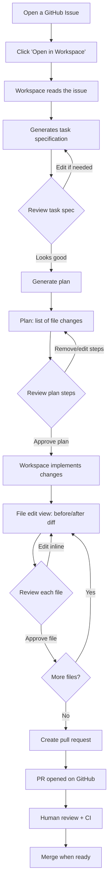

# Copilot Workspace

Copilot Workspace is a GitHub.com feature that lets you implement GitHub issues step by step, entirely in the browser. You describe a task (or open an issue), Workspace generates a plan, you step through file-by-file changes, and then create a pull request — all without leaving the browser or touching your local environment.

---

## What Copilot Workspace Is

Copilot Workspace is **not an IDE extension**. It is a standalone, browser-based coding environment built into GitHub.com. Key characteristics:

- **Task-based**: it always starts from a task specification (usually a GitHub issue)
- **Plan-first**: Workspace shows you a plan before making any changes — you can edit the plan before proceeding
- **File-edit view**: changes are shown as a before/after diff that you can review and edit inline
- **PR-centric**: the output is always a pull request, not a direct commit to main
- **No local setup required**: useful for contributors who don't have the project set up locally

Access Copilot Workspace at: [github.com/features/copilot/workspace](https://github.com/features/copilot/workspace)

Or directly from any GitHub issue: click the **"Open in Workspace"** button in the issue sidebar (if Workspace is enabled for your account).

---

## How Copilot Workspace Differs from Claude Code's Planning Mode

| Feature | Claude Code (planning mode) | Copilot Workspace |
|---------|----------------------------|-------------------|
| Location | Terminal / local machine | Browser (github.com) |
| Trigger | Conversation with Claude | GitHub issue or manual prompt |
| Plan editing | Natural language conversation | Structured plan steps UI |
| Conversation rewind | Yes — `/rewind` to previous checkpoint | No — no conversation rewind |
| File editing | Full local filesystem access | GitHub repo files only |
| Multi-repo | Yes, if configured | Single repository only |
| Output | Applied locally, then you push | Creates a GitHub PR directly |
| Context | Full codebase + local tools | Repository files + GitHub context |

The most significant difference: **Copilot Workspace has no conversation rewind**. If you go down a wrong path, your best option is to use git branches as checkpoints (see the Checkpoint Workaround section below).

---

## The Workflow



---

## Key Concepts

### Task Specification

The task specification is the starting point — a natural language description of what you want to accomplish. Workspace derives this from the issue text, but you can edit it before generating the plan.

A good task specification is:
- **Specific**: names the files or components to change, if known
- **Goal-oriented**: describes the desired outcome, not just the symptoms
- **Constrained**: tells Workspace what not to touch (optional but helpful)

See [task-specification-guide.md](./task-specification-guide.md) for detailed guidance.

### Plan Steps

After reading the task specification, Workspace generates a **plan** — an ordered list of changes to make, grouped by concern. Each step describes:

- What file will be changed
- What kind of change (add, modify, delete)
- A brief description of the change

You can:
- **Reorder** steps (drag and drop in the UI)
- **Delete** steps you don't want
- **Add** new steps manually
- **Edit** a step's description to clarify intent

Workspace uses your edits to refine the implementation. The plan is a conversation, not a commit.

### File Edit View

Once you approve the plan, Workspace shows you each file change as a side-by-side diff. You can:
- Edit the generated code inline (click to edit)
- Accept or reject individual hunks
- Ask Workspace to regenerate a specific change

This is similar to reviewing a PR, except you are making changes before the PR is created.

### Iteration

If the first implementation isn't quite right, you can:
1. Edit the task specification and regenerate the plan
2. Edit individual plan steps and regenerate that file
3. Edit the generated code directly in the file edit view
4. After the PR is created, comment `@copilot` on the PR with additional instructions

---

## Access and Availability

Copilot Workspace is available to:
- GitHub Copilot Individual, Business, and Enterprise subscribers
- Access the feature at: `https://copilot-workspace.githubnext.com`
- Or from any issue: sidebar → **"Open in Copilot Workspace"**

If you don't see the "Open in Workspace" button, ensure:
1. You are signed in to GitHub.com
2. Your account has an active Copilot subscription
3. Copilot Workspace is enabled for your account (Settings → Copilot → Workspace)

---

## Checkpoint Workaround (No `/rewind` Equivalent)

Claude Code has a `/rewind` command that returns the session to a previous checkpoint. Copilot Workspace has no equivalent. The recommended workaround is **git branches**:

### Before Starting a Risky Change

```bash
# Create a checkpoint branch from the current state
git checkout -b checkpoint/before-refactor-$(date +%Y%m%d)
git push origin checkpoint/before-refactor-$(date +%Y%m%d)
```

### If Things Go Wrong in Workspace

1. Close the Workspace session (do not create the PR)
2. Re-open Workspace from the checkpoint branch
3. Start over with a revised task specification

### Or: Use the Branch as a Recovery Point

If you already created the PR and it went badly:

```bash
# Reset your working branch to the checkpoint
git fetch origin
git checkout my-feature-branch
git reset --hard origin/checkpoint/before-refactor-$(date +%Y%m%d)
git push --force-with-lease origin my-feature-branch
```

This is not as ergonomic as `/rewind`, but it achieves the same result: returning to a known-good state and trying again with different instructions.

---

## Limitations

### No Conversation Rewind

Workspace does not maintain a conversation history you can step back through. Each session starts fresh. If you want to try a different approach, you must edit the task specification and regenerate.

### Tied to GitHub Issues (Best Path)

Workspace works best when started from a GitHub issue. It can also accept a free-form prompt, but the plan quality is higher when the input is a well-written issue with context.

### Complex Multi-System Changes

If a task requires changes to:
- Multiple repositories simultaneously
- External configuration (cloud infrastructure, secrets)
- Database migrations that require running scripts

...Workspace may only partially implement the change and leave TODOs in comments. These require manual follow-up.

### Limited Local Tool Access

Workspace cannot run arbitrary scripts, execute your build system, or access local files. It can only edit repository files. For tasks that require "run this command and see the output," use Claude Code or the Copilot coding agent in Actions instead.

---

## Common Workspace Patterns

### Start Small

Use Workspace for well-scoped, single-concern changes. Adding a new API endpoint or fixing a specific bug is a good fit. Migrating an entire framework is not.

### Edit the Task Spec Aggressively

The task specification is the most powerful lever you have. If the plan is off, rewrite the spec — don't try to patch the plan steps individually.

### Keep the Plan Visible

Don't approve the plan too quickly. Read each step and ask: "Does this step make sense? Is this the right file? Is this the right approach?" Fixing the plan before implementation is much faster than fixing broken code after.

### Iterate in the File Edit View

The generated code in the file edit view is a starting point. Edit it to match your team's conventions, add error handling the agent missed, and fix variable names.

---

## Related Files

| File | Content |
|------|---------|
| [workspace-examples.md](./workspace-examples.md) | Five real-world Workspace usage examples |
| [task-specification-guide.md](./task-specification-guide.md) | How to write effective task specs |
| [vs-code-timeline.md](./vs-code-timeline.md) | Using VS Code Timeline as a checkpoint mechanism |

---

## Further Reading

- [Copilot Workspace documentation](https://docs.github.com/en/copilot/using-github-copilot/using-copilot-workspace)
- [GitHub Next: Copilot Workspace](https://githubnext.com/projects/copilot-workspace)
- [Writing issues for Copilot](https://docs.github.com/en/copilot/using-github-copilot/writing-issues-for-copilot)
