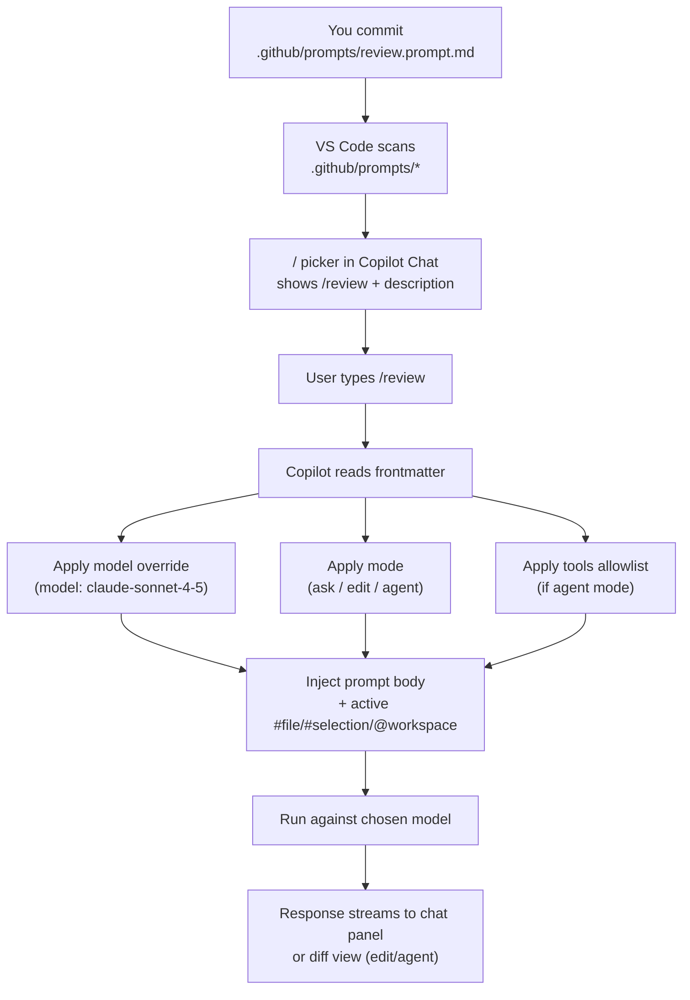

# GitHub Copilot Custom Prompt Files — Complete Guide

Custom prompt files (`.github/prompts/*.prompt.md`) turn reusable instructions into **your own slash commands**. Type `/review` or `/security-scan` in Copilot Chat and Copilot loads the matching prompt file, honours its frontmatter (model, mode, tools), and executes it.

The built-in commands covered in [Module 03](../03-slash-commands/README.md) (`/explain`, `/fix`, `/tests`, `/doc`, `/new`, `/simplify`) ship with Copilot. This module is about authoring **your own** — stable, versioned, shared with the team.

---

## Why Custom Prompt Files

- **Repeatability** — every team member runs `/review` and gets the same five-lens review, not one person's ad hoc prompt.
- **Model pinning** — `/security-scan` is pinned to `claude-opus-4-5` via frontmatter, independent of whatever model the user has selected in the picker.
- **Versioned in git** — prompt changes go through code review the same way code changes do.
- **Discoverability** — the command appears in the `/` picker with its `description:` field.

Custom prompts are the building block that most teams start with before moving up to skills, chat modes, and agents.

---

## File Location and Format

```
your-project/
└── .github/
    └── prompts/
        ├── review.prompt.md
        ├── fix-issue.prompt.md
        ├── deploy.prompt.md
        └── <your-command>.prompt.md
```

Filename becomes the command name: `review.prompt.md` → `/review`. Use kebab-case.

Personal prompts (across all projects, not committed) live in `~/.copilot/prompts/`.

---

## Frontmatter Fields

```yaml
---
mode: ask              # ask | edit | agent — see below
model: claude-sonnet-4-5   # optional; overrides the active picker
description: "Short line shown in the /command picker"
tools:                 # optional; restricts agent-mode tool access
  - read_file
  - run_terminal_command
---

The body below the frontmatter is the prompt Copilot runs.
Markdown is supported. Reference chat variables (#file, #selection, @workspace)
the same way you would in a normal chat message.
```

### `mode:` — what the prompt is allowed to do

| Mode | Effect | Use for |
|---|---|---|
| `ask` | Chat reply only. Cannot modify files. | `/review`, `/explain-codebase`, `/architect` |
| `edit` | Can edit files, shown as a diff you accept/reject. | `/fix-issue`, `/document`, `/test-gen` |
| `agent` | Agent mode — can read, write, and run terminal commands autonomously. Requires `tools:` allowlist. | `/deploy`, automation workflows |

### `model:` — which model runs this prompt

Any model available in your Copilot subscription. Examples as of April 2026:

| Slot purpose | Model | Best for |
|---|---|---|
| Reasoning | `o3` | Architecture, trade-offs, planning |
| Fast | `o4-mini` | Quick fixes, boilerplate |
| Balanced | `gpt-4.1` | DevOps, general tasks |
| Code | `claude-sonnet-4-5` | Code gen, review, docs, tests |
| Thorough | `claude-opus-4-5` | Security audits, deep review |
| Long context | `gemini-2.5-pro` | Entire codebases (1M tokens) |
| Fast long context | `gemini-2.0-flash` | Multi-file scan |

Model names must match your organisation's enabled list. See [Module 11](../11-multi-model-mcp/README.md) for the full routing strategy and how to declare named slots in `.vscode/settings.json`.

### `description:` — picker hint

The one-liner shown under your command in the `/` picker. Keep under ~80 characters. Start with a verb.

### `tools:` — agent-mode allowlist

Only relevant when `mode: agent`. Restricts what the agent can call. Common values:

- `read_file`, `write_file`, `run_terminal_command`
- `github.*` (GitHub MCP server — issues, PRs)
- `kubernetes.*` (K8s MCP — pods, logs)
- `filesystem.*` (local files)

See [Module 11 — MCP profiles](../11-multi-model-mcp/mcp-profiles.md) for the full list and least-privilege tiers.

---

## How a Prompt File Becomes a Slash Command



---

## Templates in This Module

| File | Command | Mode | Model | What it does |
|---|---|---|---|---|
| [review.prompt.md](./review.prompt.md) | `/review` | ask | `claude-sonnet-4-5` | Five-lens code review: correctness, security, performance, style, tests |
| [fix-issue.prompt.md](./fix-issue.prompt.md) | `/fix-issue` | edit | `claude-sonnet-4-5` | Root-cause diagnosis + targeted fix + regression test |
| [deploy.prompt.md](./deploy.prompt.md) | `/deploy` | ask | `gpt-4.1` | Full deployment checklist and Helm/kubectl commands |
| [architect.prompt.md](./architect.prompt.md) | `/architect` | ask | `o3` | Trade-off analysis with ADR document |
| [security-scan.prompt.md](./security-scan.prompt.md) | `/security-scan` | ask | `claude-opus-4-5` | Threat model + OWASP audit |
| [document.prompt.md](./document.prompt.md) | `/document` | edit | `claude-sonnet-4-5` | Generate Javadoc / GoDoc / docstrings |
| [explain-codebase.prompt.md](./explain-codebase.prompt.md) | `/explain-codebase` | ask | `gemini-2.5-pro` | Explain large codebases using 1M-token context |
| [test-gen.prompt.md](./test-gen.prompt.md) | `/test-gen` | edit | `claude-sonnet-4-5` | Generate comprehensive tests with edge cases |
| [frontmatter-reference.md](./frontmatter-reference.md) | — | — | — | Full frontmatter field reference |

---

## Authoring Patterns

### Pattern 1: Tight scope, clear output

Bad — vague, open-ended:
```markdown
---
mode: ask
description: "Review the code"
---

Please review the code.
```

Good — scoped, prescriptive output format:
```markdown
---
mode: ask
model: claude-sonnet-4-5
description: "Five-lens PR review with severity-tagged findings"
---

Review the diff in #selection (or #changes if no selection) across five lenses:

1. Correctness — logic bugs, off-by-one, null handling
2. Security — OWASP top 10, injection, auth, secrets
3. Performance — N+1, unnecessary work, algorithmic complexity
4. Style — follows the conventions in .github/instructions/
5. Tests — coverage of new/changed logic

For each finding, output:
- Severity: blocker / major / minor / nit
- File:line
- One-sentence problem
- Suggested fix (code block)

End with a summary: total findings by severity, and a clear merge recommendation.
```

### Pattern 2: Reference other primitives

A prompt can reference instruction files, chat variables, and skills:

```markdown
---
mode: edit
model: claude-sonnet-4-5
description: "Fix the bug from #terminalLastCommand and add a regression test"
---

The failing command and output are in #terminalLastCommand.
The code under test is in #selection.

1. Identify the root cause (not just the symptom)
2. Apply the minimal fix
3. Add a regression test covering the exact failure case
4. Follow the testing conventions in .github/instructions/testing.instructions.md
```

### Pattern 3: Chain to chat modes or agents

Prompts are one-shot. For extended conversation use a chat mode ([Module 08](../08-chat-modes/README.md)); for multi-step autonomous work use an agent ([Module 10](../10-agents/README.md)). A prompt can finish by suggesting a hand-off:

```markdown
If the issue spans more than three files, stop and recommend the user invoke
the plan agent via "@plan" for a full plan → implement → review chain.
```

---

## Gotchas

- **Frontmatter must be valid YAML.** A stray tab or unclosed quote silently drops the file from the picker. If your `/command` doesn't appear, run `bash scripts/lint-prompts.sh` (or just `yq eval` the frontmatter).
- **`model:` overrides the picker.** Users cannot switch models mid-prompt. For a user-controllable model, leave `model:` off and let the active picker win.
- **`tools:` is not enforced by Copilot UI alone.** Pair with MCP least-privilege profiles ([Module 11](../11-multi-model-mcp/mcp-profiles.md)) and hook-level policy checks ([Module 16](../16-governance/README.md)).
- **Description length matters.** Over ~120 characters gets truncated in the picker. Front-load the verb.
- **Personal prompts in `~/.copilot/prompts/` are not shared.** Don't put team workflows there — they won't exist for your teammates.
- **`mode: agent` requires org permission.** If agent mode is disabled in your org's Copilot policy, `mode: agent` prompts silently fall back to `ask`. See [Module 15](../15-enterprise/README.md).

---

## How It Fits with the Other Primitives

Copilot has six customisation primitives. Prompt files are **manual + one-shot**:

| Primitive | Trigger | Persistence | Where |
|---|---|---|---|
| Team instructions | Always | Every interaction | `.github/copilot-instructions.md` |
| Instruction files | Auto by file type | Matching files | `.github/instructions/*.instructions.md` |
| **Prompt files** | **Manual — `/command`** | **One-shot** | **`.github/prompts/*.prompt.md`** |
| Skills | Auto-discovered | Loaded when relevant | `.github/skills/<name>/SKILL.md` |
| Chat modes | Manual (mode picker) | Persistent session | `.github/chatmodes/*.chatmode.md` |
| Agents | Manual or chained | Until done or handoff | `.github/agents/*.agent.md` |

Use a prompt when the task is single-shot and the same each time. Move to a chat mode ([Module 08](../08-chat-modes/README.md)) when you need to iterate. Move to a skill ([Module 09](../09-skills/README.md)) when Copilot should auto-apply the runbook without being told. Move to an agent ([Module 10](../10-agents/README.md)) when the work is multi-step and autonomous.

---

## Further Reading

- [frontmatter-reference.md](./frontmatter-reference.md) — Every field, every valid value
- [Module 08 — Chat Modes](../08-chat-modes/README.md) — When you need persistent personas instead of one-shots
- [Module 11 — Multi-Model Routing](../11-multi-model-mcp/README.md) — How named model slots work
- [Module 16 — Governance](../16-governance/README.md) — Eval checks that validate prompt frontmatter
- [GitHub Copilot prompt files docs](https://docs.github.com/en/copilot/customizing-copilot/adding-repository-custom-instructions-for-github-copilot)
