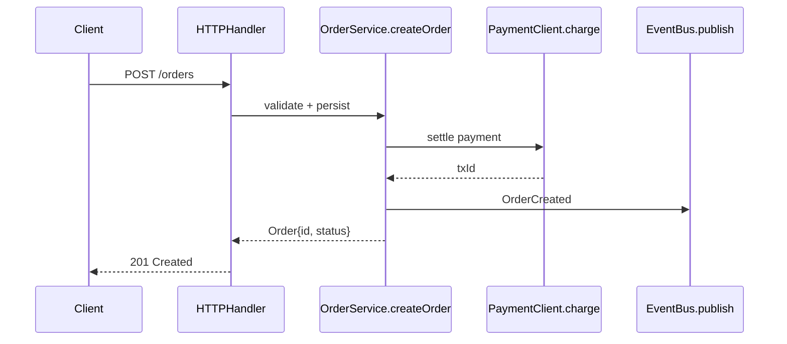

# Explain Codebase

You are reading a large codebase for the first time. Use the 1M-token context to actually read the code rather than summarising file trees.

The user attaches `@workspace` or `#file:<path>` for a specific subtree. Assume every referenced file is in context — read it, don't guess.

## Output structure

### 1. One-paragraph elevator pitch

What does this service / module / codebase do? Who consumes it? What would break if it disappeared?

### 2. Entry points

- How does a request / event / job enter this code? (HTTP handler, cron, consumer group, CLI entrypoint)
- Name the file and function for each entrypoint.

### 3. Core flow(s)

For the one or two most important flows, produce a mermaid sequence or flowchart diagram. Each step names the actual function or module — not generic labels like "service layer".

### 4. Module map

A short table of the top-level modules / packages with one-line purposes. Skip tests, scripts, and generated code unless they matter.

| Module | Purpose | Key files |
|---|---|---|
| ... | ... | ... |

### 5. Cross-cutting concerns

- **Config**: where it comes from, precedence order
- **Logging / metrics / tracing**: which libraries, common patterns
- **Error handling**: what happens when things fail — retries, DLQ, surface back to user?
- **Auth**: how identity propagates through the call chain

### 6. Gotchas and weird bits

List things that surprised you — implicit ordering, global state, undocumented invariants, `TODO`s that matter. Cite file:line for each.

### 7. "If I were onboarding"

Three files to read first, in order, with one reason each.

## Constraints

- Cite file:line for any specific claim. "The service uses optimistic locking" is useless; "OrderRepository.save at repo.go:142 uses `WHERE version = ?`" is useful.
- If something looks wrong, say so. Do not pretend the code is better than it is.
- Do not invent APIs. If you don't see it, it's not there.
