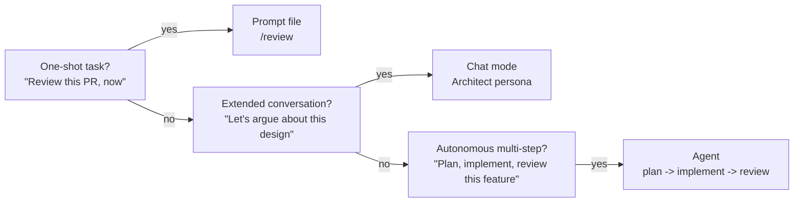
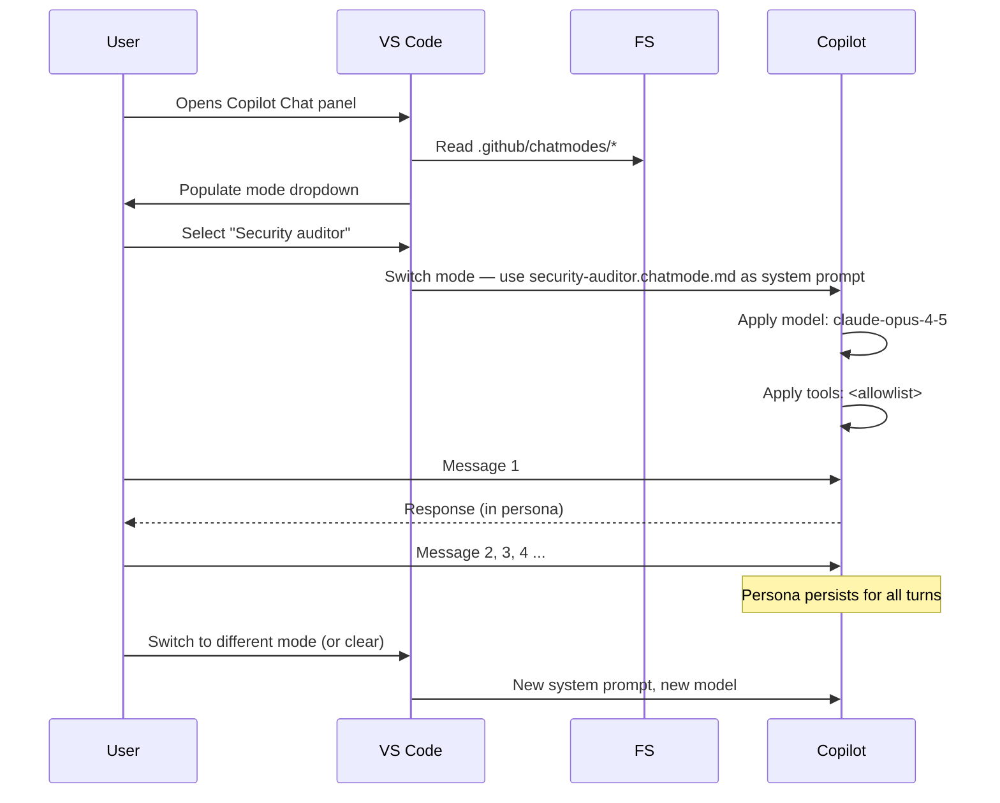

# GitHub Copilot Chat Modes — Complete Guide

Chat modes (`.github/chatmodes/*.chatmode.md`) are **named, persistent personas** you pick from the VS Code chat mode dropdown. Unlike prompt files (one-shot) or skills (auto-discovered), chat modes stay active for the entire conversation. Every follow-up message uses the mode's persona, model, and tool allowlist.

---

## Why Chat Modes

- **Back-and-forth review**, not single-shot. You want to argue with the Security Auditor for ten messages, not run `/security-scan` ten times.
- **Persona pinning** — the Architect chat mode is always `o3` with a design-focused system prompt. The user can't accidentally do architecture work in `o4-mini`.
- **Tool scoping** — the Security Auditor mode has read-only access. The DevOps Assistant mode has `kubectl` and `helm` tools. Keeps dangerous tools away from modes that don't need them.
- **Shared team voice** — every reviewer on the team uses the same Code Reviewer mode; feedback style is consistent.

---

## Prompt vs Chat Mode vs Agent



| Primitive | Turns | Session state | Who drives |
|---|---|---|---|
| Prompt file | 1 | None | User |
| Chat mode | Many | Active persona + history | User |
| Agent | Many | Full tool loop | Agent (user sets goal) |

---

## File Location and Format

```
your-project/
└── .github/
    └── chatmodes/
        ├── code-reviewer.chatmode.md
        ├── security-auditor.chatmode.md
        ├── architect.chatmode.md
        └── <your-persona>.chatmode.md
```

Filename becomes the mode name in the dropdown: `code-reviewer.chatmode.md` → "Code reviewer".

---

## Frontmatter Fields

```yaml
---
description: "What the mode does — shown in the picker"
model: claude-opus-4-5
tools:                   # optional — restricts what the persona can invoke
  - read_file
  - github.get_pull_request
temperature: 0.2         # optional — most modes want low temperature for consistency
owner: "@org/security-team"
classification: internal
---

You are <persona>. <Definition, rules, and constraints for this persona.>
Everything after the frontmatter is the system prompt applied to every turn.
```

Same field semantics as prompt files — see [Module 07 — Frontmatter Reference](../07-custom-prompts/frontmatter-reference.md).

---

## Prerequisite: Enable Chat Modes

Chat modes need one setting in `.vscode/settings.json`:

```json
{
  "github.copilot.chat.experimental.chatModes": true
}
```

Restart VS Code after toggling. If the mode dropdown is empty in the chat panel, this is almost always why.

---

## Chat Mode Templates in This Module

| File | Mode | Model | Best for |
|---|---|---|---|
| [code-reviewer.chatmode.md](./code-reviewer.chatmode.md) | Code Reviewer | `claude-sonnet-4-5` | PR review, pre-push review |
| [security-auditor.chatmode.md](./security-auditor.chatmode.md) | Security Auditor | `claude-opus-4-5` | Auth code, new endpoints, deep audit |
| [architect.chatmode.md](./architect.chatmode.md) | Architect | `o3` | System design, trade-off conversations |
| [devops-assistant.chatmode.md](./devops-assistant.chatmode.md) | DevOps Assistant | `gpt-4.1` | Deploy issues, infra debugging |
| [longcontext-reader.chatmode.md](./longcontext-reader.chatmode.md) | Long-Context Reader | `gemini-2.5-pro` | Onboarding into a large codebase |
| [test-writer.chatmode.md](./test-writer.chatmode.md) | Test Writer | `claude-sonnet-4-5` | TDD sessions, backfilling tests |
| [enabling-chatmodes.md](./enabling-chatmodes.md) | — | — | Troubleshooting mode visibility |

---

## Authoring Tips

### Name the persona, then define its rules

Bad:
```markdown
You help with code review.
```

Good:
```markdown
You are a staff engineer doing a pre-merge code review. Your goal is to catch
issues that the author missed — not to rewrite the code or debate style unless
the style choice has correctness or security implications.

Rules:
- Skepticism before praise.
- Every finding cites file:line.
- You do not suggest changes outside the scope of the diff without flagging the scope creep.
```

### Specify tone and scope

Every mode should have one paragraph on *what it doesn't do*:

```markdown
You do NOT:
- Generate code unless asked ("rewrite this for me")
- Suggest sweeping refactors unrelated to the current change
- Defer to the author's preference when their code is wrong
```

### Pin the output format

If the mode's output is consumed by another tool (PR comment, ticket, ADR), specify the format literally.

---

## How Chat Modes Load



---

## Gotchas

- **Mode switching resets context by default.** Some VS Code versions preserve chat history across mode switches; some don't. Do not rely on message history carrying over.
- **`model:` override beats the picker.** Same as prompt files — users can't switch models mid-conversation in a mode.
- **Modes can't chain automatically.** If the Architect mode decides "we need an implementation plan," the user has to switch to the Implement agent. Use agents ([Module 10](../10-agents/README.md)) for autonomous hand-offs.
- **Personal modes in `~/.copilot/chatmodes/` aren't shared.** Don't put team personas there.
- **A mode's tool allowlist supersedes the workspace allowlist.** If a mode lists `tools: [read_file]`, nothing else is callable even if `.vscode/mcp.json` defines fifteen servers.
- **Sensitive modes need a classification.** A Security Auditor mode that can read the entire repo should be `classification: restricted` with governance review. See [Module 16](../16-governance/README.md).

---

## How It Fits with Other Primitives

| When you want... | Reach for... |
|---|---|
| A consistent one-shot command | [Prompt file](../07-custom-prompts/README.md) |
| **An extended conversation with an expert persona** | **Chat mode (this module)** |
| Copilot to auto-apply a runbook when relevant | [Skill](../09-skills/README.md) |
| A multi-step autonomous workflow | [Agent](../10-agents/README.md) |
| A persona's tool access restricted | `tools:` allowlist here + [MCP profiles](../11-multi-model-mcp/mcp-profiles.md) |

---

## Further Reading

- [enabling-chatmodes.md](./enabling-chatmodes.md) — Troubleshoot mode picker visibility
- [Module 07 — Custom Prompts](../07-custom-prompts/README.md) — One-shot equivalents
- [Module 10 — Agents](../10-agents/README.md) — Autonomous multi-step variant
- [Module 11 — MCP Profiles](../11-multi-model-mcp/mcp-profiles.md) — Restricting chat-mode tool access
