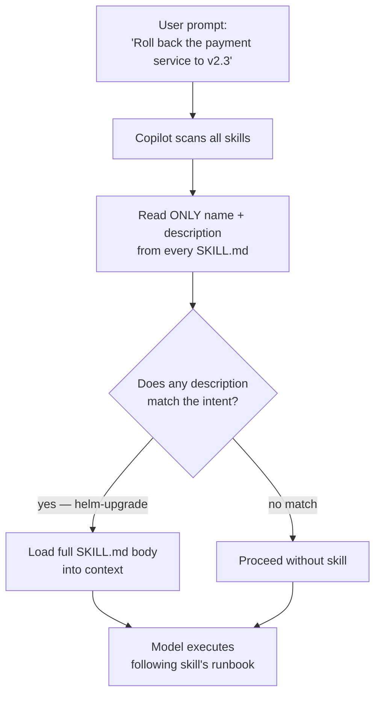
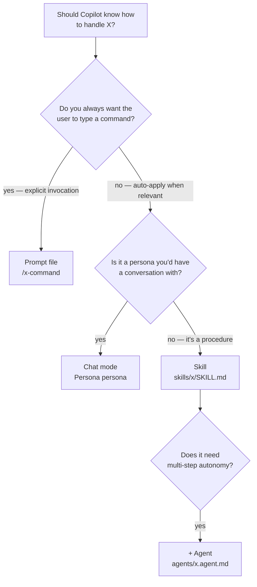

# GitHub Copilot Skills — Complete Guide

Skills (`.github/skills/<name>/SKILL.md`) are **auto-discovered task runbooks**. Unlike prompt files (you type `/command`) or chat modes (you pick from a dropdown), Copilot reads the `description:` of every skill and loads the full runbook only when your request matches. You don't invoke them — they invoke themselves.

Think of skills as "if Copilot encounters X, it should know to follow this procedure."

---

## Why Skills

- **Task knowledge without ritual.** A new hire can say "I need to roll back the payment service" and Copilot loads the `helm-upgrade` skill automatically. No one has to remember "call `/rollback` or `@helm-agent`."
- **Layered over models.** Any model — `o3`, `claude-sonnet-4-5`, `gemini-2.5-pro` — uses the same skill. Skills are context, not commands.
- **Bundled resources.** A skill folder can contain templates, scripts, and reference docs. The skill's SKILL.md tells Copilot how to use them.
- **Selective loading.** Only the `description:` field is always in context. The full body loads when relevant — which keeps the token budget manageable.

---

## File Layout

```
your-project/
└── .github/
    └── skills/
        ├── helm-upgrade/
        │   └── SKILL.md
        ├── debug-eks/
        │   ├── SKILL.md
        │   └── common-errors.md         ← bundled reference
        ├── terraform-plan/
        │   └── SKILL.md
        ├── incident-triage/
        │   ├── SKILL.md
        │   ├── postmortem-template.md   ← bundled template
        │   └── runbook.sh               ← bundled script
        └── <your-skill>/
            └── SKILL.md
```

**Precedence and scope:**

| Path | Scope |
|---|---|
| `.github/skills/<name>/SKILL.md` | Project-scoped — committed, everyone on the team gets it |
| `.claude/skills/<name>/SKILL.md` | Same spec, works with both Copilot and Claude Code |
| `~/.copilot/skills/<name>/SKILL.md` | Personal, available across all your projects |

---

## Frontmatter

```yaml
---
name: helm-upgrade
description: >
  Use when asked to deploy, upgrade, roll back, or release a service to Kubernetes.
  Also triggers for questions about Helm chart values, image tags, or release history.
owner: "@org/platform-team"
classification: internal
---
```

**The `description:` field is the single most important line.** It is the *only* text Copilot reads when scanning skills for relevance. The full SKILL.md body is only loaded if the description matches your prompt.

See [description-writing-guide.md](./description-writing-guide.md) for how to write descriptions that actually trigger reliably.

---

## How Skill Discovery Works



Skills can also be invoked manually — typing the skill's name, or `/skills list` to see what's discovered.

---

## The SKILL.md Body

After the frontmatter, write a detailed runbook as if you were training a new hire. Include:

- **Prerequisites** — what env vars, tools, access the user needs
- **Step-by-step procedure** — numbered, with exact commands
- **Decision points** — "if X, do A; if Y, do B"
- **Verification** — how to confirm each step worked
- **Rollback / undo** — how to back out safely
- **Escalation** — who to page, when
- **Common pitfalls** — real failure modes and their fixes

Example structure:

```markdown
# Helm Upgrade — Runbook

## Prerequisites
...

## Procedure
1. ...
2. ...
3. ...

## Verification
...

## Rollback
...

## Common errors
...
```

Copilot treats the whole body as instructions to follow, so write it as imperative directions — not as a tutorial explaining *why*.

---

## Templates in This Module

| Skill | Triggers on | Purpose |
|---|---|---|
| [helm-upgrade/](./helm-upgrade/) | deploy, upgrade, rollback, helm, image tag | Full Helm deploy/rollback runbook |
| [debug-eks/](./debug-eks/) | pod crash, OOMKilled, ImagePullBackOff, kubectl | EKS/Kubernetes pod debugging |
| [terraform-plan/](./terraform-plan/) | tofu plan, apply, terraform state, infrastructure change | OpenTofu / Terraform apply safely |
| [incident-triage/](./incident-triage/) | production incident, alert firing, postmortem, pager | Incident response and postmortem workflow |
| [description-writing-guide.md](./description-writing-guide.md) | — | How to write descriptions that trigger |
| [skill-anatomy.md](./skill-anatomy.md) | — | Full SKILL.md field reference |

---

## When to Use a Skill vs Other Primitives



Put another way:

- **Prompt** = "run this recipe on demand"
- **Chat mode** = "I want to talk to an expert for a while"
- **Skill** = "when you see this kind of question, follow this runbook"
- **Agent** = "do this whole thing end-to-end, then hand off"

---

## Gotchas

- **Description vagueness kills discovery.** "Helm deployment skill" will not trigger reliably. You need natural-language cues people actually say — "deploy", "upgrade", "roll back", "image tag", "release".
- **Description + synonyms > description + buzzwords.** Include the words your team actually uses, not the canonical terms. If engineers say "blue/green" or "canary" colloquially, include them.
- **Body length costs tokens only when loaded.** A 10 KB SKILL.md is fine — it only hits the context budget when the skill is triggered. But more text means more scanning time for the model when executing.
- **Bundled resources need relative paths.** If SKILL.md says "use the template at `postmortem-template.md`", the model needs to know it's relative to the skill folder. State the convention once in the SKILL body.
- **Skills don't chain.** If `incident-triage` needs to hand off to `helm-upgrade`, Copilot won't autonomously transition. That's an agent job — see [Module 10](../10-agents/README.md).
- **Personal skills aren't shared.** `~/.copilot/skills/` stays on your laptop. Commit team skills to `.github/skills/`.
- **Loud descriptions interfere with each other.** If ten skills all claim relevance to "deploy," Copilot may load a wrong one or none. Write descriptions that describe the *conditions* under which the skill applies, not just the keyword.

---

## Governance

Skills that touch production should be registered in the asset manifest with an owner and classification. See [Module 16 — Governance](../16-governance/README.md) for the eval checks that enforce this.

Destructive skills (anything that runs `helm uninstall`, `terraform destroy`, or direct `kubectl delete`) should additionally be gated behind a policy hook. See [destructive-commands.sh](../16-governance/hooks/scripts/destructive-commands.sh).

---

## Further Reading

- [description-writing-guide.md](./description-writing-guide.md) — How to write triggers that work
- [skill-anatomy.md](./skill-anatomy.md) — Every SKILL.md field, every valid value
- [Module 10 — Agents](../10-agents/README.md) — For multi-step workflows that chain skills together
- [GitHub Copilot skills docs](https://docs.github.com/copilot)
