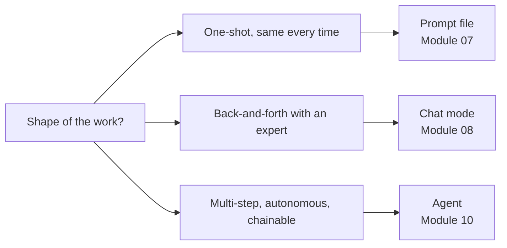

# GitHub Copilot Agents — Complete Guide

Agents (`.github/agents/*.agent.md`) are **autonomous multi-step workers**. Unlike chat modes (you drive the conversation) or prompt files (one-shot), an agent takes a goal and runs with it — reading files, writing code, running commands, and then handing off to another agent when its phase is done.

The canonical pattern is a three-stage chain: **plan → implement → review**. Each stage uses the model that plays best to its strength.

---

## Why Agents

- **End-to-end execution.** You say "add retry logic to the payment webhook with exponential backoff." The chain plans it, implements it, reviews it, and hands back a PR. You stay out of the tool-calling loop.
- **Model specialisation per phase.** Planning wants deep reasoning (`o3`); implementation wants code quality (`claude-sonnet-4-5`); review wants thoroughness (`claude-opus-4-5`). A single prompt can't pick all three.
- **Tool segmentation.** The planning agent is read-only (can't write bad code). The reviewer is read-only (can't hide findings by editing). Only the implementer writes.
- **Auditable handoffs.** Each agent leaves a checkpoint — a plan doc, a diff, a review. You can inspect or rewind between phases.

---

## Agent vs Chat Mode vs Prompt



| Primitive | Who drives | Tools | Lifespan |
|---|---|---|---|
| Prompt | User | None (ask) or edit | 1 turn |
| Chat mode | User | Configurable | A session |
| Agent | Itself (toward a goal) | `tools:` allowlist | Until done or handoff |

---

## File Location and Format

```
your-project/
└── .github/
    └── agents/
        ├── plan.agent.md
        ├── implement.agent.md
        └── review.agent.md
```

Filename = agent name. Agents reference each other by `name:`, so the filename must match the frontmatter name exactly.

---

## Frontmatter

```yaml
---
name: plan
description: "Turn a feature request into a file-by-file implementation plan"
model: o3
tools:
  - read_file
  - github.search_code
  - github.get_issue
handoffs:
  - implement      # when this agent finishes, offer to hand off to "implement"
owner: "@org/platform-team"
classification: internal
---

System prompt goes here — the persona and rules for this agent.
```

### Fields

| Field | Required | Purpose |
|---|---|---|
| `name` | yes | Identifier used in `handoffs:` by other agents |
| `description` | yes | Picker hint; what the agent does |
| `model` | strongly recommended | Which model runs this agent |
| `tools` | yes for writes / commands | Tool allowlist. **Omitting means "all tools"** — dangerous for reviewers |
| `handoffs` | optional | List of agent names this agent can hand off to |
| `owner`, `classification` | governance | See [Module 16](../16-governance/README.md) |

### Handoffs

When an agent finishes, if it has `handoffs:`, Copilot shows a button: "Continue with `<next-agent>` ?". The next agent receives the current context (plan doc, diff, review) and picks up where the previous one left off.

```yaml
# plan.agent.md
handoffs:
  - implement     # operator can continue to implement agent

# implement.agent.md
handoffs:
  - review        # then to review agent

# review.agent.md
# no handoffs — end of chain
```

Handoff is a *suggestion*, not automatic. The user clicks to confirm — this is the safety rail.

---

## Tools Reference

The `tools:` list controls what the agent can invoke. Keep it as narrow as the job allows.

### Read-only tools (planning, reviewing)

```yaml
tools:
  - read_file
  - filesystem.read
  - github.get_issue
  - github.get_pull_request
  - github.list_pull_request_files
  - github.search_code
```

### Write tools (implementation)

```yaml
tools:
  - read_file
  - write_file            # apply edits
  - run_terminal_command  # compile, run tests
  - github.create_commit
  - github.create_pull_request
```

### Risky tools (not for the standard chain)

Explicitly document if an agent uses these. Gate with [MCP profiles](../11-multi-model-mcp/mcp-profiles.md) and [policy hooks](../16-governance/hooks/scripts/destructive-commands.sh):

```yaml
tools:
  - kubernetes.apply          # changes live cluster state
  - kubernetes.delete         # destructive
  - terraform.apply           # changes live infra
```

See [tools-reference.md](./tools-reference.md) for the full catalogue.

---

## The Plan → Implement → Review Chain

```mermaid
flowchart LR
    User[/User: "Add retry logic to the webhook handler"/] --> Plan
    subgraph Plan[Plan agent]
        P1[Read issue + related code]
        P2[Draft file-by-file plan]
        P3[Risk & test strategy]
    end
    Plan -->|plan doc| Handoff1{Operator confirms<br/>handoff}
    Handoff1 --> Implement
    subgraph Implement[Implement agent]
        I1[Follow plan]
        I2[Write code]
        I3[Run tests locally]
        I4[Iterate on failures]
    end
    Implement -->|diff + test results| Handoff2{Operator confirms<br/>handoff}
    Handoff2 --> Review
    subgraph Review[Review agent]
        R1[Read diff]
        R2[Check correctness, security, tests, style]
        R3[Produce review report]
    end
    Review -->|review report| Done[PR with plan + diff + review]
```



Each agent's model is chosen for the phase:

| Agent | Model | Why |
|---|---|---|
| `plan` | `o3` | Multi-step reasoning, identifies risks, weighs options |
| `implement` | `claude-sonnet-4-5` | Follows a plan reliably; produces idiomatic code |
| `review` | `claude-opus-4-5` | Thorough, catches subtle issues pre-merge |

---

## Agent Templates in This Module

| File | Agent | Model | Role |
|---|---|---|---|
| [plan.agent.md](./plan.agent.md) | `plan` | `o3` | Turn a goal into a file-by-file plan |
| [implement.agent.md](./implement.agent.md) | `implement` | `claude-sonnet-4-5` | Execute the plan, write code, run tests |
| [review.agent.md](./review.agent.md) | `review` | `claude-opus-4-5` | Pre-merge review of the resulting diff |
| [handoff-chains.md](./handoff-chains.md) | — | — | Chain patterns beyond plan→implement→review |
| [tools-reference.md](./tools-reference.md) | — | — | Full catalogue of available agent tools |

---

## Invoking an Agent

Two entry points:

### From Copilot Chat (manual)

```
@plan Add retry logic to the payment webhook with exponential backoff (max 3 retries, starts at 500 ms)
```

The plan agent runs, produces a plan doc in chat, and offers the handoff button.

### From GitHub (Copilot coding agent)

Assign an issue to Copilot in the GitHub UI. The coding agent runs with the agent chain configured in your workflows. This is the "full automation" mode — no human in the loop between plan and PR, unless you configure approval gates.

See [Module 12 — GitHub Actions](../12-github-actions/README.md) and [Module 16 — copilot-setup-steps](../16-governance/workflows/copilot-setup-steps.yml) for the CI side of this.

---

## Authoring Rules

### Tools always narrow, never wide

Default to the minimum. "All tools" is never the right answer for a production agent.

### Separation of duties

- **Never** give the reviewer `write_file`. A reviewer that can edit can hide findings by editing.
- **Never** give the planner `write_file` or `run_terminal_command`. A plan isn't an edit.
- **Always** give the implementer `run_terminal_command` so it can run the tests. An implementer that can't verify its own work wastes review budget.

### System prompt structure

Agents need very explicit system prompts. Include:

- **Role** — "You are the X agent. You do Y."
- **Allowed actions** — "You may: read files, search code, ..."
- **Forbidden actions** — "You may NOT: modify files, commit, call tools outside the allowlist."
- **Success criteria** — "You are done when ..."
- **Handoff criteria** — "You hand off to `<next>` when ..."
- **Stop conditions** — "Stop and ask the user if: tests fail after 3 attempts; the plan diverges from the request; you encounter data you shouldn't touch."

### Budget the loop

State explicit retry / iteration budgets:

> You may retry a failing test at most 3 times. If it still fails, stop, summarise what you tried, and hand back to the user.

Agents without budgets occasionally spiral.

---

## Gotchas

- **Handoffs don't carry secret state.** If the plan agent learned something sensitive (e.g., an API key was in the repo), it passes the observation in plain text. Classify sensitive agents as `restricted` and route through [governance hooks](../16-governance/README.md).
- **Tool allowlist is not sandboxing.** The tool can still do harm if the MCP server has broad permissions. Pair with [MCP profiles](../11-multi-model-mcp/mcp-profiles.md) — the profile controls *what* the server can reach.
- **`mode: agent` in a prompt is NOT an agent file.** Prompt files with `mode: agent` are single-pass agent-mode execution; agent files are named, chainable entities. Use prompt agent-mode for one-off automation; use agent files for reusable chains.
- **Agent mode must be org-enabled.** If the org policy disables agent mode, `.agent.md` files silently don't run. See [Module 15 — Enterprise](../15-enterprise/README.md).
- **Don't build a fourth agent before the first three are solid.** Most teams over-engineer agent chains. Plan → Implement → Review covers 80% of work. Specialised agents (security, performance) belong as separate chains, not as insertions.

---

## Agents vs Copilot Coding Agent vs Agent Mode

Three related-but-different things. Keeping them straight saves a lot of confusion:

| Term | What it is |
|---|---|
| **Agent file** (this module) | A named `.agent.md` file defining a persona + tools + handoffs, invocable via `@<name>` in Chat |
| **Copilot agent mode** | A VS Code chat mode with tool access — the feature that makes agent files work. Turn on with `"chat.agent.enabled": true` |
| **Copilot coding agent** | The GitHub-side feature where you assign an issue to Copilot and it opens a PR. Uses your agents, instructions, and workflows |

Agent files configure personas. Agent mode is the capability. Coding agent is the CI-side automation.

---

## Further Reading

- [handoff-chains.md](./handoff-chains.md) — Beyond plan → implement → review
- [tools-reference.md](./tools-reference.md) — Every tool you can put in `tools:`
- [Module 11 — MCP Profiles](../11-multi-model-mcp/mcp-profiles.md) — Tool sandboxing at the server layer
- [Module 16 — Governance](../16-governance/README.md) — Hooks and eval checks for agent changes
- [Module 15 — Enterprise](../15-enterprise/README.md) — Org policy for agent mode
