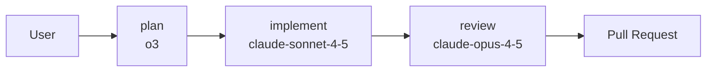
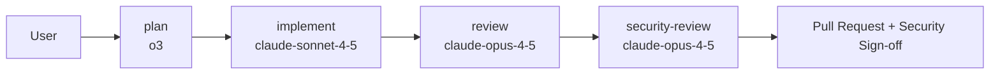
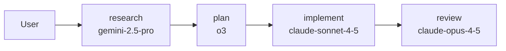
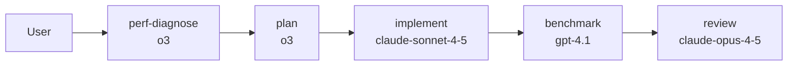
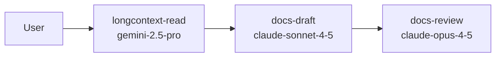
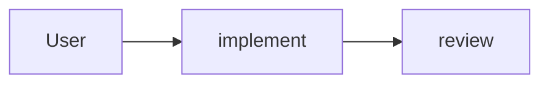
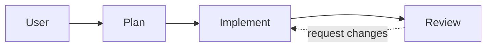
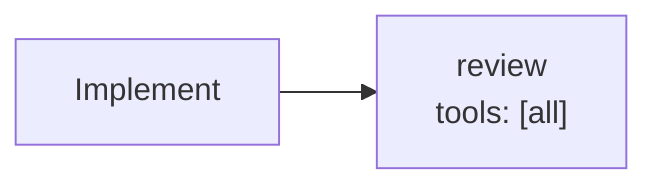

# Agent Handoff Chains Beyond Plan → Implement → Review

The default chain works for 80% of feature work. Here are chain patterns for the other 20%.

---

## The default chain (recap)



Use when: the work is well-scoped, fits one reasonable design, and doesn't touch a specialised concern (security, performance, data migration) deeply enough to need an expert review.

---

## Security-gated chain

For any change touching auth, payments, PII handling, or external attack surface.



`security-review.agent.md` has the same tool allowlist as `review` but a specialised system prompt focused exclusively on the security lens (see [Module 08's security-auditor.chatmode.md](../08-chat-modes/security-auditor.chatmode.md) for the persona).

Define the chain by extending `review.agent.md`:

```yaml
# review.agent.md
handoffs:
  - security-review    # for sensitive paths
```

---

## Research → plan chain

When the request isn't clearly implementable yet — "what's the best way to add real-time sync to the app?"



`research.agent.md` reads the existing codebase and produces a recommendations doc. The plan agent then picks one recommendation and produces the implementation plan. Keeping them separate avoids the common failure where the planner invents specifics before the design is settled.

---

## Performance-investigation chain

For "the API is slow, find out why and fix it."



`perf-diagnose.agent.md` reads profiles, flamegraphs, query plans. `benchmark.agent.md` runs the before/after measurements to prove the change actually helps.

---

## Documentation chain

For "document this subsystem."



`longcontext-read.agent.md` uses Gemini's 1M context to actually read the whole subsystem. `docs-draft.agent.md` produces the README/ADR/architecture-guide. `docs-review.agent.md` checks for accuracy (cites file:line) and missing pieces.

---

## Chain patterns that do NOT work

### Skipping plan



Implementers without a plan optimise for "make the tests pass" and miss the underlying design question. The plan-doc is the artifact you review *before* review — it's where design feedback lives.

### Loopback from review



Tempting, but the handoff mechanism isn't an unbounded loop. If review requests changes, the user drives the next round (pointing the implement agent at the review findings). Autonomous loops without human judgement gradually drift off-plan.

### Review without tool scoping



If the reviewer has `write_file`, there's a pressure to "just fix the nit" and silently expand the diff. Reviewers MUST be read-only.

---

## Designing a new chain

Questions to answer before creating a new chain:

1. **What phases are actually different?** Two phases that could share a persona shouldn't be split.
2. **What's the failure mode of each phase?** If you can't describe what each agent is protecting against, you don't need it.
3. **Who is the human decision point?** Every chain needs a place where the human can say "no, start over." Default: the handoff button between plan and implement.
4. **What's the budget?** Each phase needs retry / iteration limits. Unbounded chains burn budget.
5. **How do you know the chain is working?** A chain without a success metric (PR merge rate? review turnaround?) can't be tuned.

---

## Governance for chains

When you add a new agent:

1. File goes in `.github/agents/<name>.agent.md`
2. Add to `copilot-asset-manifest.json` (see [Module 16](../16-governance/README.md))
3. Add to `COPILOT-CHANGELOG.md`
4. Run eval checks — `bash .github/eval/checks/manifest-sync.sh` confirms the agent is registered
5. If the agent can write or run commands, verify MCP profile coverage — see [mcp-profiles.md](../11-multi-model-mcp/mcp-profiles.md)

---

## Quick decision matrix

| Work shape | Chain |
|---|---|
| Well-scoped feature | plan → implement → review |
| Bug fix with known cause | implement → review (skip plan) |
| Large / exploratory | research → plan → implement → review |
| Security-sensitive | plan → implement → review → security-review |
| Performance work | perf-diagnose → plan → implement → benchmark → review |
| Documentation | longcontext-read → docs-draft → docs-review |
| Refactor / cleanup | plan → implement → review (no new tests; regression tests only) |
| Data migration | plan → implement → data-verify → review |
