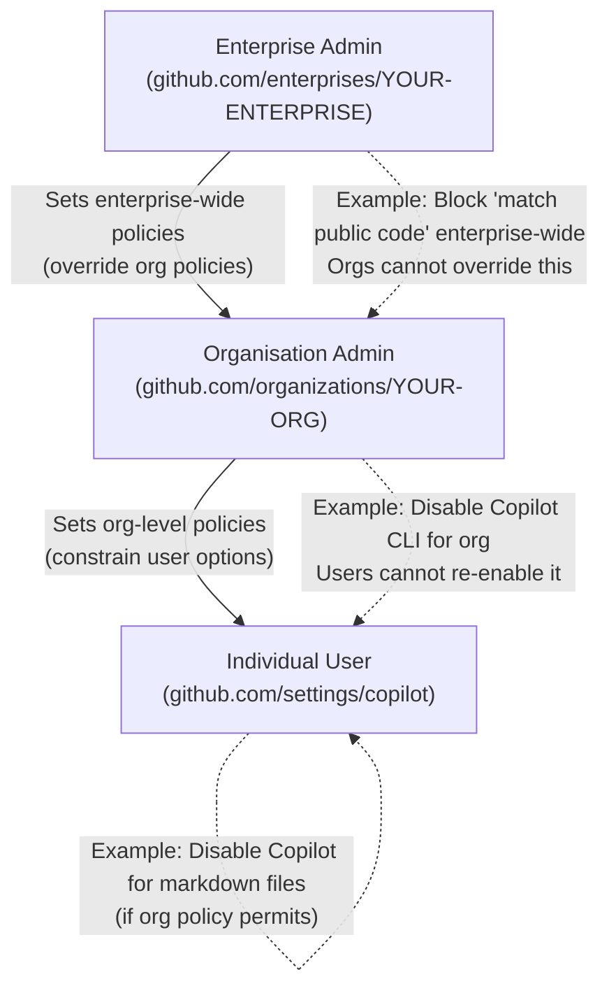

# GitHub Copilot Enterprise Features

This guide covers the administrative and governance features available with GitHub Copilot for organisations and enterprises. It is intended for GitHub organisation administrators and enterprise administrators who are responsible for deploying, configuring, and auditing Copilot across their teams.

---

## Table of Contents

1. [Who This Is For](#who-this-is-for)
2. [Feature Tiers](#feature-tiers)
3. [Key Enterprise Features](#key-enterprise-features)
4. [Administration URLs](#administration-urls)
5. [Policy Hierarchy](#policy-hierarchy)
6. [Further Reading](#further-reading)

---

## Who This Is For

This section of the tutorial targets:

- **GitHub Organisation Admins**: Responsible for managing Copilot seat assignments, configuring policies for their organisation's members, and reviewing organisation-level audit logs.
- **GitHub Enterprise Admins**: Responsible for setting enterprise-wide Copilot policies that apply across all organisations in the enterprise, and for enterprise-level audit log access.
- **Security and Compliance Teams**: Interested in content exclusion, audit logs, and demonstrating Copilot governance to internal or external auditors.
- **Platform / DevOps Engineers**: Responsible for configuring network access (proxies, firewalls) so that Copilot can be used in corporate environments.

If you are an individual developer looking for setup instructions, see [../09-ide-integration/README.md](../09-ide-integration/README.md).

---

## Feature Tiers

GitHub Copilot is available in three subscription tiers. Enterprise features build on top of Business features, which build on top of Individual features.

### Copilot Individual

Designed for solo developers. Includes:
- Inline suggestions (ghost text) in all supported IDEs
- Copilot Chat in VS Code, JetBrains, and Visual Studio
- No organisation management controls
- No audit logs

**Not suitable for** organisations that need policy enforcement, seat management, or compliance reporting.

### Copilot Business

Designed for teams and organisations. Everything in Individual, plus:
- **Organisation seat management**: Admins assign and revoke Copilot access at the individual user level
- **Content exclusion**: Exclude specific files or paths from being sent to Copilot as context
- **Policy management**: Enable or disable specific Copilot features for all org members
- **Suggestion matching**: Policy control over whether Copilot can suggest code that matches publicly available code
- **Organisation-level audit logs**: Track seat assignment changes and policy changes
- **GitHub.com Copilot features**: PR summaries, issue assistance (depending on policy)

### Copilot Enterprise

Designed for large enterprises with complex governance requirements. Everything in Business, plus:
- **Enterprise-level policies**: Policies set at the enterprise level override or constrain organisation-level settings
- **Enterprise-wide audit logs**: Consolidated audit log across all organisations in the enterprise
- **Audit log streaming**: Stream audit events to a SIEM (Splunk, Datadog, Azure Event Hubs, etc.)
- **Copilot on GitHub.com**: Enhanced AI features in the GitHub web UI (PR reviews, issue triage)
- **Custom model selection** (where available): Choose which AI model powers completions
- **Fine-grained access control**: More granular seat assignment options
- **SSO/SAML enforcement**: Tighter integration with your identity provider

---

## Key Enterprise Features

### 1. Content Exclusion

Prevents specific files and directories from being sent to Copilot as context. This is critical for repositories that contain secrets, sensitive business logic, regulated data, or proprietary algorithms that should not influence AI training or completions.

**Example use cases:**
- Exclude `.env` files and secret stores
- Exclude `/vendor` and generated code (to keep suggestions focused on first-party code)
- Exclude files containing PII or financial data

Full guide: [content-exclusion.md](./content-exclusion.md)

### 2. Organisation-Level Policies

Admins can enable or disable specific Copilot features for all members of the organisation, preventing individual users from activating features that have not been approved.

**Example policies:**
- Disable Copilot CLI for users who are not permitted to run AI-suggested shell commands
- Enable or block Copilot's ability to suggest code that matches public repositories
- Allow or block Copilot Chat on GitHub.com

Full guide: [policy-management.md](./policy-management.md)

### 3. Enterprise-Level Policies

Enterprise admins can set policies that apply across all organisations in the enterprise, overriding or restricting what organisation admins can configure. This ensures a consistent baseline across a large organisation.

Full guide: [policy-management.md](./policy-management.md)

### 4. Audit Logs

Every significant Copilot action (seat assignments, policy changes, Chat interactions where logging is enabled) is recorded in GitHub's audit log. This supports compliance requirements in regulated industries.

**Audit log capabilities:**
- Filter by user, date range, and action type
- Export as CSV
- Stream to a SIEM via GitHub's audit log streaming feature
- Query via the REST API

Full guide: [audit-logs.md](./audit-logs.md)

### 5. Network Configuration

For organisations with corporate proxies, firewalls, or SSL inspection, Copilot requires specific network configuration to function. This includes allowlisting Copilot endpoints and configuring HTTP proxy settings in IDEs and system environments.

Full guide: [network-proxy.md](./network-proxy.md)

### 6. SSO / SAML Integration

When a GitHub organisation enforces SAML SSO, Copilot access is mediated through the SSO session. Developers must explicitly authorise Copilot under SSO, and token expiry behaviour changes when OIDC is used.

Full guide: [sso-setup.md](./sso-setup.md)

---

## Administration URLs

| Task | URL |
|---|---|
| Organisation Copilot settings | `https://github.com/organizations/YOUR-ORG/settings/copilot` |
| Organisation seat management | `https://github.com/organizations/YOUR-ORG/settings/copilot/seats` |
| Organisation audit log | `https://github.com/organizations/YOUR-ORG/settings/audit-log` |
| Enterprise Copilot settings | `https://github.com/enterprises/YOUR-ENTERPRISE/settings/copilot` |
| Enterprise audit log | `https://github.com/enterprises/YOUR-ENTERPRISE/settings/audit-log` |
| Repository content exclusion | Repository → **Settings → Copilot** (within the repository settings) |
| Individual subscription management | `https://github.com/settings/copilot` |

Replace `YOUR-ORG` with your GitHub organisation slug and `YOUR-ENTERPRISE` with your enterprise slug.

---

## Policy Hierarchy

Copilot policies flow from the enterprise level down to the organisation level and finally to individual users. Policies set at a higher level take precedence over those at lower levels.

**Hierarchy rules:**

| Level | Can Override | Can Be Overridden By |
|---|---|---|
| Enterprise admin | Org admin settings | Cannot be overridden |
| Org admin | User settings | Enterprise admin |
| User | Nothing (for org/enterprise members) | Org admin or Enterprise admin |

**Practical implication**: If an enterprise admin sets a policy to "Block suggestions matching public code," no organisation admin or user can change that setting. If an org admin sets a policy to "Disable Copilot Chat," users in that org cannot re-enable it in their IDE settings — the feature will appear greyed out.

---

## Further Reading

- [content-exclusion.md](./content-exclusion.md) — Excluding files from Copilot context
- [policy-management.md](./policy-management.md) — Managing org and enterprise policies
- [audit-logs.md](./audit-logs.md) — Accessing and exporting audit logs
- [network-proxy.md](./network-proxy.md) — Configuring proxies and firewalls
- [sso-setup.md](./sso-setup.md) — SAML/OIDC SSO integration
- [GitHub Copilot for Business documentation](https://docs.github.com/en/copilot/managing-copilot/managing-github-copilot-in-your-organization)
- [GitHub Copilot for Enterprise documentation](https://docs.github.com/en/copilot/github-copilot-enterprise)
