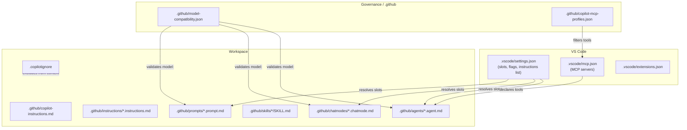

# Multi-Model Routing, MCP, and Context Exclusion

This module covers the configuration layer that ties the primitives together:

- **Named model slots** in `.vscode/settings.json` — so a prompt says `model: slot/code` instead of hardcoding `claude-sonnet-4-5`
- **Model compatibility matrix** (`.github/model-compatibility.json`) — the source of truth for which models exist and how to fall back
- **MCP servers** in `.vscode/mcp.json` — GitHub, Kubernetes, Postgres, filesystem, web search, memory — the live tools Copilot agent mode uses
- **MCP profiles** (`.github/copilot-mcp-profiles.json`) — three-tier least-privilege: read-only, standard, elevated
- **`.copilotignore`** — keeping secrets, compiled artefacts, and noise out of the context window
- **`.vscode/extensions.json`** — so teammates get the right extensions on clone

---

## Why This Layer Matters

Without it, every prompt / chat mode / agent hardcodes its own model and tools. That creates two problems:

1. **Stale when a new model ships.** If Anthropic releases Claude Opus 4.7, you have to find every file that says `claude-opus-4-5` and update it. With slots, one line in `settings.json` changes everything.
2. **Inconsistent tool access.** If one agent has `kubernetes.*` and another only has `kubernetes.list_pods`, the difference is either a bug or an invariant that isn't documented. MCP profiles put the policy in one place.

---

## Named Model Slots

Instead of:

```yaml
# In a prompt file
---
model: claude-sonnet-4-5
---
```

Define slots once in `.vscode/settings.json`:

```json
{
  "github.copilot.chat.models": {
    "slot/fast":     "o4-mini",
    "slot/reason":   "o3",
    "slot/balanced": "gpt-4.1",
    "slot/code":     "claude-sonnet-4-5",
    "slot/thorough": "claude-opus-4-5",
    "slot/haiku":    "claude-haiku-4-5",
    "slot/longctx":  "gemini-2.5-pro",
    "slot/flash":    "gemini-2.0-flash"
  }
}
```

Then in prompts / chat modes / agents:

```yaml
---
model: slot/thorough
---
```

When Anthropic ships Opus 4.7, one line change updates every prompt.

See [settings.json.example](./settings.json.example) for the full team config.

---

## Model Compatibility Matrix

`.github/model-compatibility.json` is the authoritative list of models your repo supports. Every `model:` reference in a prompt / mode / agent must be listed here — the eval check in [Module 16](../16-governance/README.md) enforces this.

```json
{
  "models": {
    "o3": {
      "provider": "openai",
      "capabilities": ["reasoning", "tool_use"],
      "context_window": 200000,
      "premium_multiplier": 5,
      "available_in": ["copilot-business", "copilot-enterprise"]
    },
    "claude-sonnet-4-5": {
      "provider": "anthropic",
      "capabilities": ["code_gen", "tool_use", "thinking"],
      "context_window": 200000,
      "premium_multiplier": 1
    },
    "gemini-2.5-pro": {
      "provider": "google",
      "capabilities": ["long_context", "tool_use"],
      "context_window": 1000000,
      "premium_multiplier": 5
    }
  },
  "slots": {
    "slot/fast": "o4-mini",
    "slot/code": "claude-sonnet-4-5",
    "slot/thorough": "claude-opus-4-5",
    "slot/longctx": "gemini-2.5-pro"
  },
  "fallback_policy": {
    "default": "fail-closed",
    "advisory": "controlled-fallback"
  }
}
```

### Fallback policy

- **`fail-closed`** — if the requested model is unavailable (org hasn't enabled Anthropic, provider is down), the agent fails. Use for gated workflows (security scans, release reviews) where "silently fell back to a weaker model" is an incident.
- **`controlled-fallback`** — allowed to use an alternative, but must name which model was actually used in the output. Use for advisory workflows (code review, documentation) where getting an answer is better than blocking.

See [model-compatibility.json](./model-compatibility.json) for the full example.

---

## Models in This Configuration

Current as of April 2026. Availability depends on subscription and org policy.

| Model | Provider | Best for | Premium multiplier |
|---|---|---|---|
| `o3` | OpenAI | Architecture, multi-step reasoning, planning | ~5x |
| `o4-mini` | OpenAI | Inline completions, boilerplate | ~1x |
| `gpt-4.1` | OpenAI | Balanced default, DevOps, general | ~1x |
| `claude-sonnet-4-5` | Anthropic | Code gen, review, docs, tests | ~1x |
| `claude-opus-4-5` | Anthropic | Deep review, security audits, nuanced | ~5x |
| `claude-haiku-4-5` | Anthropic | Fast + cheap | ~1x |
| `gemini-2.5-pro` | Google | 1M token context, full-codebase reads | ~5x |
| `gemini-2.0-flash` | Google | Fast long-context scan | ~1x |

Model IDs, capabilities, and multipliers change. Always check the [GitHub Copilot supported-models reference](https://docs.github.com/en/copilot/reference/ai-models/supported-models) for the current list.

### Auto mode

If the user selects "Auto" in the Copilot Chat picker, Copilot dynamically chooses the model based on availability and task hints. Per GitHub's pricing, Auto mode gives a 10% discount on premium requests. Use Auto by default for chat; use explicit `model:` in prompts / agents where the model matters.

---

## MCP — Model Context Protocol

MCP is the standard Copilot uses (as of April 2026) to give agents live access to external systems. An MCP server exposes tools (`github.get_issue`, `kubernetes.list_pods`); Copilot agent mode calls those tools during the conversation.

### `.vscode/mcp.json`

Declare the servers your workspace uses:

```json
{
  "servers": {
    "github": {
      "command": "npx",
      "args": ["-y", "@modelcontextprotocol/server-github"],
      "env": { "GITHUB_PERSONAL_ACCESS_TOKEN": "${env:GITHUB_TOKEN}" }
    },
    "kubernetes": {
      "command": "npx",
      "args": ["-y", "mcp-server-kubernetes"],
      "env": { "KUBECONFIG": "${env:KUBECONFIG}" }
    },
    "filesystem": {
      "command": "npx",
      "args": ["-y", "@modelcontextprotocol/server-filesystem", "${workspaceFolder}"]
    },
    "postgres": {
      "command": "npx",
      "args": ["-y", "@modelcontextprotocol/server-postgres"],
      "env": { "DATABASE_URL": "${env:DB_READONLY_URL}" }
    },
    "brave-search": {
      "command": "npx",
      "args": ["-y", "@modelcontextprotocol/server-brave-search"],
      "env": { "BRAVE_API_KEY": "${env:BRAVE_API_KEY}" }
    },
    "memory": {
      "command": "npx",
      "args": ["-y", "@modelcontextprotocol/server-memory"]
    }
  }
}
```

See [mcp.json.example](./mcp.json.example) for the full config with comments.

### Common servers

| Server | Tools exposed | Env vars |
|---|---|---|
| `github` | Issues, PRs, code search, workflows | `GITHUB_PERSONAL_ACCESS_TOKEN` |
| `filesystem` | Read/write sandboxed files | — |
| `kubernetes` | Pods, logs, events, describe | `KUBECONFIG` |
| `postgres` | Schema, queries (read-only replica!) | `DATABASE_URL` |
| `mysql` | Schema, queries | `MYSQL_URL` |
| `brave-search` | Web search | `BRAVE_API_KEY` |
| `aws-docs` | Search AWS docs | — |
| `memory` | Persist facts across sessions | — |
| `slack` | Messages, channels | `SLACK_TOKEN` |
| `notion` | Pages, DBs | `NOTION_TOKEN` |

### Setup checklist

1. Install Node.js 18+ (MCP servers usually run as npx).
2. Set env vars for any server that needs them (`GITHUB_TOKEN`, `KUBECONFIG`, etc.).
3. Commit `.vscode/mcp.json` but NOT the token values.
4. Restart VS Code after changing `mcp.json`.
5. Verify tools appear in agent mode: open Copilot Chat → agent mode → the tool palette should list `github.*`, `kubernetes.*`, etc.

### Troubleshooting

- **Tools not appearing**: env var missing. VS Code reads env at startup — `echo $GITHUB_TOKEN` in a new terminal, then restart VS Code.
- **"Server crashed on startup"**: wrong `command` or `args`. Run the command manually in a shell to see the actual error.
- **Tool works but returns nothing**: check token permissions. A GitHub PAT without `read:org` can't list org repos.

---

## MCP Profiles — Least Privilege

A single workspace rarely wants the same tools for all users. The platform team's admin laptop should have `kubernetes.apply`. The new hire's laptop should have `kubernetes.list_pods` and nothing else.

Solve with profiles:

`.github/copilot-mcp-profiles.json`:

```json
{
  "profiles": {
    "read-only": {
      "description": "Default for most developers. Cannot modify anything.",
      "allowed_tools": [
        "read_file",
        "github.get_*",
        "github.list_*",
        "github.search_code",
        "kubernetes.list_*",
        "kubernetes.get_*",
        "kubernetes.describe_*",
        "postgres.list_*",
        "postgres.describe_*"
      ]
    },
    "standard": {
      "description": "Regular development. Can edit files and open PRs.",
      "allowed_tools": [
        "read_file", "write_file", "run_terminal_command",
        "github.*",
        "kubernetes.list_*", "kubernetes.get_*", "kubernetes.describe_*", "kubernetes.get_logs",
        "filesystem.read", "filesystem.write",
        "postgres.list_*", "postgres.describe_*", "postgres.query"
      ],
      "denied_tools": [
        "github.delete_repository",
        "github.merge_pull_request"
      ]
    },
    "elevated": {
      "description": "Platform engineers only. Can modify infrastructure.",
      "allowed_tools": ["*"],
      "denied_tools": [
        "github.delete_repository",
        "kubernetes.delete_resource",
        "terraform.destroy"
      ],
      "requires": "platform-team-membership"
    }
  },
  "default_profile": "read-only"
}
```

See [mcp-profiles.md](./mcp-profiles.md) for the full three-tier pattern.

---

## `.copilotignore` — Keeping Junk Out of Context

Gitignore syntax; excludes files from Copilot's context window. Does NOT affect git tracking.

Example [.copilotignore.example](./copilotignore.example):

```gitignore
# Build artefacts
target/
build/
dist/
*.class
*.jar
*.war
*.pyc
__pycache__/

# Dependencies
node_modules/
vendor/
.venv/

# Terraform / IaC state
*.tfstate
*.tfstate.backup
.terraform/

# Secrets (belt-and-braces — these should also be in .gitignore)
*.pem
*.key
*.jks
*.p12
*.crt
.env
.env.*

# Generated / machine-produced
*.pb.go
*.pb.py
generated/
**/*_generated.*

# Large data files (just in case)
*.parquet
*.arrow
*.csv
*.sqlite
*.db

# IDE noise
.idea/
.vscode/chrome/
*.iml

# CI artefacts
coverage/
coverage.xml
.nyc_output/
```

### Why it matters

- **Context budget**: context tokens are finite. Filling them with `node_modules/` wastes money and worsens answers.
- **Security**: sending `.jks` keystore or `.env` files to an external model API is a leak, even if ephemeral.
- **Signal-to-noise**: generated `.pb.go` files overwhelm the real code.

Copilot still respects `.gitignore` by default. `.copilotignore` is for things that ARE tracked in git but shouldn't go to the model.

---

## `.vscode/extensions.json`

Prompts teammates to install the right VS Code extensions on clone.

```json
{
  "recommendations": [
    "github.copilot",
    "github.copilot-chat",
    "github.vscode-github-actions",
    "github.vscode-pull-request-github",
    "dbaeumer.vscode-eslint",
    "esbenp.prettier-vscode",
    "hashicorp.terraform",
    "ms-kubernetes-tools.vscode-kubernetes-tools",
    "ms-azuretools.vscode-docker"
  ]
}
```

VS Code shows a notification the first time a teammate opens the workspace: "This repo recommends extensions. Install all?"

---

## Files in This Module

| File | Purpose |
|---|---|
| [settings.json.example](./settings.json.example) | Team `.vscode/settings.json` with model slots, instructions, chat flags |
| [mcp.json.example](./mcp.json.example) | `.vscode/mcp.json` with common servers |
| [model-compatibility.json](./model-compatibility.json) | Model matrix with capabilities and fallback policy |
| [copilot-mcp-profiles.json](./copilot-mcp-profiles.json) | Three-tier MCP access profiles |
| [copilotignore.example](./copilotignore.example) | Full `.copilotignore` template |
| [extensions.json.example](./extensions.json.example) | Recommended VS Code extensions |
| [model-routing-guide.md](./model-routing-guide.md) | Task → model mapping with rationale |
| [mcp-profiles.md](./mcp-profiles.md) | Least-privilege MCP profile pattern in detail |

---

## Interaction Diagram



---

## Further Reading

- [model-routing-guide.md](./model-routing-guide.md) — Which model for which task and why
- [mcp-profiles.md](./mcp-profiles.md) — Profile design patterns
- [Module 16 — Governance](../16-governance/README.md) — Eval checks that validate model and tool references
- [Module 07 — Prompt frontmatter](../07-custom-prompts/frontmatter-reference.md) — How `model:` fields reference slots
