# MCP Least-Privilege Profiles

Three-tier access control for MCP tools: **read-only**, **standard**, **elevated**. Each profile filters which tools (from `.vscode/mcp.json`) an agent or chat mode can actually invoke.

See [copilot-mcp-profiles.json](./copilot-mcp-profiles.json) for the canonical config.

---

## Why profiles

Without profiles, everyone gets the same tool set. That's wrong in two directions:

- **Too permissive for most**: a new hire's laptop can call `kubernetes.apply` against production.
- **Too restrictive for some**: the platform on-call can't `helm rollback` without leaving Copilot and switching to their terminal.

Profiles solve both: the default is narrow; elevated access is explicit and audited.

---

## The three tiers

```mermaid
flowchart LR
    subgraph RO[Read-only]
        R1[read_file]
        R2[github.get_*]
        R3[kubernetes.list_*]
        R4[postgres.query]
    end
    subgraph STD[Standard — extends Read-only]
        S1[write_file]
        S2[run_terminal_command]
        S3[github.create_pull_request]
    end
    subgraph ELV[Elevated — extends Standard]
        E1[kubernetes.apply]
        E2[kubernetes.rollout_restart]
        E3[terraform.apply]
        E4[github.merge_pull_request]
    end
    RO --> STD --> ELV
    ELV -.-> DENY["Always denied:<br/>- kubernetes.delete_resource<br/>- terraform.destroy<br/>- github.delete_repository"]
```



### Tier 1: `read-only` (default)

**Who**: all developers by default; reviewers always; chat modes like `security-auditor`, `longcontext-reader`.

**Can do**:
- Read files
- Search code
- List and inspect GitHub issues, PRs, workflows
- List pods, read logs, describe resources
- Query DB schema and run SELECTs against the read replica

**Cannot do**: write anything, run anything, change anything.

### Tier 2: `standard` (extends `read-only`)

**Who**: regular development. `implement` agent, `test-writer` mode, `code-reviewer` mode (with additional hook gates).

**Can do** (additional):
- Write files in the workspace
- Run local terminal commands (tests, lint, build)
- Open PRs and add review comments
- Store memory facts

**Still cannot do**: anything that mutates shared infrastructure.

### Tier 3: `elevated` (extends `standard`)

**Who**: platform and SRE engineers. `devops-assistant` mode in prod context. Deploy agents.

**Can do** (additional):
- Apply Kubernetes manifests
- Restart or scale Deployments
- Run `terraform apply`
- Merge PRs

**Always denied even here** (irrecoverable):
- `github.delete_repository`
- `kubernetes.delete_resource` (in prod — requires manual kubectl)
- `kubernetes.delete_namespace`
- `terraform.destroy`
- `postgres.execute` (writes to the primary)

Why these are always denied: even an authorised operator should not run them from inside a chat tool loop. Require going out of band (direct shell + change record) to confirm intent.

---

## How profiles are applied

### Activation

The profile name lives in an env var:

```bash
export COPILOT_MCP_PROFILE=standard   # or read-only, or elevated
```

`.vscode/mcp.json` references it:

```json
{
  "profile": "${env:COPILOT_MCP_PROFILE:-read-only}"
}
```

VS Code reads env at startup — restart after changing.

### Inheritance

`standard` extends `read-only`. `elevated` extends `standard`. Each tier's `allowed_tools_additional` is merged with all lower tiers. `denied_tools` at any tier stop the call regardless of inheritance.

### Wildcards

Tool lists support `*`:

```json
"allowed_tools": [
  "github.get_*",      // matches get_issue, get_pull_request, etc.
  "kubernetes.list_*", // matches list_pods, list_deployments, etc.
  "*"                   // allow everything (only in elevated)
]
```

### Precedence

For any given tool call:

1. Is the tool in `denied_tools` at the active profile? → Deny.
2. Is the tool in `allowed_tools` at the active or any inherited profile? → Allow.
3. Otherwise → Deny (default-deny).

---

## Example: agent running under `standard`

`implement.agent.md` has `tools:` listed in its frontmatter. At runtime:

```
Agent wants: github.create_pull_request
 -> Is in implement.agent.md tools? YES
 -> Active profile: standard
 -> Is in standard.allowed_tools_additional? YES
 -> Is in standard.denied_tools? NO
 -> Allow
```

```
Agent wants: kubernetes.apply
 -> Is in implement.agent.md tools? NO
 -> Deny (not in agent's allowlist — no profile check needed)
```

```
Agent wants: terraform.destroy (somehow got into the agent's tool list)
 -> Is in implement.agent.md tools? YES
 -> Active profile: standard
 -> Is in standard.denied_tools? YES
 -> Deny with audit log entry
```

The agent's `tools:` list is the first gate; the profile is the second. Both must pass.

---

## Auditing

All tool calls land in Copilot's audit log (Business and Enterprise tiers). Suggested reviews:

- **Weekly**: inspect any `denied` calls. A pattern of denied calls means either the profile is too tight or the agent is misconfigured.
- **Per incident**: during any security or production incident, pull the tool-call log for the affected time window.
- **Post change**: when you update a profile, run `.github/eval/checks/tool-refs.sh` to confirm no agent references a newly-denied tool.

---

## Profile changes — process

Profile changes are governance events. Treat them like IAM changes:

1. Open a PR against `.github/copilot-mcp-profiles.json`.
2. Include in the PR description: what tool is being allowed/denied, why, and which agents/modes are affected.
3. Require review from the security team.
4. Merge triggers `.github/workflows/copilot-eval.yml` — which verifies the profile JSON is valid and all tool references still resolve.
5. Operators pick up the change on next VS Code restart.

Do NOT:

- Add a tool to the profile to make one specific agent work. Narrow the agent or create a new profile instead.
- Remove a tool from the denied list because a senior engineer wanted to try something. File a change request with a specific justification.

---

## Edge cases

### "I need this specific tool once, as a one-off"

Don't change the profile. Run the command directly in the shell. The profile is a standing rule; one-offs go outside the tool loop.

### "The profile filter is wrong in VS Code"

Confirm the env var is set at VS Code startup (restart after changing). If still wrong, the VS Code MCP client may have cached a prior profile — check the Copilot logs pane.

### "I want different profiles per workspace"

Use `.vscode/settings.local.json` (gitignored) to override the profile for a specific repo:

```json
{
  "github.copilot.mcp.profile": "elevated"
}
```

This only affects your laptop; the committed default stays narrow.

---

## Related

- [copilot-mcp-profiles.json](./copilot-mcp-profiles.json) — Canonical profile definitions
- [mcp.json.example](./mcp.json.example) — MCP server configuration
- [Module 10 — Agent tools](../10-agents/tools-reference.md) — The catalog of tool names
- [Module 16 — Hooks](../16-governance/hooks/scripts/) — Policy checks that run alongside profile enforcement
