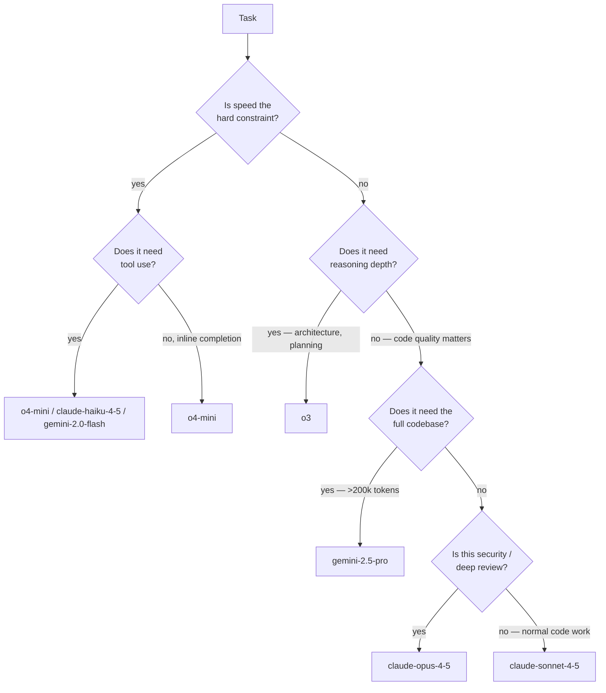
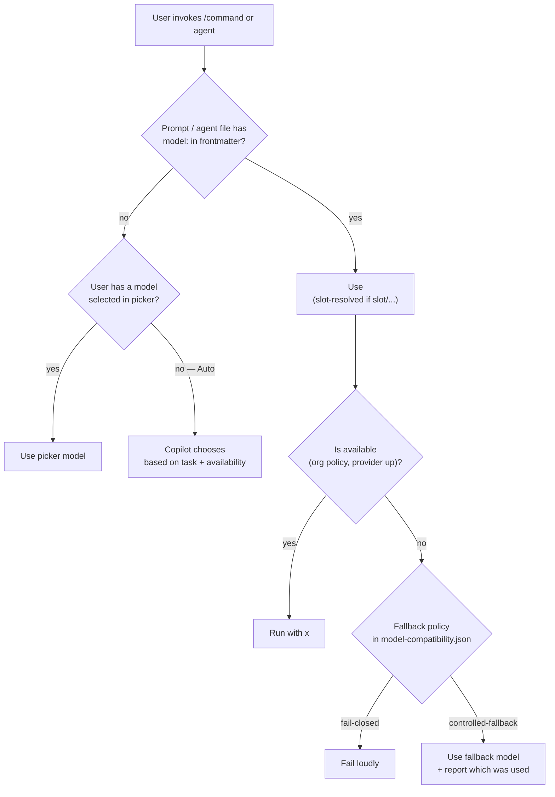

# Model Routing Guide — Which Model for Which Task

A decision guide from task → model, with reasoning. Current as of April 2026.

---

## The core insight

Different models are better at different things. Routing tasks to the right model — automatically, via `model:` frontmatter and named slots — gives you better results without the user having to think about it.

---

## Task-by-task mapping

| Task | Model | Why |
|---|---|---|
| Inline completion / ghost text | `o4-mini` | Must complete in under 200 ms; speed > depth |
| `/review` (code review) | `claude-sonnet-4-5` | Best code understanding + natural feedback tone |
| `/fix-issue` | `claude-sonnet-4-5` | Reliable targeted edits, follows instructions |
| `/deploy` | `gpt-4.1` | Fast, structured CLI output, good with scripts |
| `/architect` | `o3` | Multi-step trade-off reasoning shines |
| `/security-scan` | `claude-opus-4-5` | Most thorough; catches subtle issues |
| `/document` | `claude-sonnet-4-5` | Natural prose + technical accuracy |
| `/explain-codebase` | `gemini-2.5-pro` | Only model with 1M context for whole services |
| `/test-gen` | `claude-sonnet-4-5` | Idiomatic, realistic tests |
| **plan agent** (planning) | `o3` | Systematic planning and risk analysis |
| **implement agent** (coding) | `claude-sonnet-4-5` | High code quality at scale |
| **review agent** (pre-merge) | `claude-opus-4-5` | Maximum scrutiny before merge |
| **code-reviewer chatmode** | `claude-sonnet-4-5` | Balanced for back-and-forth |
| **security-auditor chatmode** | `claude-opus-4-5` | Depth over speed for long sessions |
| **architect chatmode** | `o3` | Extended reasoning conversations |
| **devops-assistant chatmode** | `gpt-4.1` | Fast, reliable for command lookups |
| **longcontext-reader chatmode** | `gemini-2.5-pro` | 1M token window for whole-codebase reads |
| **test-writer chatmode** | `claude-sonnet-4-5` | Idiomatic test writing |

---

## Model strengths — the longer version

### `o3` — Deep multi-step reasoning
- **Best at**: architecture decisions, trade-off analysis, complex algorithmic problems, things that require "thinking through" a chain of implications.
- **Weak at**: fast completions (it's slow), quick fixes (over-reasons for trivial tasks).
- **Cost signal**: ~5x premium multiplier. Don't burn it on boilerplate.

### `o4-mini` — Speed
- **Best at**: inline ghost-text completions, boilerplate generation, quick one-liners.
- **Weak at**: anything requiring long context or sustained reasoning.
- **Cost signal**: ~1x. Essentially free at scale.

### `gpt-4.1` — Balanced
- **Best at**: DevOps commands, shell scripts, structured output, "just do this normal thing."
- **Weak at**: nothing in particular — nothing outstanding either. It's the safe default.
- **Cost signal**: ~1x. Good workhorse.

### `claude-sonnet-4-5` — Code quality + instruction following
- **Best at**: code generation, code review, writing tests, writing docs. Follows instruction files accurately.
- **Weak at**: nothing for code work. For pure reasoning, `o3` edges it out; for thoroughness, Opus edges it out.
- **Cost signal**: ~1x. Main working horse for implementation agents.

### `claude-opus-4-5` — Maximum thoroughness
- **Best at**: security audits, deep review, nuanced analysis, catching subtle bugs.
- **Weak at**: fast turnaround (deliberately slower / more thorough).
- **Cost signal**: ~5x. Use where thoroughness is the point — release gates, security-sensitive reviews.

### `claude-haiku-4-5` — Fast and cheap
- **Best at**: lightweight chat turns, summarisation, classification.
- **Weak at**: heavy code work.
- **Cost signal**: ~1x, among the cheapest.

### `gemini-2.5-pro` — 1M token context
- **Best at**: reading entire services or very large files. Answering "how does this codebase work?" for real.
- **Weak at**: tasks where the context would fit in 200k anyway — you're paying for capacity you don't need.
- **Cost signal**: ~5x. Reserve for genuine large-context tasks.

### `gemini-2.0-flash` — Fast long-context scan
- **Best at**: scanning many files quickly for patterns.
- **Weak at**: deep reasoning.
- **Cost signal**: ~1x. Good pairing with Gemini Pro (flash to narrow, pro to analyse).

---

## How model selection resolves

Three mechanisms, in priority order:

### Tip: Auto as the default picker

For everyday work, set the picker to "Auto" so the user never manually switches. Explicit `model:` in prompts and agents overrides the picker when needed. This gives a 10% premium request discount and better resilience to provider outages.

---

## Avoid

- **Pinning `o3` everywhere.** It's 5x. You'll burn your quota by Tuesday.
- **Using Opus for inline completions.** Far too slow to keep up with typing.
- **Using Gemini Pro for short chat answers.** You're paying for 1M tokens you never use.
- **Raw model IDs in file frontmatter.** When the next Anthropic model ships, you'll be rewriting 40 files. Use slots.

---

## Model availability — keeping it current

Models change. Every quarter:

1. Check the [GitHub Copilot supported-models reference](https://docs.github.com/en/copilot/reference/ai-models/supported-models).
2. Update `.github/model-compatibility.json` — add new models, mark retired ones.
3. Update slot definitions in `.vscode/settings.json` if a newer model is a drop-in replacement.
4. The eval check in [Module 16](../16-governance/README.md) will flag any prompt / agent referencing a retired model ID.

---

## Further reading

- [model-compatibility.json](./model-compatibility.json) — The source of truth for this repo
- [settings.json.example](./settings.json.example) — Slot definitions
- [Module 07 — Prompt frontmatter](../07-custom-prompts/frontmatter-reference.md) — How prompts reference slots
- [Module 10 — Agent tools](../10-agents/tools-reference.md) — Tool allowlists (orthogonal to model choice)
