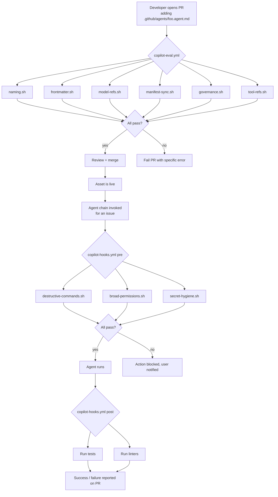

# GitHub Copilot Governance

When your repo has dozens of prompts, skills, chatmodes, and agents — plus a model-compatibility matrix and MCP profiles — you need governance. Otherwise:

- Someone adds a new agent with no owner. A year later no one knows who maintains it.
- A prompt references `claude-opus-4-3`, which no longer exists. It silently falls back to a weaker model.
- A skill is deprecated but no one removes the file. New hires still trip on it.
- An agent file gets `tools: ["*"]` snuck in. No one catches it until something blows up.

Governance covers six things:

1. **Manifest** — `copilot-asset-manifest.json`: every asset, its owner, its classification
2. **Changelog** — `COPILOT-CHANGELOG.md`: every change, in Keep-a-Changelog format
3. **Governance guide** — `GOVERNANCE.md`: the process for adding, deprecating, and transferring assets
4. **Eval checks** — `.github/eval/checks/*.sh`: deterministic CI validation
5. **Hooks** — `.github/hooks/scripts/*.sh`: policy checks that run against agent actions
6. **Workflows** — `.github/workflows/copilot-*.yml`: CI wiring

---

## Six governance artefacts at a glance

| File | Purpose | Enforced by |
|---|---|---|
| `copilot-asset-manifest.json` | Registry of every asset with owner + classification | `manifest-sync.sh` |
| `COPILOT-CHANGELOG.md` | Log of adds / changes / deprecations / removals | `frontmatter.sh`, human review |
| `GOVERNANCE.md` | Process for lifecycle events | Human review |
| `.github/eval/checks/*.sh` | Shell scripts that validate the repo's Copilot assets | `copilot-eval.yml` |
| `.github/hooks/scripts/*.sh` | Pre/post-action policy checks | `copilot-hooks.yml` |
| `.github/workflows/copilot-*.yml` | CI workflows that run the checks | GitHub Actions |

---

## The Asset Manifest

`.github/copilot-asset-manifest.json` is the single source of truth. Every prompt, skill, chatmode, agent, instruction file, and governance artefact is listed with metadata:

```json
{
  "assets": [
    {
      "path": ".github/prompts/review.prompt.md",
      "type": "prompt",
      "owner": "@org/platform-team",
      "classification": "internal",
      "description": "Five-lens PR review",
      "status": "active",
      "version": "1.0.0"
    },
    {
      "path": ".github/skills/helm-upgrade/SKILL.md",
      "type": "skill",
      "owner": "@org/platform-team",
      "classification": "internal",
      "description": "Helm upgrade / rollback runbook",
      "status": "active"
    },
    {
      "path": ".github/agents/plan.agent.md",
      "type": "agent",
      "owner": "@org/platform-team",
      "classification": "internal",
      "description": "Plan agent in the plan -> implement -> review chain",
      "status": "active"
    }
  ]
}
```

See [copilot-asset-manifest.json.example](./copilot-asset-manifest.json.example).

**Rule**: if a file exists under `.github/prompts/`, `.github/skills/`, `.github/chatmodes/`, `.github/agents/`, or `.github/instructions/`, it MUST have a manifest entry. `manifest-sync.sh` will fail CI otherwise.

---

## Changelog

`COPILOT-CHANGELOG.md` uses [Keep a Changelog](https://keepachangelog.com/) format:

```markdown
## [Unreleased]

### Added
- `plan.agent.md` — plan agent for plan→implement→review chain

### Changed
- `review.prompt.md` — switched from claude-sonnet-4-0 to claude-sonnet-4-5

### Deprecated
- `old-deploy.skill.md` — superseded by helm-upgrade skill; removal scheduled 2026-06-15

### Removed
- `legacy-reviewer.chatmode.md` — replaced by code-reviewer.chatmode.md (deprecated 2026-02-10)

### Security
- MCP profile elevated: denied kubernetes.delete_namespace
```

See [COPILOT-CHANGELOG.example.md](./COPILOT-CHANGELOG.example.md) for the full template.

---

## Governance Guide

`GOVERNANCE.md` documents the lifecycle of an asset: adding, changing, deprecating, retiring. See [GOVERNANCE.example.md](./GOVERNANCE.example.md).

Key rules:

- **Every asset must have an owner.** A team (preferred) or a role. Never a single person.
- **Deprecations require 60 days minimum.** Give teams time to migrate.
- **New assets must pass all eval checks before merge.**
- **Elevated-classification assets** (agents with `elevated` MCP profile, anything touching prod) need security-team sign-off.

---

## Eval Checks

Deterministic shell scripts in `.github/eval/checks/`. Every PR touching Copilot assets runs them via `copilot-eval.yml`.

| Check | What it validates | File |
|---|---|---|
| `naming.sh` | Kebab-case files, correct extensions | [eval/checks/naming.sh](./eval/checks/naming.sh) |
| `frontmatter.sh` | Required YAML fields present per asset type | [eval/checks/frontmatter.sh](./eval/checks/frontmatter.sh) |
| `model-refs.sh` | `model:` references exist in `model-compatibility.json` | [eval/checks/model-refs.sh](./eval/checks/model-refs.sh) |
| `manifest-sync.sh` | Every file has a manifest entry; no orphan entries | [eval/checks/manifest-sync.sh](./eval/checks/manifest-sync.sh) |
| `governance.sh` | `owner` + `classification` present on every manifest entry | [eval/checks/governance.sh](./eval/checks/governance.sh) |
| `doc-consistency.sh` | No stale references (`chatmode` that doesn't exist, slot that was removed) | [eval/checks/doc-consistency.sh](./eval/checks/doc-consistency.sh) |
| `deprecation.sh` | 60-day minimum grace period enforced | [eval/checks/deprecation.sh](./eval/checks/deprecation.sh) |
| `tool-refs.sh` | Agent `tools:` entries resolve to real MCP-server tools | [eval/checks/tool-refs.sh](./eval/checks/tool-refs.sh) |

Run locally:

```bash
bash .github/eval/checks/naming.sh
bash .github/eval/checks/frontmatter.sh
# or run them all:
for f in .github/eval/checks/*.sh; do bash "$f" || echo "FAIL: $f"; done
```

---

## Hooks — Policy Checks

Hooks are scripts that run *against agent actions* (not against repo state). When the Copilot coding agent or an agent chain is about to make a change, hooks gate the action.

| Hook | What it blocks | File |
|---|---|---|
| `destructive-commands.sh` | `rm -rf`, `DROP TABLE`, `git push --force`, `kubectl delete namespace`, `terraform destroy` | [hooks/scripts/destructive-commands.sh](./hooks/scripts/destructive-commands.sh) |
| `broad-permissions.sh` | IAM `"*"`, `AdministratorAccess`, `cluster-admin` | [hooks/scripts/broad-permissions.sh](./hooks/scripts/broad-permissions.sh) |
| `secret-hygiene.sh` | API key patterns, private keys, `AKIA...`, in diffs and Dockerfiles | [hooks/scripts/secret-hygiene.sh](./hooks/scripts/secret-hygiene.sh) |

Hooks are wired into the Copilot coding agent via `.github/workflows/copilot-hooks.yml`:

```yaml
# copilot-hooks.yml
name: copilot_pre_action
on:
  workflow_call:
    inputs:
      action: { required: true, type: string }
jobs:
  pre-action-checks:
    runs-on: ubuntu-latest
    steps:
      - uses: actions/checkout@v4
      - run: bash .github/hooks/scripts/destructive-commands.sh
      - run: bash .github/hooks/scripts/broad-permissions.sh
      - run: bash .github/hooks/scripts/secret-hygiene.sh
```

See [workflows/copilot-hooks.yml](./workflows/copilot-hooks.yml).

Hook semantics: `warn-only` or `fail-closed`. Start with warn-only for new hooks to calibrate; switch to fail-closed once false-positives are tuned out.

---

## Workflows

Three CI workflows that tie everything together:

### `copilot-eval.yml` — validate Copilot assets on every PR

Runs every eval check. Fails the PR if any deterministic check fails.

See [workflows/copilot-eval.yml](./workflows/copilot-eval.yml).

### `copilot-hooks.yml` — enforce policy on agent actions

Called by the Copilot coding agent before applying changes and after.

See [workflows/copilot-hooks.yml](./workflows/copilot-hooks.yml).

### `copilot-setup-steps.yml` — bootstrap the coding agent's toolchain

Runs before the Copilot coding agent starts any task. Installs the language runtimes, lint tools, and CLIs the agent needs to verify its own work.

```yaml
# copilot-setup-steps.yml — what the agent's sandbox gets
- Java 17
- Maven with internal mirror
- Go 1.22 + golangci-lint
- Python 3.11 + poetry
- OpenTofu
- Helm + kubectl
- Node.js 18 (for MCP servers)
```

Without this, the coding agent would try to generate code it can't compile or test. With it, the agent has a full toolchain.

See [workflows/copilot-setup-steps.yml](./workflows/copilot-setup-steps.yml).

---

## The End-to-End Flow



---

## Operational Scripts

Copilot-anatomy ships three operator scripts that work alongside governance:

| Script | Purpose | File |
|---|---|---|
| `copilot-setup.sh` | Generator — scaffold `.github/` Copilot structure into an existing repo | (top-level script, see [copilot-anatomy](https://github.com/vib795/copilot-anatomy)) |
| `copilot-discover.sh` | Task → asset mapping with keyword search | [scripts/copilot-discover.sh](./scripts/copilot-discover.sh) |
| `copilot-health.sh` | Health dashboard — JSON + Markdown output | [scripts/copilot-health.sh](./scripts/copilot-health.sh) |
| `copilot-onboarding.sh` | Role-based onboarding for new hires | [scripts/copilot-onboarding.sh](./scripts/copilot-onboarding.sh) |

---

## Files in This Module

| File | Purpose |
|---|---|
| [copilot-asset-manifest.json.example](./copilot-asset-manifest.json.example) | Asset registry |
| [COPILOT-CHANGELOG.example.md](./COPILOT-CHANGELOG.example.md) | Changelog template |
| [GOVERNANCE.example.md](./GOVERNANCE.example.md) | Lifecycle process guide |
| [eval/checks/](./eval/checks/) | Deterministic validation scripts |
| [hooks/scripts/](./hooks/scripts/) | Policy check scripts |
| [workflows/](./workflows/) | CI workflows |
| [scripts/](./scripts/) | Operator scripts (discover, health, onboarding) |
| [asset-lifecycle.md](./asset-lifecycle.md) | Add → deprecate → remove lifecycle guide |

---

## Further Reading

- [asset-lifecycle.md](./asset-lifecycle.md) — Full lifecycle walkthrough
- [Module 11 — MCP Profiles](../11-multi-model-mcp/mcp-profiles.md) — Profile changes are governance events
- [Keep a Changelog spec](https://keepachangelog.com/en/1.1.0/)
- [GitHub Copilot docs — Policies](https://docs.github.com/en/copilot/managing-copilot/managing-policies-for-copilot-in-your-organization)
