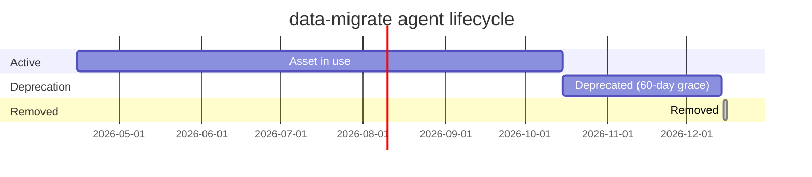

# Asset Lifecycle — Worked Example

A complete walkthrough: adding a new asset, using it, deprecating it, removing it. Every step shows the exact file changes and the eval checks that run.

---

## Scenario

Our team wants a new agent, `data-migrate`, for database migrations. It reads the proposed migration, plans rollout + rollback, and runs the migration script in a dry-run mode.

Later, the team consolidates migration work into an existing skill and retires `data-migrate`.

---

## Step 1: Propose

- Discussion in `#copilot-governance` channel confirms: this is an agent (multi-step, autonomous), not a skill (no auto-discovery needed) or a prompt (more than one-shot).
- Owner: `@org/data-platform-team`
- Classification: `restricted` (it runs migrations)

---

## Step 2: Add — the PR

### Files added

```
.github/agents/data-migrate.agent.md
```

### Files changed

```
.github/copilot-asset-manifest.json            ← new entry
COPILOT-CHANGELOG.md                            ← entry under Added
```

### `data-migrate.agent.md`

```yaml
---
name: data-migrate
description: "Plan and dry-run a database migration — reads migration scripts, produces rollout and rollback plan, runs migration in dry-run mode"
model: slot/thorough
tools:
  - read_file
  - write_file
  - run_terminal_command
  - postgres.list_tables
  - postgres.describe_table
  - postgres.explain
  - postgres.query
handoffs:
  - review
owner: "@org/data-platform-team"
classification: restricted
---

You are the data-migrate agent. You do NOT run migrations against production.
Your job is to plan, dry-run, and hand off to review.

[...full system prompt...]
```

### Manifest entry

```json
{
  "path": ".github/agents/data-migrate.agent.md",
  "type": "agent",
  "owner": "@org/data-platform-team",
  "classification": "restricted",
  "description": "Database migration planning + dry-run agent",
  "status": "active",
  "version": "1.0.0",
  "tags": ["database", "migration"]
}
```

### Changelog entry

```markdown
## [Unreleased]

### Added
- `.github/agents/data-migrate.agent.md` — database-migration planning agent (restricted; dry-run only)
```

### CI runs

```
copilot-eval.yml:
  naming.sh         [pass]   data-migrate.agent.md — kebab-case, .agent.md extension
  frontmatter.sh    [pass]   required fields present
  model-refs.sh     [pass]   slot/thorough -> claude-opus-4-5 (registered)
  tool-refs.sh      [pass]   all tools (postgres.*, read_file, ...) in active MCP servers
  manifest-sync.sh  [pass]   file in manifest, manifest points at existing file
  governance.sh     [pass]   owner + classification present
  doc-consistency.sh [pass]  no stale references
  deprecation.sh    [pass]   no deprecated_on (asset is active)
```

Two reviewers: one from `@org/data-platform-team`, one from `@org/security-team` (required for `restricted`). Merged.

---

## Step 3: Use

The agent is used for three months. It gets invoked ~50 times. Two enhancements land as follow-up PRs (each adds a changelog entry under `Changed`). A handful of minor fixes land (typos, clearer wording — changelog or not depending on team policy).

---

## Step 4: Deprecate

Six months later, the data platform team extends the `terraform-plan` skill to cover migration workflows. `data-migrate` is now redundant.

### PR

### Files changed

```
.github/agents/data-migrate.agent.md          ← add deprecation frontmatter
.github/copilot-asset-manifest.json           ← status: deprecated
COPILOT-CHANGELOG.md                          ← entry under Deprecated
```

### `data-migrate.agent.md` frontmatter

```yaml
---
name: data-migrate
description: "[DEPRECATED — use terraform-plan skill instead] Database migration planning"
model: slot/thorough
tools: [...]
handoffs:
  - review
owner: "@org/data-platform-team"
classification: restricted
deprecated_on: "2026-10-15"
removal_scheduled_on: "2026-12-15"
replaced_by: "skills/terraform-plan"
---
```

### Manifest

```json
{
  "path": ".github/agents/data-migrate.agent.md",
  "type": "agent",
  "owner": "@org/data-platform-team",
  "classification": "restricted",
  "description": "Database migration planning + dry-run agent",
  "status": "deprecated",
  "deprecated_on": "2026-10-15",
  "removal_scheduled_on": "2026-12-15",
  "replaced_by": "skills/terraform-plan"
}
```

### Changelog

```markdown
## [Unreleased]

### Deprecated
- `.github/agents/data-migrate.agent.md` — superseded by terraform-plan skill; removal scheduled 2026-12-15
```

### CI runs

```
copilot-eval.yml:
  deprecation.sh     [pass]   removal_scheduled_on is 61 days after deprecated_on (>= 60)
  doc-consistency.sh [warn]   3 references to data-migrate in docs; recommend updating
  manifest-sync.sh   [pass]   status: deprecated is valid
```

### Communication

- Posted in `#copilot-governance`: "data-migrate agent deprecated; use terraform-plan skill. Removal on 2026-12-15."
- The `copilot-discover.sh` script now labels data-migrate as `[DEPRECATED]`.

---

## Step 5: Grace period (60 days)

For 60 days:

- The agent still works. Nobody is cut off mid-migration.
- Every invocation shows a deprecation warning pointing at the replacement.
- Users migrate.

`deprecation.sh` tracks the countdown and warns when `removal_scheduled_on` is within 7 days.

---

## Step 6: Remove

On 2026-12-15 (or shortly after):

### PR

### Files changed

```
.github/agents/data-migrate.agent.md          ← DELETED
.github/copilot-asset-manifest.json           ← status: removed (entry kept!)
COPILOT-CHANGELOG.md                          ← entry under Removed
```

### Manifest

```json
{
  "path": ".github/agents/data-migrate.agent.md",
  "type": "agent",
  "owner": "@org/data-platform-team",
  "classification": "restricted",
  "description": "Database migration planning + dry-run agent",
  "status": "removed",
  "deprecated_on": "2026-10-15",
  "removed_on": "2026-12-15",
  "replaced_by": "skills/terraform-plan"
}
```

Note: the manifest entry is NOT deleted. It stays with `status: removed` as audit history. `manifest-sync.sh` has a rule: `status: removed` entries may point at files that don't exist.

### Changelog

```markdown
## [Unreleased]

### Removed
- `.github/agents/data-migrate.agent.md` — deprecated on 2026-10-15; replaced by terraform-plan skill
```

### CI runs

```
copilot-eval.yml:
  manifest-sync.sh  [pass]   no file at path, but status: removed — allowed
  doc-consistency.sh [pass]  no active references to data-migrate remain
  deprecation.sh    [pass]   removal happened after removal_scheduled_on
```

---

## Anti-patterns seen during this lifecycle

### "We'll just delete the file and skip the process"

No. Deletion without deprecation:
- Breaks users mid-task
- Leaves stale references in docs and other assets
- Loses audit history

The manifest + changelog + 60-day grace period exists to prevent exactly this.

### "We'll extend the grace period because people haven't migrated"

Sometimes OK, with a new PR that updates `removal_scheduled_on` and a changelog note. Don't do it silently — update the date and communicate.

### "We'll remove without updating the manifest"

`manifest-sync.sh` will fail CI. Fix it properly — update the manifest entry's status.

### "Deprecation warning is too loud; let's suppress it"

No. A deprecated asset that doesn't warn defeats the point. If the warning is genuinely too loud, look at *where* users are still using it and help them migrate faster.

---

## Timeline summary



Total lifecycle from add to remove: 8 months, of which the last 60 days is a deliberate soft-landing.
