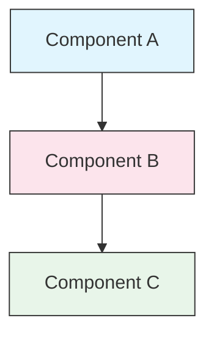

# Style Guide

> Conventions and formatting rules for contributing to Copilot How To. Follow this guide to keep content consistent, professional, and easy to maintain.

---

## Table of Contents

- [File and Folder Naming](#file-and-folder-naming)
- [Document Structure](#document-structure)
- [Headings](#headings)
- [Text Formatting](#text-formatting)
- [Lists](#lists)
- [Tables](#tables)
- [Code Blocks](#code-blocks)
- [Links and Cross-References](#links-and-cross-references)
- [Diagrams](#diagrams)
- [Emoji Usage](#emoji-usage)
- [GitHub Actions YAML](#github-actions-yaml)
- [Images and Media](#images-and-media)
- [Tone and Voice](#tone-and-voice)
- [Commit Messages](#commit-messages)
- [Checklist for Authors](#checklist-for-authors)

---

## File and Folder Naming

### Lesson Folders

Lesson folders use a **two-digit numbered prefix** followed by a **kebab-case** descriptor:

```
03-slash-commands/
05-custom-instructions/
14-extensions/
04-chat-variables/
12-github-actions/
```

The number reflects the learning path order from beginner to advanced.

### File Names

| Type | Convention | Examples |
|------|-----------|----------|
| **Lesson README** | `README.md` | `03-slash-commands/README.md` |
| **Feature file** | Kebab-case `.md` | `explain-with-context.md`, `suggest-patterns.md` |
| **GitHub Actions workflow** | Kebab-case `.yml` | `pr-review-workflow.yml`, `format-check-workflow.yml` |
| **JavaScript scaffold** | Standard names | `index.js`, `server.js` |
| **Config/definition file** | Kebab-case | `skillset-definition.yaml`, `personal-instructions-vscode.jsonc` |
| **Custom instructions** | Standard name | `copilot-instructions.md` (deployed to `.github/`) |
| **Top-level docs** | UPPER_CASE `.md` | `CATALOG.md`, `QUICK_REFERENCE.md`, `CONTRIBUTING.md` |
| **Image assets** | Kebab-case | `extension-flow.png`, `copilot-howto-logo.svg` |

### Rules

- Use **lowercase** for all file and folder names (except top-level docs like `README.md`, `CATALOG.md`)
- Use **hyphens** (`-`) as word separators, never underscores or spaces
- Keep names descriptive but concise

---

## Document Structure

### Root README

The root `README.md` follows this order:

1. H1 title
2. Introductory tagline
3. Quick navigation links
4. "The Problem" section
5. "How This Guide Fixes It" section with comparison table
6. Horizontal rule (`---`)
7. Table of Contents
8. Module overview table
9. Get Started section
10. What Can You Build section
11. Feature gaps table
12. FAQ
13. Contributing / License

### Lesson README

Each lesson `README.md` follows this order:

1. H1 title (e.g., `# Slash Commands`)
2. Brief overview paragraph
3. Quick reference table (optional)
4. Architecture diagram (Mermaid)
5. Detailed sections (H2)
6. Practical examples (numbered, 4-6 examples)
7. Best practices (Do's and Don'ts tables)
8. Troubleshooting
9. Related guides / Official documentation
10. Document metadata footer

### Feature/Example File

Individual feature files (e.g., `explain-with-context.md`, `suggest-patterns.md`):

1. H1 title
2. Purpose / description
3. Usage instructions
4. Code/prompt examples
5. Customization tips

### Section Separators

Use horizontal rules (`---`) to separate major document regions:

```markdown
---

## New Major Section
```

Place them after the introductory tagline and between logically distinct parts of the document.

---

## Headings

### Hierarchy

| Level | Use | Example |
|-------|-----|---------|
| `#` H1 | Page title (one per document) | `# Slash Commands` |
| `##` H2 | Major sections | `## Best Practices` |
| `###` H3 | Subsections | `### Building a Skillset Extension` |
| `####` H4 | Sub-subsections (rare) | `#### Configuration Options` |

### Rules

- **One H1 per document** — the page title only
- **Never skip levels** — don't jump from H2 to H4
- **Keep headings concise** — aim for 2-5 words
- **Use sentence case** — capitalize first word and proper nouns only (exception: feature names stay as-is)
- **Add emoji prefixes only on root README** section headers (see [Emoji Usage](#emoji-usage))

---

## Text Formatting

### Emphasis

| Style | When to Use | Example |
|-------|------------|---------|
| **Bold** (`**text**`) | Key terms, labels in tables, important concepts | `**Installation**:` |
| *Italic* (`*text*`) | First use of a technical term, book/doc titles | `*ghost text*` |
| `Code` (`` `text` ``) | File names, commands, config values, code references | `` `.github/copilot-instructions.md` `` |

### Blockquotes for Callouts

Use blockquotes with bold prefixes for important notes:

```markdown
> **Note**: Custom instructions apply to the entire repository, not per-directory.

> **Important**: Never commit API keys or credentials.

> **Tip**: Combine `@workspace` with `#file` for the most targeted context.
```

Supported callout types: **Note**, **Important**, **Tip**, **Warning**.

### Paragraphs

- Keep paragraphs short (2-4 sentences)
- Add a blank line between paragraphs
- Lead with the key point, then provide context
- Explain the "why" not just the "what"

---

## Lists

### Unordered Lists

Use dashes (`-`) with 2-space indentation for nesting:

```markdown
- First item
- Second item
  - Nested item
  - Another nested item
    - Deep nested (avoid going deeper than 3 levels)
- Third item
```

### Ordered Lists

Use numbered lists for sequential steps, instructions, and ranked items:

```markdown
1. First step
2. Second step
   - Sub-point detail
   - Another sub-point
3. Third step
```

### Descriptive Lists

Use bold labels for key-value style lists:

```markdown
- **Skillset extension** - simple, declarative; Copilot calls your HTTP endpoint
- **Agent extension** - full conversational control; you manage the response stream
- **Marketplace extension** - pre-built; install from github.com/marketplace
```

### Rules

- Maintain consistent indentation (2 spaces per level)
- Add a blank line before and after a list
- Keep list items parallel in structure (all start with verb, or all are nouns, etc.)
- Avoid nesting deeper than 3 levels

---

## Tables

### Standard Format

```markdown
| Column 1 | Column 2 | Column 3 |
|----------|----------|----------|
| Data     | Data     | Data     |
```

### Common Table Patterns

**Feature comparison (3-4 columns):**

```markdown
| Feature | Invocation | Scope | Best For |
|---------|-----------|-------|----------|
| **Slash Commands** | Manual (`/cmd`) | Chat session | Quick shortcuts |
| **Custom Instructions** | Auto-loaded | All sessions | Persistent standards |
```

**Do's and Don'ts:**

```markdown
| Do | Don't |
|----|-------|
| Use descriptive names | Use vague names |
| Keep instructions concise | Pad with boilerplate |
```

**Quick reference:**

```markdown
| Aspect | Details |
|--------|---------|
| **Purpose** | Generate unit tests |
| **Command** | `/tests` |
| **Best context** | `#file` or `#selection` |
```

### Rules

- **Bold table headers** when they are row labels (first column)
- Align pipes for readability in source (optional but preferred)
- Keep cell content concise; use links for details
- Use `code formatting` for commands and file paths inside cells

---

## Code Blocks

### Language Tags

Always specify a language tag for syntax highlighting:

| Language | Tag | Use For |
|----------|-----|---------|
| Shell | `bash` | CLI commands, scripts |
| Python | `python` | Python code |
| JavaScript | `javascript` | JS code |
| TypeScript | `typescript` | TS code |
| JSON | `json` | Configuration files |
| JSONC | `jsonc` | VS Code settings with comments |
| YAML | `yaml` | GitHub Actions workflows, config |
| Markdown | `markdown` | Markdown examples |
| SQL | `sql` | Database queries |
| Plain text | (no tag) | Expected output, directory trees |

### Conventions

```bash
# Copy the custom instructions template to your project
mkdir -p .github
cp 05-custom-instructions/project-copilot-instructions.md .github/copilot-instructions.md
```

- Add a **comment line** before non-obvious commands
- Make all examples **copy-paste ready**
- Show **both simple and advanced** versions when relevant
- Include **expected output** when it aids understanding (use untagged code block)

### Installation Blocks

Use this pattern for installation instructions:

```bash
# Copy the custom instructions template to your project
cp 05-custom-instructions/project-copilot-instructions.md .github/copilot-instructions.md
```

### Multi-step Workflows

```bash
# Step 1: Create the .github directory
mkdir -p .github

# Step 2: Copy the instructions template
cp 05-custom-instructions/project-copilot-instructions.md .github/copilot-instructions.md

# Step 3: Edit to match your stack
code .github/copilot-instructions.md
```

---

## Links and Cross-References

### Internal Links (Relative)

Use relative paths for all internal links:

```markdown
[Slash Commands](03-slash-commands/)
[Extensions Guide](14-extensions/)
[Custom Instructions](05-custom-instructions/#project-level-instructions)
```

From a lesson folder back to root or sibling:

```markdown
[Back to main guide](../README.md)
[Related: Extensions](../14-extensions/)
```

### External Links (Absolute)

Use full URLs with descriptive anchor text:

```markdown
[GitHub Copilot documentation](https://docs.github.com/copilot)
[VS Code Copilot Chat docs](https://code.visualstudio.com/docs/copilot/overview)
[Copilot Extensions API reference](https://docs.github.com/copilot/building-copilot-extensions)
```

- Never use "click here" or "this link" as anchor text
- Use descriptive text that makes sense out of context

### Section Anchors

Link to sections within the same document using GitHub-style anchors:

```markdown
[Feature Catalog](#feature-catalog)
[Best Practices](#best-practices)
```

### Related Guides Pattern

End lessons with a related guides section:

```markdown
## Related Guides

- [Slash Commands](../03-slash-commands/) — Quick shortcuts
- [Custom Instructions](../05-custom-instructions/) — Persistent context
- [Chat Variables](../04-chat-variables/) — Context attachment
```

---

## Diagrams

### Mermaid

Use Mermaid for all diagrams. Supported types:

- `graph TB` / `graph LR` — architecture, hierarchy, flow
- `sequenceDiagram` — interaction flows (especially for extension request/response)
- `timeline` — chronological sequences

### Style Conventions

Apply consistent colors using style blocks:



**Color palette:**

| Color | Hex | Use For |
|-------|-----|---------|
| Light blue | `#e1f5fe` | Primary components, inputs |
| Light pink | `#fce4ec` | Processing, middleware |
| Light green | `#e8f5e9` | Outputs, results |
| Light yellow | `#fff9c4` | Configuration, optional |
| Light purple | `#f3e5f5` | User-facing, UI |

### Rules

- Use `["Label text"]` for node labels (enables special characters)
- Use `<br/>` for line breaks within labels
- Keep diagrams simple (max 10-12 nodes)
- Add a brief text description below the diagram for accessibility
- Use top-to-bottom (`TB`) for hierarchies, left-to-right (`LR`) for workflows
- Always include a diagram title in the surrounding Markdown heading or caption

---

## Emoji Usage

### Where Emojis Are Used

Emojis are used **sparingly and purposefully** — only in specific contexts:

| Context | Emojis | Example |
|---------|--------|---------|
| Root README section headers | Category icons | `## 📚 Learning Path` |
| Skill level indicators | Colored circles | 🟢 Beginner, 🔵 Intermediate, 🔴 Advanced |
| Do's and Don'ts | Check/cross marks | ✅ Do this, ❌ Don't do this |
| Complexity ratings | Stars | ⭐⭐⭐ |

### Standard Emoji Set

| Emoji | Meaning |
|-------|---------|
| 📚 | Learning, guides, documentation |
| ⚡ | Getting started, quick reference |
| 🎯 | Features, quick reference |
| 🎓 | Learning paths |
| 📊 | Statistics, comparisons |
| 🚀 | Installation, quick commands |
| 🟢 | Beginner level |
| 🔵 | Intermediate level |
| 🔴 | Advanced level |
| ✅ | Recommended practice |
| ❌ | Avoid / anti-pattern |
| ⭐ | Complexity rating unit |

### Rules

- **Never use emojis in body text** or paragraphs
- **Only use emojis in headers** on the root README (not in lesson READMEs)
- **Do not add decorative emojis** — every emoji should convey meaning
- Keep emoji usage consistent with the table above

---

## GitHub Actions YAML

All workflow files in `12-github-actions/` must follow these conventions:

### Required Fields

```yaml
name: Descriptive Workflow Name
on:
  pull_request:
    types: [opened, synchronize]
jobs:
  job-name:
    runs-on: ubuntu-latest
    permissions:         # Always include explicitly
      pull-requests: write
      contents: read
    steps:
      - uses: actions/checkout@v4   # Always pin to a version tag
```

### Rules

- **Always include a `permissions` block** — do not rely on default permissions
- **Always pin action versions** with a tag (e.g., `@v4`), never use `@main` or `@latest`
- **Use `actions/checkout@v4`** as the first step in every job that accesses code
- **Add comments** explaining non-obvious steps
- **Use `continue-on-error: true`** only when you explicitly handle the failure in a later step

---

## Images and Media

### Screenshots

- Store in the relevant lesson folder (e.g., `03-slash-commands/inline-chat-example.png`)
- Use kebab-case file names
- Include descriptive alt text
- Prefer SVG for diagrams, PNG for screenshots

### Rules

- Always provide alt text for images
- Keep image file sizes reasonable (< 500KB for PNGs)
- Use relative paths for image references
- Store images in the same directory as the document that references them, or in `assets/` for shared images

---

## Tone and Voice

### Writing Style

- **Professional but approachable** — technical accuracy without jargon overload
- **Active voice** — "Create a file" not "A file should be created"
- **Direct instructions** — "Run this command" not "You might want to run this command"
- **Beginner-friendly** — assume the reader is new to GitHub Copilot, not new to programming
- **Honest about gaps** — when Copilot lacks a feature, say so clearly and offer the best workaround

### Content Principles

| Principle | Example |
|-----------|---------|
| **Show, don't tell** | Provide working examples, not abstract descriptions |
| **Progressive complexity** | Start simple, add depth in later sections |
| **Explain the "why"** | "Use `@workspace` for... because..." not just "Use `@workspace` for..." |
| **Copy-paste ready** | Every code block should work when pasted directly |
| **Real-world context** | Use practical scenarios, not contrived examples |

### Vocabulary

- Use "GitHub Copilot" or "Copilot" (not "the tool" or "the AI")
- Use "custom instructions" (not "memory" — that's the Claude Code term)
- Use "extension" for Copilot Extensions (not "plugin" or "skill")
- Use "chat variable" for `@workspace`, `#file`, etc.
- Use "inline suggestion" or "ghost text" for code completion
- Use "lesson" or "module" for the numbered sections
- Use "example" for individual feature files

---

## Commit Messages

Follow [Conventional Commits](https://www.conventionalcommits.org/):

```
type(scope): description
```

### Types

| Type | Use For |
|------|---------|
| `feat` | New feature, example, or guide |
| `fix` | Bug fix, correction, broken link |
| `docs` | Documentation improvements |
| `refactor` | Restructuring without changing behavior |
| `style` | Formatting changes only |
| `test` | Test additions or changes |
| `chore` | Build, dependencies, CI |

### Scopes

Use the module name or file area as scope:

```
feat(slash-commands): Add chaining commands example
docs(custom-instructions): Improve scoped instructions workaround
fix(README): Correct module table link
feat(extensions): Add agent extension scaffold
```

---

## Document Metadata Footer

Lesson READMEs end with a metadata block:

```markdown
---
**Last Updated**: April 2026
**GitHub Copilot Version**: Compatible with Copilot Individual, Business, and Enterprise
**Supported IDEs**: VS Code, JetBrains, Neovim, Xcode
```

- Use month + year format (e.g., "April 2026")
- Update when features or IDE support changes
- List the relevant IDEs for the module's content

---

## Checklist for Authors

Before submitting content, verify:

- [ ] File/folder names use kebab-case
- [ ] Document starts with H1 title (one per file)
- [ ] Heading hierarchy is correct (no skipped levels)
- [ ] All code blocks have language tags
- [ ] Code examples are copy-paste ready
- [ ] Internal links use relative paths
- [ ] External links point to `docs.github.com/copilot` or `code.visualstudio.com/docs/copilot`
- [ ] External links have descriptive anchor text
- [ ] Tables are properly formatted
- [ ] Emojis follow the standard set (if used at all)
- [ ] Mermaid diagrams use the standard color palette
- [ ] GitHub Actions workflows include explicit `permissions` blocks and pinned action versions
- [ ] No sensitive information (API keys, credentials, tokens)
- [ ] Images have alt text
- [ ] Paragraphs are short and focused
- [ ] Related guides section links to relevant modules
- [ ] Commit message follows conventional commits format
- [ ] Feature gaps are acknowledged honestly (no silent omissions)
