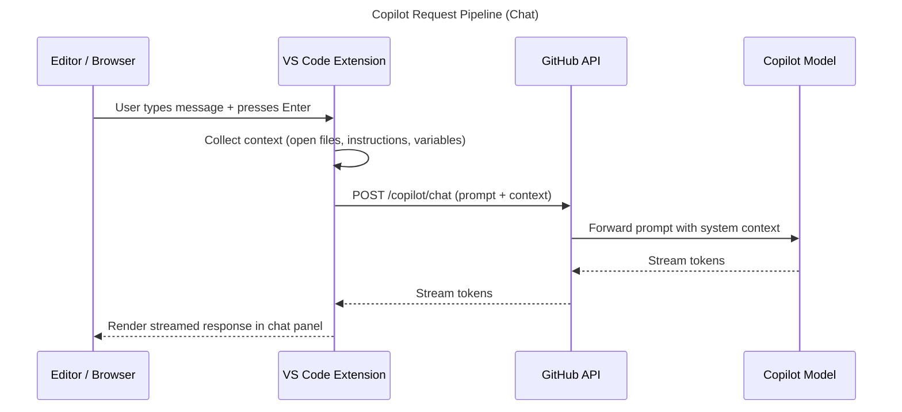
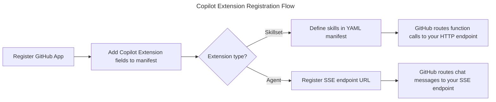
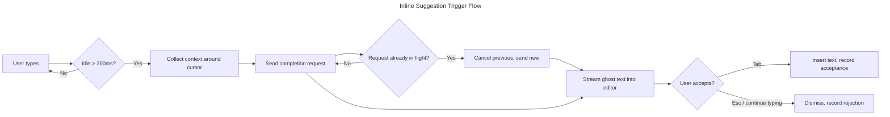
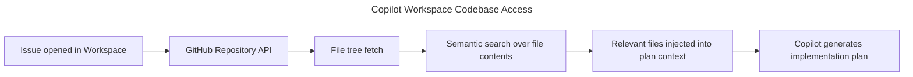
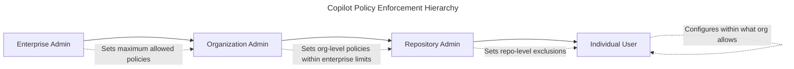

# GitHub Copilot Concepts Guide

A deep-dive reference covering how GitHub Copilot works under the hood — the request pipeline, context management, custom instructions, extensions architecture, chat variables, inline suggestions, Copilot Workspace, and enterprise controls.

## Table of Contents

1. [How Copilot Works Under the Hood](#part-1-how-copilot-works-under-the-hood)
2. [Custom Instructions Deep Dive](#part-2-custom-instructions-deep-dive)
3. [The Extension Architecture](#part-3-the-extension-architecture)
4. [Chat Variable Resolution](#part-4-chat-variable-resolution)
5. [Inline Suggestion Model](#part-5-inline-suggestion-model)
6. [Copilot Workspace Architecture](#part-6-copilot-workspace-architecture)
7. [Enterprise Architecture](#part-7-enterprise-architecture)

---

## Part 1: How Copilot Works Under the Hood

### The Request Pipeline

Every interaction with Copilot — whether you press Tab to accept a ghost-text suggestion or send a message in Copilot Chat — follows the same basic pipeline. Understanding it helps you write prompts that produce better results and diagnose situations where Copilot gives unexpected output.



**Step 1 — Keystroke captured.** Your editor captures the event (Enter in chat, or idle time after typing for completions) and delegates to the Copilot extension.

**Step 2 — Context collection.** The extension assembles everything it will send to the model. This is the most consequential step. What gets included and in what order determines what the model sees.

**Step 3 — API call.** The extension sends an HTTPS POST to GitHub's Copilot API. The payload is a structured prompt that GitHub's backend prepends system instructions to before forwarding to the underlying model (currently GPT-4o or Claude depending on the user's model selection).

**Step 4 — Streaming response.** The model streams tokens back. GitHub's API proxies the stream to the extension.

**Step 5 — UI render.** The extension renders tokens as they arrive. For chat, this is the familiar streaming text effect. For completions, ghost text appears inline.

### Context Sources in Priority Order

The extension has a fixed budget (see the context window section below). When there is more potential context than budget, it prioritizes in this order:

| Priority | Source | Description |
|---|---|---|
| 1 | Explicit chat variables | `#file`, `#selection`, `#codebase` — you explicitly requested these |
| 2 | Cursor position | The lines immediately around where your cursor sits |
| 3 | Current file | The rest of the currently active file |
| 4 | Custom instructions | `.github/copilot-instructions.md` and VS Code user settings |
| 5 | Open tabs | Other files you have open, ranked by recency and relevance |
| 6 | Related files | Files the language server knows are imported or related |

The practical implication: if you are working on a large file and also have many tabs open, Copilot may not see all your open files. Closing irrelevant tabs improves suggestion quality by freeing budget for the files that matter.

### The Context Window

The effective context window available to Copilot varies by model:

- **GPT-4o (default as of 2025)**: approximately 16,000 tokens for chat interactions
- **Claude 3.5 Sonnet (selectable)**: approximately 16,000 tokens (higher limits available via API, not surfaced in the Copilot UX)
- **Completion suggestions**: approximately 8,000 tokens (smaller because latency requirements are stricter)

One token is roughly 3–4 characters of English text or 2–3 characters of code. A 500-line TypeScript file is typically 3,000–6,000 tokens depending on identifier length and comment density.

When you use `@workspace` or `#codebase`, Copilot runs a semantic search and injects the top-ranked code snippets — it does not inject your entire codebase. The search result count is limited by the remaining context budget after accounting for your message and other context sources.

### Why Copilot "Forgets" Earlier in a Conversation

Copilot Chat maintains a conversation history, but that history competes for context window space with your code. As a conversation grows, two things happen:

1. The history itself consumes tokens, leaving less room for code context.
2. At some threshold, the extension starts truncating older messages from the beginning of the conversation.

This is the sliding window problem. If you have a long Copilot Chat conversation and Copilot stops referring to something you established early on, the most likely cause is that the early message has been evicted from the context window.

**Practical workarounds:**

- Use `/clear` to start a fresh conversation when you change topic. This removes the stale history and restores the full context budget.
- Summarize key decisions in your custom instructions file instead of repeating them in chat.
- Use `#file` to re-attach a file that was discussed earlier rather than expecting Copilot to remember it.

---

## Part 2: Custom Instructions Deep Dive

### How `.github/copilot-instructions.md` Is Loaded

When you open a repository in VS Code (or another supported IDE), the Copilot extension checks for `.github/copilot-instructions.md` at repository root. If the file exists, its contents are automatically prepended to the system prompt of every Copilot Chat request made within that repository — no configuration required, no opt-in needed from the user.

This happens at the extension level before the request reaches GitHub's API. The file is read fresh on each request (not cached at startup), so changes take effect immediately without restarting the IDE.

The file is not injected into inline completion requests, only into chat requests. If you want to influence completions, you use VS Code's `github.copilot.editor.enableCodeSuggestions` settings and the language-specific configuration, not this file.

### Token Budget for Custom Instructions

Your instructions file competes for context window space with your actual code. GitHub's documentation recommends keeping the file under 8,000 characters (roughly 2,000–2,500 tokens). Beyond that threshold, the instructions will still be included but they crowd out code context, which can produce worse answers for code-specific questions.

**What this means in practice:**

- Write instructions that are directive, not explanatory. Say what to do, not why.
- Use tables and bullet lists rather than prose paragraphs — they communicate more information per token.
- Remove instructions that are general enough to be default model behavior. "Write clear code" is not useful instruction; "use `const` over `let` unless reassignment is required, and prefer early returns over deeply nested `if` blocks" is.

### Instruction Effectiveness

**Specific beats vague.**

| Less effective | More effective |
|---|---|
| Write good error handling | Wrap every async function in try/catch; log errors with `console.error(err)` not `console.log` |
| Follow our coding style | Use 2-space indentation, single quotes, and semicolons throughout |
| Write tests | Write Jest unit tests; test happy path and at least two error cases per function |

**Forbidden patterns are more reliably followed than preferred patterns.**

The model treats a prohibition ("never use `var`") as a hard constraint. A preference ("prefer `const`") is treated as a soft suggestion that can be overridden by other signals in the prompt. For things that matter, phrase them as prohibitions.

**Concrete examples beat abstract rules.**

Instead of describing a pattern, show a short example:

```markdown
## Error Response Format
Always return errors in this shape:
{ "error": { "code": "VALIDATION_ERROR", "message": "human readable", "field": "optional" } }
```

### User-Level vs. Project-Level Instructions

Both levels are supported and they stack. Here is how they interact:

| Level | Where configured | Scope | Loaded automatically? |
|---|---|---|---|
| Project | `.github/copilot-instructions.md` | All users in that repo | Yes |
| User (VS Code) | `github.copilot.chat.codeGeneration.instructions` in settings | That user only, all repos | Yes |
| User (VS Code) | `github.copilot.chat.testGeneration.instructions` in settings | That user only, test generation | Yes |

User-level instructions are appended on top of project-level instructions. The model sees project instructions first, then user instructions. If they conflict, user instructions generally win because they appear later in the prompt — but this is model-dependent and should not be relied upon. Design project and user instructions to be complementary, not contradictory.

**Example VS Code user settings snippet** (JSONC format):

```jsonc
{
  "github.copilot.chat.codeGeneration.instructions": [
    {
      "text": "I prefer functional React components with hooks. Never generate class components."
    },
    {
      "text": "Always add JSDoc comments to exported functions."
    }
  ],
  "github.copilot.chat.testGeneration.instructions": [
    {
      "text": "Use Vitest, not Jest. Import from 'vitest' not 'jest'."
    }
  ]
}
```

---

## Part 3: The Extension Architecture

### GitHub App Model

Copilot Extensions are OAuth GitHub Apps with additional manifest fields that signal to GitHub that the app participates in the Copilot ecosystem. There are two extension types (skillset and agent), but both start as a GitHub App.



To register an extension you need:

1. A GitHub App with the `copilot` permission in its manifest.
2. A publicly reachable HTTPS endpoint (or a tunnel like `ngrok` for local development).
3. The extension type specified: `skillset` or `agent`.

### Skillset Extensions

A skillset extension exposes one or more named "skills." When the user asks a question that Copilot routes to your extension, GitHub calls your HTTP endpoint with the function name and arguments. You return a text or JSON response. Copilot incorporates your response into its answer.

**What Copilot sends to your endpoint:**

```json
{
  "skillName": "get-deployment-status",
  "parameters": {
    "environment": "production",
    "service": "api-gateway"
  }
}
```

**What your endpoint returns:**

```json
{
  "content": "api-gateway in production is healthy. Last deploy: 2 hours ago (v3.14.2). P99 latency: 42ms."
}
```

The skill invocation is synchronous from your perspective — you receive an HTTP request and return an HTTP response. There is no streaming in the skillset model; Copilot waits for your full response before generating the final answer.

Skillsets are the right choice when your extension retrieves data from an existing system (a deployment dashboard, a ticketing system, an internal database) and returns structured information.

### Agent Extensions

An agent extension has full conversational control. The user invokes your extension via `@your-extension-name` in Copilot Chat. GitHub sends the entire conversation turn to your endpoint as a Server-Sent Events (SSE) stream, and you respond as an SSE stream.

**Request format (simplified):**

```
POST /your-agent-endpoint
Content-Type: application/json

{
  "messages": [
    { "role": "user", "content": "Show me all open P1 incidents" }
  ],
  "copilot_thread_id": "abc123"
}
```

**Response format (SSE):**

```
data: {"type": "content", "body": "Here are the open P1 incidents:\n\n"}
data: {"type": "content", "body": "1. INC-4421 — Database timeout in payments service (opened 3h ago)\n"}
data: {"type": "content", "body": "2. INC-4418 — CDN cache purge failure (opened 5h ago)\n"}
data: [DONE]
```

Agent extensions are appropriate when you need multi-turn conversation, access to tool calls within the conversation, or the ability to render rich content (code blocks, formatted tables) as part of a longer response.

### Security: Token Verification

GitHub signs every request to your extension endpoint with an HMAC signature. You must verify this signature before processing the request. Skipping verification means any actor who discovers your endpoint URL can forge Copilot requests to your service.

**Verification in Node.js:**

```js
// Demonstrates how to verify a GitHub Copilot extension request signature.
// Requires: Node.js 18+ (for crypto.timingSafeEqual)
// See: https://docs.github.com/en/copilot/building-copilot-extensions/building-a-copilot-skillset/configuring-your-skillset

const crypto = require('crypto');

function verifySignature(req, secret) {
  const signature = req.headers['x-github-public-key-signature'];
  const keyId = req.headers['x-github-public-key-identifier'];

  if (!signature || !keyId) {
    return false;
  }

  // In production, fetch the public key from GitHub's JWKS endpoint
  // and verify the Ed25519 signature using the key matching keyId.
  // This example shows the structure; use @octokit/webhooks for a production implementation.
  return true; // replace with real verification
}
```

GitHub uses Ed25519 signatures (not HMAC). Use GitHub's official verification library or implement Ed25519 signature verification against the public key you fetch from GitHub's public key endpoint.

### Rate Limits and Quotas

- **Skillset invocations**: subject to GitHub App rate limits (5,000 requests/hour for an authenticated app).
- **Agent invocations**: each turn is one API call from GitHub to your endpoint. The 30-second response timeout is enforced; if your endpoint does not begin streaming within 30 seconds, GitHub returns an error to the user.
- **Copilot user quota**: each user's interactions with extensions count against their Copilot usage quota.

---

## Part 4: Chat Variable Resolution

### How `@workspace` Builds Its Index

`@workspace` is a Copilot Chat participant — a named actor in the chat interface that has specialized context access. When you prefix a message with `@workspace`, the extension runs a two-phase process:

**Phase 1 — Index construction.** VS Code maintains a background workspace search index (the same one powering Ctrl+Shift+F). Copilot uses this index plus language server symbol information to build a semantic map of your codebase.

**Phase 2 — Query-time retrieval.** When you send a message, Copilot embeds your query and runs a vector similarity search against the index. The top-ranked code snippets (typically 10–30 files or file sections, depending on size) are injected into the system prompt.

The index is updated as you edit files. New files are indexed within seconds of being saved.

### `@workspace` vs. `#codebase`

These two mechanisms answer different questions:

| | `@workspace` | `#codebase` |
|---|---|---|
| **Type** | Chat participant (prefix) | Context variable (inline) |
| **Scope** | Full workspace, broad context | Targeted semantic search |
| **Best for** | "How does X work in this project?" | "Find all usages of the `AuthService`" |
| **Token cost** | High (injects many snippets) | Medium (injects matched snippets only) |
| **Use in** | Start of message (`@workspace explain...`) | Inline (`explain #codebase the auth flow`) |

Use `@workspace` when you want Copilot to reason about your entire project structure. Use `#codebase` when you want a targeted semantic search result injected into a question that is otherwise scoped to the current file.

### How `#file` Works

When you use `#file:path/to/file.ts` in a chat message, the extension reads that file from disk at the moment the message is sent and injects its full contents into the system prompt. The file is read once per message — it is not live-updated if the file changes while you are composing your message.

If the file is larger than the remaining context budget, the extension truncates it (typically from the end of the file upward). For large files, reference specific functions or line ranges in your message to help Copilot focus.

### `#terminalLastCommand` and `#terminalSelection`

Both of these read from VS Code's integrated terminal:

- `#terminalLastCommand` injects the last command run and its output (stdout + stderr up to a buffer limit).
- `#terminalSelection` injects whatever text is currently selected in the terminal panel.

These are most useful for debugging build failures and runtime errors. A workflow like "run the failing test, then ask `@workspace why is this test failing? #terminalLastCommand`" is significantly more effective than copying the output manually.

### Context Variable Reference

| Variable | What it attaches | Approx. token cost | Best used when |
|---|---|---|---|
| `#file` | Full contents of a specific file | Low–High (file-size dependent) | You want Copilot to reason about a specific file other than the current one |
| `#selection` | Currently highlighted text | Very low | You want Copilot to explain or fix a specific code block |
| `#codebase` | Semantic search results from workspace | Medium | You want Copilot to find and reason about related code |
| `#terminalSelection` | Selected text in terminal | Very low | You want Copilot to explain terminal output you've highlighted |
| `#terminalLastCommand` | Last terminal command + output | Low–Medium | Debugging a failed command or test |

---

## Part 5: Inline Suggestion Model

### How Ghost Text Is Triggered

Inline suggestions (ghost text) are triggered by one of two mechanisms:

1. **Idle trigger**: You stop typing for a short duration (typically 300–500ms). The extension detects the idle period and sends a completion request.
2. **Explicit trigger**: You press `Alt+\` (VS Code default) to request a suggestion immediately without waiting for the idle timeout.

The extension sends the request only if no suggestion is already pending. If you type faster than Copilot can respond, the in-flight request is cancelled and a new one is sent when you next idle.



### Multi-Cursor Support

Copilot generates suggestions for the **primary cursor** only. If you have multiple cursors active, Copilot suggests for the topmost cursor (VS Code's primary cursor). Accepting the suggestion inserts text at the primary cursor only; secondary cursors are unaffected.

This is an intentional limitation, not a bug. The context around each cursor would need separate completion requests, which would exceed latency budgets for inline suggestions.

### Why Suggestions Vary

If you open the same file twice and position the cursor identically, you may get different suggestions. This is expected. The completion model uses a non-zero temperature setting (a sampling parameter that controls randomness). A temperature > 0 means the model samples from a probability distribution rather than always choosing the most likely next token.

Other factors that produce variation:

- **Context differences**: Even a one-character difference in your file changes the context hash, potentially producing a different completion.
- **Time**: The model version changes over time without explicit versioning exposed to users.
- **Server-side caching**: Identical prompts may return cached responses; near-identical prompts will not.

You cannot set the temperature for inline suggestions — it is controlled server-side by GitHub.

### Navigating Multiple Suggestions

Copilot generates up to 10 alternative suggestions for each trigger point. You can cycle through them:

- **VS Code**: `Alt+]` next suggestion, `Alt+[` previous suggestion
- **JetBrains**: `Alt+]` / `Alt+[` (same bindings)
- **Neovim (copilot.lua)**: `:Copilot next` / `:Copilot prev`

Use multiple suggestions when the first one is close but not right — a later suggestion may better match your intent.

### Telemetry and Opt-Out

GitHub collects the following telemetry for inline suggestions:

| Event | Data collected |
|---|---|
| Suggestion shown | Suggestion ID, language, file extension, editor version |
| Suggestion accepted | Suggestion ID (no code content) |
| Suggestion rejected | Suggestion ID, rejection type (dismissed vs. overtyped) |
| Suggestion retained | Whether accepted code is still present 30 seconds later |

GitHub states that suggestion content is not sent back as telemetry. The telemetry is used to measure acceptance rates and improve model quality.

**To opt out of telemetry** (VS Code):

```jsonc
{
  "github.copilot.advanced": {
    "shareOpenFiles": false
  }
}
```

Enterprise administrators can disable telemetry at the organization level via the Copilot policy settings in GitHub organization settings.

---

## Part 6: Copilot Workspace Architecture

### Browser-Based, Separate from the IDE

Copilot Workspace runs entirely in the browser at `githubnext.com`. It is not an extension of VS Code or any other IDE. You access it from a GitHub issue — a link in the issue sidebar opens Workspace with that issue pre-loaded as the task.

This architecture means Copilot Workspace reads your codebase through GitHub's repository API, not through a local filesystem mount. It sees the state of your default branch (or a branch you specify), not your local working tree.

### How Workspace Reads Your Codebase



Workspace does not clone your repository. It queries the repository API to fetch the file tree, then fetches individual file contents as needed. For semantic search, it uses a pre-built index similar to the one backing `@workspace` in VS Code, but hosted server-side against the default branch.

This means:
- Changes you have locally but have not pushed are invisible to Workspace.
- Private repository access requires the GitHub App to be installed and authorized.

### The Plan Format

Workspace represents its proposed solution as a numbered plan. Each step in the plan:

1. Identifies a specific file (by path) to create or modify.
2. Describes the change in natural language.
3. Shows a diff preview of the proposed change.

A typical plan looks like:

```
1. Create src/middleware/rateLimit.ts
   Add a rate-limiting middleware using the `express-rate-limit` package.

2. Modify src/app.ts
   Import and register the rateLimit middleware before the route handlers.

3. Update package.json
   Add `express-rate-limit` to the dependencies block.
```

The plan is editable. You can change the natural language description of a step and click "Regenerate" to get a new diff for that step without affecting other steps.

### Iterating on a Plan

To iterate effectively in Copilot Workspace:

1. **Edit the spec, not the plan.** The spec (derived from the issue) drives plan generation. If the plan is going in the wrong direction, edit the spec text and regenerate the plan from scratch. Editing individual plan steps works for small corrections but does not propagate intent changes to other steps.
2. **Regenerate individual steps.** Click the "Regenerate" icon on a step to get an alternative implementation of that step without affecting the others.
3. **Accept and open in VS Code / Codespaces.** Once the plan looks correct, click "Open in Codespace" to create a branch with the changes applied. You can then test and adjust locally before pushing.

### Current Limitations

- **Large repositories**: Repositories with more than ~100,000 files experience slower index builds and may have incomplete semantic search coverage.
- **Private dependencies**: Workspace cannot access packages from private npm registries or private GitHub Package Registry scopes. It will generate code that references those packages but cannot inspect their APIs.
- **Binary files**: Workspace ignores binary files (images, compiled artifacts). Changes to binary files must be made manually.
- **No runtime**: Workspace generates code but cannot run it. There is no feedback loop from tests or the runtime environment.

---

## Part 7: Enterprise Architecture

### Policy Enforcement Hierarchy

GitHub Copilot enterprise policies follow a four-level hierarchy. Each level can only restrict, not expand, what the level below allows.



| Level | Controls | Examples |
|---|---|---|
| Enterprise | Which organizations can use Copilot, global model selection, audit log export | Block all Copilot use in a subsidiary org |
| Organization | Seat assignment, allowed IDE list, content exclusion, network proxy | Require users to use VS Code only |
| Repository | Content exclusion patterns specific to this repo | Exclude `secrets/` directory |
| User | Personal instructions, keybindings, UI preferences | Set personal coding style instructions |

An enterprise admin who disables Copilot for an organization overrides any org-admin setting. An org admin who restricts an IDE choice overrides any user preference for a different IDE.

### Content Exclusion Pipeline

Content exclusion allows administrators to prevent Copilot from seeing specified files — the content of those files will not be sent to GitHub's API even if the file is open in the editor.

Exclusion patterns are defined in the organization settings under "GitHub Copilot → Content exclusion." They use `.gitignore`-style glob syntax.

**How patterns are evaluated at request time:**

1. The Copilot extension builds the context payload (current file, open tabs, etc.).
2. Before sending the payload, the extension fetches the current exclusion policy from GitHub's API (cached locally for up to 15 minutes).
3. Each file path in the payload is matched against the exclusion pattern list.
4. Matched files are dropped from the payload. If the current active file is excluded, Copilot disables suggestions entirely for that file.

This means content exclusion is enforced client-side by the extension, not server-side. An outdated extension version may not enforce newly added exclusion patterns until the cache expires or the extension updates.

**Example exclusion patterns:**

```
# Exclude all files in the secrets directory
secrets/**

# Exclude environment files anywhere in the repo
**/.env
**/.env.*

# Exclude a specific config file
infrastructure/terraform.tfstate
```

### Audit Log Schema

GitHub logs Copilot activity in the organization audit log. Events are prefixed with `copilot.`. Key event types:

| Event | Trigger |
|---|---|
| `copilot.enabled` | Admin enables Copilot for the org |
| `copilot.disabled` | Admin disables Copilot for the org |
| `copilot.seat_assigned` | A seat is assigned to a user |
| `copilot.seat_unassigned` | A seat is removed from a user |
| `copilot.content_exclusion_changed` | An admin changes content exclusion patterns |
| `copilot.policy_changed` | Any org-level Copilot policy is changed |

You can query audit logs via the GitHub API:

```bash
# List recent Copilot audit log events for an organization
# Requires: Personal access token with read:audit_log scope
curl -H "Authorization: Bearer $GITHUB_TOKEN" \
     "https://api.github.com/orgs/YOUR_ORG/audit-log?phrase=action:copilot&per_page=100"
```

The response includes `actor` (who made the change), `created_at`, and event-specific fields. Pipe the output through `jq` to filter for specific events or time ranges.

### Data Residency

As of 2025, GitHub Copilot processes prompts and responses in data centers operated by Microsoft Azure. Specific regional processing is available for GitHub Enterprise Cloud customers with data residency agreements.

Key data handling points:

- **Prompts**: sent to GitHub's API over TLS, then to Azure OpenAI or the selected model endpoint. Prompts are not retained for training by default for GitHub Copilot Business and Enterprise customers.
- **Completions**: streamed back over TLS. Not stored server-side after delivery.
- **Telemetry**: suggestion shown/accepted/rejected events are stored. Customers with a GitHub Enterprise agreement can disable this telemetry collection.
- **Training data opt-out**: for Copilot Business and Enterprise customers, GitHub's Terms of Service specify that code snippets sent as prompts are not used to train public models. Individual users on Copilot Individual can opt in to code snippet telemetry contributing to model improvement.

For the current data handling policy, always refer to [GitHub's Copilot privacy statement](https://docs.github.com/en/site-policy/privacy-policies/github-general-privacy-statement) as policies are updated more frequently than this guide.

---

*This guide covers concepts as of GitHub Copilot's 2025 feature set. For the latest on any specific feature, see [docs.github.com/en/copilot](https://docs.github.com/en/copilot).*
